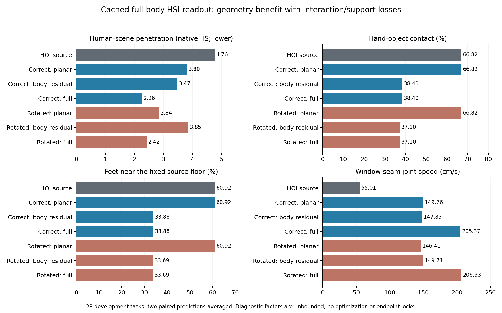

# Phase2.30 — 完整HSI预测与身体读出诊断

**root／朝向读出舍弃了能降低人体场景穿透的身体变化，但直接迁移这些变化会显著破坏交互和足部支撑。** 正确场景的完整预测优于错配的点估计，任务级区间仍跨零。几何信号的登记点估计条件通过，身体迁移升级条件失败；保持Phase2.28几何强基线。

## 同一来源的完整结果

本表来源是未经过表面优化的原始HOI动作，HS=4.764332；Phase2.29引用的纯几何编辑HS=1.177500属于另一个处理结果。这里的完整身体反事实没有边界、终点锁定或几何优化，表内因子比较用于定位信息，不能作为新的组合方法性能。两个固定draw先各自评价，再取均值；完成数两draw完全相同。

| 诊断反事实 | HS↓ | OS↓ | FS cm↓ | 接触%↑ | 固定源地面近地足部% | 完成数 |
|---|---:|---:|---:|---:|---:|---:|
|原始HOI来源|4.764332|31.093625|0.173899|66.8160|60.9153|22/28|
|正确／root XZ＋yaw|3.801325|32.974356|0.254381|66.8160|60.9153|8/28|
|正确／剩余身体变化|3.472903|31.093625|0.045662|38.4038|33.8809|22/28|
|正确／完整身体|2.260640|32.974356|0.052025|38.4038|33.8809|8/28|
|错配／root XZ＋yaw|2.841951|27.863441|0.246594|66.8160|60.9153|5/28|
|错配／剩余身体变化|3.850586|31.093625|0.054341|37.0999|33.6901|22/28|
|错配／完整身体|2.421306|27.863441|0.062098|37.0999|33.6901|5/28|

完整身体相对正确planar的HS降低40.53%，相对原始来源降低52.55%。28任务中21条优于正确planar、17条优于来源、15条优于错配完整预测。额外几何收益可测量，正确场景专属收益的任务级证据仍有不确定性。

## 配对证据与损失定位

10000次seed42配对bootstrap，任务与场景分别重采样；所有原生指标和附加指标均保留。场景只有4个，所有任务已有开发使用。

| 差值 | HS均值差 | 任务95%区间 | 场景95%区间 |
|---|---:|---|---|
|正确完整－来源|-2.503693|[-6.864717, -0.077002]|[-6.262126, -0.157158]|
|正确完整－正确planar|-1.540685|[-3.168803, -0.422740]|[-2.564072, -0.517299]|
|正确完整－错配完整|-0.160666|[-0.383322, +0.026828]|[-0.405199, -0.008832]|
|正确residual－错配residual|-0.377684|[-1.127007, +0.062531]|[-1.082954, +0.053303]|
|正确planar－错配planar|+0.959374|[-0.188174, +3.078591]|[-0.145462, +2.925421]|

正确完整的接触相对来源下降28.4122个百分点，任务95%区间[-36.8284,-19.9682]；固定源地面的足部近地比例下降27.0344个百分点，区间[-36.3931,-17.8172]。两者各有25/28任务下降。身体残差单独施加时也出现同样损失，说明这部分损失来自身体变化；planar共同变换保持接触逐任务精确一致。

物体坐标系中的手平均偏移19.7028cm。身体root Y平均增加2.9018cm，原生重新估计脚高从4.0046降到3.4370cm；仅看原生脚高或FS会漏掉固定地面近地比例的大幅下降。FS从.173899降到.052025cm伴随支撑代理下降，本轮无法把滑动变小解释为步态质量改善。

正确planar和完整身体都从22/28完成变成8/28，错配相应为5/28；residual保留22/28。这里目标端没有锁定，完成损失定位于原始planar预测的终点变化，不据此判定受约束编辑或原生HSI完整采样的目标能力。OS随相同planar物体变换，正确从31.093625增加到32.974356（+6.05%），residual保持来源OS。

完整预测的窗口接缝关节速度55.0074→205.3662cm/s，而全帧平均速度43.6818→46.9045cm/s。独立窗口x0读出明显放大接缝，这也是直接复制需要处理的问题。原始位置通道与原生SMPL-X/FK的root相对关节平均差2.9393→4.5074cm，增加1.5681cm，任务区间[1.3874,1.7584]；该值包含来源已有表示/身体模型差异，作为配对变化报告，不能当作GT动作误差。

场景对应变化在全身关节的平均距离5.5387cm，两draw噪声差.5323cm；手部为10.5850cm对1.1037cm，腿部4.0872cm对.3766cm。信号受场景输入影响，敏感性本身不等于有用知识。描述性的“正确full−planar减去错配full−planar”HS差为−1.12004，任务区间[-3.33665,.08035]；它支持进一步定位，但仍跨零，且未加入登记升级条件。

## 固定协议与实现

用户在2026-09-08批准继续区分完整预测价值与root/yaw读出损失。预登记83501a3，运行e9b05b0；分支phase/02aa-hsi-body-readout，协议experiments/protocols/p2_hsi_body_readout_s42_20260908.json，覆盖配置config_sample_hosi_body_readout.yaml。

复用Phase2.29修正原生human-goal查询后的28任务、124窗口、2次配对noise199原始x0预测。专家前向、训练、优化及新生成窗口全部为0。模型来源仍是冻结R2 EMA；此次没有载入新权重或改变查询。错配保持原先绕任务起点+90°的查询压力对照，已知它与正确查询的域外覆盖不同。

每窗口保留local2..15，对应global14*w+2..15，首2个粗帧沿用HOI历史，使用正确世界矩阵解码两组预测。原生30Hz插值与SMPL-X求完整人体表面，全部物体预测通道用HOI来源替代。小型CPU旋转解码沿用原生一致性规则，SMPL-X、SDF和配对统计在GPU。

在原生网格上从完整身体相对来源提取root XZ差及最近世界Y轴yaw：planar共同刚体变换来源人体和物体；residual从完整人体中逆掉同一变换并保留来源物体；full保留完整人体并使物体接受同一planar变换。完整人体可由planar作用于residual精确重建。这是几何因子分解，未把身体变化称作独立训练或可自由相加的因果变量。

足部近地比例固定使用来源估计地面、踝8cm/脚尖4cm阈值，是支撑代理而非真实接触标签。源stance足位移、手物漂移、root Y、位置/FK差与接缝速度同时保存。无bound/envelope/endpoint lock，完整动作属于诊断反事实；这些单步x0也不是一条原生HSI自回归生成链。

## 门槛、执行与产物

几何点估计3条件均通过：正确full HS比source和正确planar各降低至少1%，并优于错配full至少.5%source HS。保护条件中FS和原生脚高通过；接触、固定地面近地比例、OS及完成失败。因此body_transfer_entry=false，停止直接全身迁移的升级。

全部9作业exit0；28任务、124窗口、392条task/draw/arm记录（source逐draw复用），所有指标有限。来源关节及16项原生指标与缓存最大误差均为0；完整表面重建最大误差4.7684e-7m，planar手物关系保持检查通过。

20组件检查通过，运行前全套1108 passed/4历史skips，273.42s；409条registry有效。正式数据运行验证功能，生成/训练/优化路径保持原样，按协议跳过额外性能基准。8×RTX3090与另一HSI训练共享，预检记录实际占用；控制器wall62.735s、allocator峰值.9732GiB，耗时不用于速度比较。其他训练保持运行。

运行results/experiments/p2-mixer-hsi-body-readout-s42-20260908，manifest已在干净运行源码上完成；其下有9份resolved配置、机器预检、输入引用、日志及退出码，每任务metrics.json与motion.pt，analysis保存全体任务/draw、7组任务/场景表及配对统计、secondary与completion_metrics。原始HSI预测从2.29修正轮引用，未覆盖任何既有结果。

紧凑结果experiments/results/p2_mixer_hsi_body_readout_s42_20260908.json；图提供PNG/PDF。诊断加入mixer/diagnostics.py并接入已有原生evaluator；测试归入surface_edit组件。core及两个专家目录保持原样。完成提交和本地整合由exp/p2aa-hsi-body-readout-v1定位。

## 下一会话入口

先读本总结、docs/plan/OVERVIEW.md与Phase2计划。当前优先问题是：在保持手物关系、固定地面支撑和窗口连续性后，身体残差是否仍保有正确场景的额外收益。下一份具体提案应围绕这项受约束读出诊断形成单一协议，再决定可迁移的身体自由度；现有结果尚不足以选择共同去噪重设计或新专家训练。当前阶段完成，下一实验与469均未启动。

最终封存检查：1108 passed/4历史skips，250.45s；410条registry有效，正式manifest已完成，图表已检查。Phase2.30诊断工程门槛完成；几何点估计信号通过、直接身体迁移保护条件失败。完成提交整合至本地phase/02-mixer并由exp/p2aa-hsi-body-readout-v1定位。
