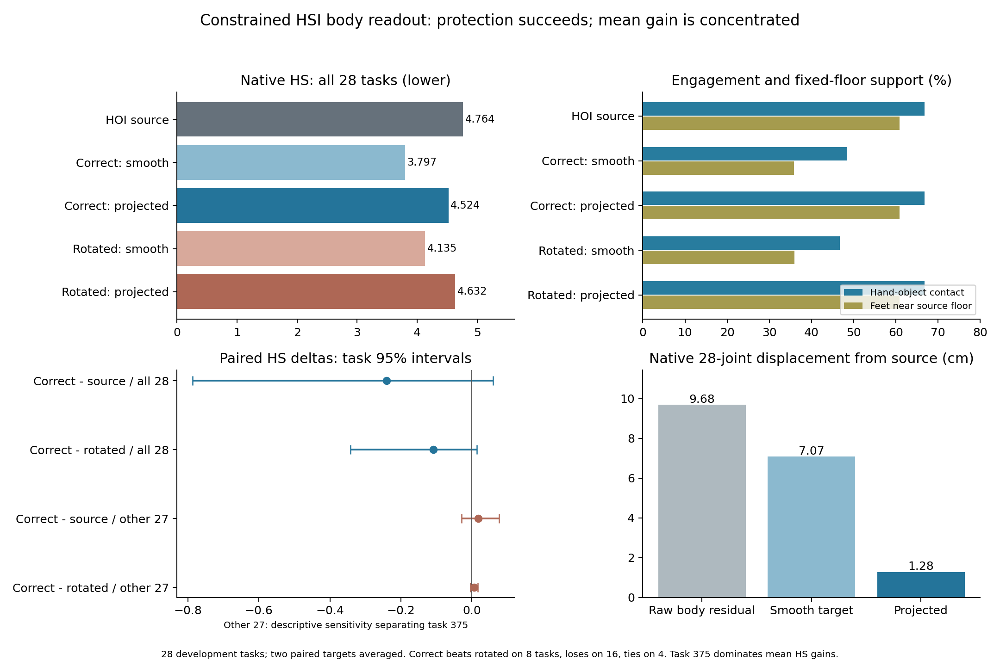

# Phase2.31 — 受交互、足部与连续性约束的HSI身体读出

**预登记的点估计入口、运动量与保护条件全部通过；均值场景收益主要来自任务375，普遍迁移收益仍待验证。** 正确投影HS相对原始HOI下降5.05%，同时保持逐任务手物接触、微米级手足轨迹、物体和首尾动作。正确场景相对来源及错配场景的任务/场景95%区间均跨零；默认保留Phase2.28强几何路径。

## 全体结果与判定

来源是与2.30相同的原始HOI动作，HS=4.764332，属于新增表面优化之前的状态。现有纯几何编辑HS=1.177500是更强的另一个处理结果，当前诊断没有证明在该强解上的额外收益。所有28任务、两次固定预测和五臂均保留，两个draw先各自评价再平均，完成数两draw一致。

| 固定28任务 | HS↓ | OS↓ | FS cm↓ | 接触%↑ | 固定地面近地足部% | 完成数 |
|---|---:|---:|---:|---:|---:|---:|
|原始HOI来源|4.764332|31.093625|0.173899|66.8160|60.9153|22/28|
|正确／平滑目标|3.796690|31.093625|0.053121|48.4336|35.8769|22/28|
|正确／受约束投影|4.523796|31.093625|0.173899|66.8160|60.9127|22/28|
|错配／平滑目标|4.135331|31.093625|0.056612|46.6638|35.9612|22/28|
|错配／受约束投影|4.632435|31.093625|0.173899|66.8160|60.9127|22/28|

两项几何条件、两项实质运动条件、八项保护条件均通过：正确投影HS比来源降低至少1%，比错配降低至少.5%来源HS；平均身体位移>=.5cm且至少14/28条达到.5cm；接触、FS、OS、完成、固定地面近地比例、原生锚点、首尾与物体均满足登记阈值。实际28/28条达到位移要求，协议24点身体平均位移1.1722cm，故投影保留了实质运动。entry=true按原协议记录，没有根据区间或敏感性结果改写门槛，也没有据此自动启动下一实验或469。

正确平滑目标改善HS，同时把接触从66.82%降至48.43%、足部近地比例从60.92%降至35.88%。受约束投影恢复这些保护后，保留了部分几何改善；这验证了投影机制与可行运动，当前场景收益证据仍高度集中。

## 不确定性与375敏感性

10000次seed42任务与场景配对bootstrap，全体原生和附加指标保存。4个场景和开发用过的28任务不构成独立未见评测。

| 比较/HS | 均值差 | 任务95%区间 | 场景95%区间 |
|---|---:|---|---|
|正确投影－来源|-0.240536|[-0.787116, +0.059933]|[-0.773444, +0.040868]|
|正确投影－错配投影|-0.108639|[-0.342383, +0.013141]|[-0.338959, +0.013806]|
|正确投影－正确平滑|+0.727106|[-0.285571, +2.114697]|[-0.130307, +1.715118]|

正确投影对来源为11条改善、13条退化、4条相等；对错配投影为8条改善、16条退化、4条相等。任务375来源HS106.563805，正确投影降低7.206905，对错配降低3.187542，贡献超过全体均值的净改善。作为明确标注的描述性敏感性分析，将375单列后，剩余27条正确－来源HS为+.017477，任务区间[-.029736,.076294]；正确－错配为+.005395，区间[-.004650,.016457]。正式28条分母和结果保持原样，没有据此筛选新的方法或任务路由。

因此本轮支持“在约束下仍保留身体运动，并对一个严重穿透状态产生可测量收益”；目前证据不足以把它概括为广泛的正确场景知识迁移。来源均值受极重穿透样本支配，是强几何解上的下一次增量验证需要显式检查的风险。

## 保护、幅度与表面代价

112个draw/view投影全部完成。六锚点原生重建最大误差1.221532e-6m；FK来源对原生误差最多7.633119e-7m，投影内锚点误差最多9.902267e-7m。两手接触逐任务与来源一致，所有物体运动及首尾动作精确保持。FS平均差−1.82e-7cm，接近浮点精度。

固定源地面近地足部比例只减少.002566个百分点。审计定位到任务20的draw1、第10帧右脚尖：距离判定阈值的裕量从−3.72529e-8m变为+8.19564e-8m。该纳米级边界跨越在support_boundary_events.json保留；不把比例的末位差异误报为可见支撑损失。

相对来源的全帧身体修正速度平均2.7646cm/s，窗口接缝平均3.7427cm/s。全部投影的最大修正速度29.4238cm/s，满足30cm/s硬限制；全帧/接缝均值的全局最大值为5.0099/6.9764cm/s，低于10cm/s。实际原生接缝关节速度55.0074→55.4564cm/s，上轮直接完整读出为205.3662cm/s。最大root位移5.6553cm、局部角变化18.7108°，首6/末3帧保持原样。

正确组56个预测保留幅度为1×6、.5×39、.25×11；错配为1×2、.5×45、.25×9，无零幅度返回。候选选择仅检查运动学界限和连续性，未调用场景指标。所有幅度候选的旋转/平移、误差和拒绝原因保留。

位移分母明确区分：协议采用22个身体关节加两手，共24个FK点，正确投影平均1.1722cm；按28个原生点计算，原始身体残差9.6797→平滑目标7.0716→投影1.2805cm。逐任务/实现平均保留原始残差14.65%、平滑目标18.84%，不是三个聚合均值的直接比值。剩余运动显著但受约束大幅缩小。

固定手部位置仍允许手掌转动。正确投影原生hand_pen_loss从.518461降至.515737，差−.002724、任务区间[-.011974,.008344]；human_pen_loss从8.269917降至8.259356，差−.010561、区间[-.186037,.231377]。两者相对来源没有均值增加，但不宣称显著改善。相对错配，正确组手物深度指标增加.005087、区间[.000092,.012326]，人体物体深度指标增加.095712、区间[.003795,.238280]；该次级取舍保留，接触率恒定不代表整个抓握表面几何恒定。

## 固定实现与资源

用户在2026-09-08批准受手物关系、地面支撑和跨窗连续性约束的身体残差读出。预登记3dada53，运行源码4bf3a8a，分支phase/02ab-hsi-body-projection。协议experiments/protocols/p2_hsi_body_projection_s42_20260908.json，唯一覆盖配置config_sample_hosi_body_projection.yaml。

复用2.30已解码的正确/错配完整身体预测与相同原始HOI来源，R2 EMA/noise199/两个固定配对draw与原生human-goal查询继承封存记录。去掉预测的root XZ/yaw，保留高度和局部身体姿态；SO3局部残差先受10cm/20°界限，再用整段30Hz、15帧结点的三次B-spline拟合与既有进出包络。平滑臂直接重建；投影臂使用固定物体与手/足全帧来源轨迹。

NativeBodyProjection使用原生SMPL-X形状回归的rest joints、22关节链和零手指均值，六锚点为原生28点中的24/26及7/8/10/11。69个规范化增量包含root XYZ和22个局部旋转，位置尺度5cm、角尺度10°；rootXZ/yaw的教师目标为零，运动学恢复可以调整它们，完整首尾保持来源。

80次源动作起步的投影拟合，步长1/37；目标平移/SO3距离加权重9的相邻来源相对增量平滑。解析18×69雅可比和float64 Gram矩阵的Moore–Penrose逆去掉改变锚点的一阶分量；每步最多5mm/2°，再做5次Newton锚点恢复。最后按1,.5,.25,.125,.0625,.03125,.015625,0固定幅度作可行性回溯，每个非零候选恢复20次锚点；首个满足锚点、位移、角度与速度约束的候选进入原生SMPL-X重建。没有SDF/native分数目标或优先选择正确场景的额外规则。手和所有四个足部轨迹包含非接触/摆动帧，属于较强的运动学限制。

22项组件检查通过，包括解析雅可比有限差分、零空间和恢复后非零身体运动；运行前全套1110 passed/4历史skips，253.66s，411条registry有效。初始2帧雅可比fixture调整为符合完整序列契约的60帧，正式运行前完成。实际来源关节与16项原生指标误差均为0。

9作业全部exit0，28任务/124窗口/280条task-draw-arm记录，专家前向、训练、新采样均为0。首个371任务使用完整342帧网格、单任务batch；4组完整投影平均17.5783s，含拟合、恢复、可行性检查和候选控制量回收；任务功能/性能记录在pilot_performance.json。正式首条同时完成新计算路径的全长度验证，额外smoke和新hash机制均未添加。

8×RTX3090与既有HSI训练共享，控制器wall398.621s；实际硬件预检、完整长度性能及各任务GPU峰值均保存，耗时不用于速度比较。其他训练保持运行。原生小型CPU姿态解码保留一致性，投影、SMPL-X、SDF和统计在GPU。

## 产物、封存及下一入口

运行results/experiments/p2-mixer-hsi-body-projection-s42-20260908，manifest已在干净4bf3a8a源码上完成。9份完整resolved配置、硬件/输入引用、日志与退出码、首任务性能、每任务完整指标/求解轨迹/候选控制量/动作、全部任务/场景表及配对统计均保留。secondary包含幅度、运动保留、全局约束最大值及375敏感性；额外足部边界事件独立保存，不覆盖正式完成指标。

紧凑结果experiments/results/p2_mixer_hsi_body_projection_s42_20260908.json；本图提供PNG/PDF，一页报告位于/data/yujinlun/report/PriorHOSI_hsi_body_projection_20260908.md。实现为mixer/body_projection.py通用原生投影组件及已有diagnostics/evaluator入口，测试归入surface_edit组件；core和两个专家目录保持原样。完成提交由exp/p2ab-hsi-body-projection-v1定位。

下一会话先读本总结、OVERVIEW和Phase2计划。下一份具体提案优先在现有强几何解上验证同一受约束读出的额外收益，预先报告任务覆盖与375敏感性，并确保HSI查询条件对应当前动作。既有28条已反复开发使用，不能再把新对比宣称为独立泛化证据。当前阶段完成；默认几何路径保持原样，469、专家训练、共同去噪及下一阶段均未启动。

最终封存检查：1110 passed/4历史skips，279.17s；412条registry有效，正式manifest已完成，图表已检查。Phase2.31工程门槛和登记点入口完成，保留375敏感性与区间跨零的科学限制。完成提交整合至本地phase/02-mixer，exp/p2ab-hsi-body-projection-v1定位本次交付。
