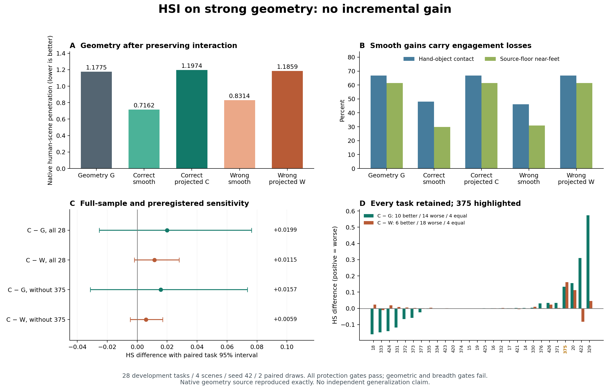

# Phase2.32 — 强几何解上的HSI增量

**固定受约束读出没有改善强几何基线：几何入口和四项覆盖条件均失败，运动量及全部保护条件通过。** 正确场景投影HS由1.177500升至1.197355（退化1.69%），错配场景为1.185904。停止本固定设置，保留Phase2.28强几何默认路径。

## 完整28任务结果

同28任务、124窗口、两次配对预测，五臂全部保留。来源为封存的relation_20强几何解，处于终点修复之前。每个draw各自原生评价，再平均；两次draw的完成数相同。HS/OS沿用原生指标尺度，FS单位cm。

| 固定28任务 | HS↓ | OS↓ | FS↓ | 接触%↑ | 固定源地面近地足部% | 完成数 |
|---|---:|---:|---:|---:|---:|---:|
|强几何来源G|1.177500|11.607790|0.176571|66.8160|61.4245|22/28|
|正确／平滑目标|0.716204|11.607790|0.046672|48.1125|29.7756|22/28|
|正确／受约束投影C|1.197355|11.607790|0.176571|66.8160|61.4245|22/28|
|错配／平滑目标|0.831434|11.607790|0.051958|46.1891|30.9391|22/28|
|错配／受约束投影W|1.185904|11.607790|0.176571|66.8160|61.4245|22/28|

正确投影相对G为10条改善、14条退化、4条相等；相对W为6条改善、18条退化、4条相等。28/28条24点身体位移达到0.5cm，均值1.217800cm，投影保留了实质身体运动。两项几何入口、四项覆盖条件均失败，entry=false、incremental_evidence=false；两项运动条件及八项保护条件全部通过。

正确平滑目标相对错配平滑目标HS差−0.115230，任务95%区间[−0.222747,−0.016757]，场景区间[−0.216066,−0.051885]，在此开发集上存在正确场景信号。但其接触下降18.70个百分点、足部近地比例下降31.65个百分点。固定投影恢复保护后，该场景优势消失。结果支持“这一教师目标加固定投影未产生可行增益”；本轮无法独立区分目标方向与投影限制各自的责任，也无法据此否定HSI模型在其他任务上的价值。

## 不确定性、覆盖与375

全部指标采用10000次seed42配对bootstrap，分别按任务和场景；只有4个场景。28条已经反复用于开发，区间描述本固定样本集，不构成独立泛化或跨训练种子证据。

| HS比较 | 均值差 | 任务95%区间 | 场景95%区间 |
|---|---:|---|---|
|C−G，全28|+0.019855|[−0.025401,+0.076329]|[+0.003321,+0.036388]|
|C−W，全28|+0.011450|[−0.001906,+0.028061]|[−0.000071,+0.022098]|
|C−G，预登记其余27|+0.015664|[−0.031312,+0.073615]|—|
|C−W，预登记其余27|+0.005870|[−0.004592,+0.017069]|—|

任务375：G=5.862796、C=5.995806、W=5.833671；C−G=+0.133011，C−W=+0.162136。其余27条两个比较也都退化，当前负结果延伸到375以外。全28仍为正式分母，未用敏感性或任务胜负构造新的筛选策略。

## 保护与表面代价

112个投影全部完成。原生六锚点最大误差1.250278e−6m；来源FK锚点最大误差7.633119e−7m。接触及固定源地面近地比例逐任务与G完全一致，物体与首6/尾3帧精确保持，FS差−1.59155e−7cm。全局root最大位移5.7018cm、局部角变化18.3575°，修正速度最大29.7150cm/s，全帧/接缝均值的全局最大值4.9901/7.0140cm/s，均通过登记界限。

正确投影全帧/接缝修正速度均值2.8615/3.8427cm/s；原生接缝关节速度55.0803→55.4837cm/s。正确56组幅度为1×5、0.5×44、0.25×7；错配为1×2、0.5×44、0.25×10。逐任务/draw平均保留平滑目标原生28点位移的18.15%/16.75%；登记运动量使用22身体关节加两手的24点分母，两者明确区分。所有候选和拒绝原因保留，选择只使用运动学与连续性条件。

固定手部位置允许手掌转动。C相对G的hand_pen_loss变化−0.004949，任务区间[−0.014591,+0.005067]；human_pen_loss变化−0.049954，区间[−0.222194,+0.155797]。C相对W分别增加0.002906和0.056461，任务区间均跨零，场景区间分别[+0.001407,+0.004517]、[+0.027244,+0.094135]。接触恒定与完整抓握表面几何是不同保护量，次级取舍保留。

## 当前动作输入与固定方法

用户于2026-09-08批准本强几何增量验证。预登记fa82a4e，实现ea4bcbf，资源失败/执行契约提交8863153，粗网格审计修正f75781e。分支phase/02ac-hsi-geometry-increment；协议experiments/protocols/p2_hsi_geometry_increment_s42_20260908.json，唯一覆盖配置config_sample_hosi_geometry_increment.yaml。

冻结R2 epoch222 EMA、level199、两个固定配对draw、完整条件预测。由当前native姿态重建世界位置/全局旋转，按原生get_mat和16/2窗口编码；保留实际物体与原预测接触历史，未来object/contact使用既有KnownEmpty规则。原生sample_step生成当前human-goal及动态场景条件。124/124窗口human-goal误差0、其余条件和动态物体检查通过；世界位置/物体/旋转往返最大4.77e−7，直接粗帧native身体误差最大5.96e−7m。

当前nativeFK位置通道与旧HOI预测位置通道平均相差4.1217cm（124窗口均值，含几何编辑）。这是明确的输入表示变化，与2.31的差异同时包含来源和输入变化；本轮有效主比较是相同当前G上的C/W。

clean编码与教师预测都经相同原生30Hz解码，再把两者root位移与局部SO3差施加到精确G上，抵消时间重采样误差。零教师残差还原误差严格为0。直接粗帧检查和插值后诊断分开：原生插值后粗索引最大差1.4987mm，全帧最大5.9752mm，均保留为诊断。首尾与物体最终保持G。

随后沿用2.31的完整B-spline平滑、80步原生锚点投影、Newton恢复、幅度可行性回溯和全部阈值；body_projection.py保持原样。投影目标中没有场景SDF或原生得分。全16项来源原生指标和关节与封存G的误差均为0。core及两个专家目录保持原样。

## 执行失败、修复与验证

首轮p2-mixer-hsi-geometry-increment-s42-20260908在375上因内存整理阻塞于517.53s中断，40次教师前向保留，0条完整任务。此前两次完整测试在559.20s（466 passed/2 skips）和1466.05s（469/2）中断。采样显示authority/375内核CPU占比91.79%/87.74%，同区间565次compact_stall全部失败。

仅对本任务进程树设置PR_SET_THP_DISABLE=1及NUMPY_MADVISE_HUGEPAGE=0，保留OMP/MKL/OpenBLAS各4线程。完整测试恢复为1112 passed/4 skips、231.44s，375完整任务98.49s；首轮40次模型输入/预测与重跑误差0。全局内核设置及其他HSI训练保持原样；进程级控制依据见[Linux内核文档](https://www.kernel.org/doc/html/latest/admin-guide/mm/transhuge.html)。

r1完成5任务后，7个lane在粗网格审计失败，12任务268次教师前向保留。根因是将原生时间插值后的粗索引当成编码输入：既有quaternion_slerp近同向线性分支在t=0改变样本。修正为时间插值前直接native身体解码，仍采用1e−4m输入容差，并保留插值后诊断。原生插值、教师、目标和投影数值路径保持原样。两个failed manifest及所有部分产物完整保留。

最终r2首先完成373/375，覆盖原最大插值偏差和非零几何编辑；全套1113 passed/4历史skips（233.86s）、25组件检查通过后释放其余26任务。9作业全部exit0，28任务/124窗口/496教师前向/280条task-draw-arm指标记录完成。跨r1/r2的12任务2996个teacher.pt张量逐项完全一致，原5个完整任务的全部原生及附加均值误差0，证实审计位置修正保持数值路径。

本轮8×RTX3090与既有HSI训练共享。r2控制器789.628s包含authority等待；两任务首作业165.320s、余26最大lane329.048s。教师查询合计35.507s（其中前向18.222s），112投影合计1820.916s；它们是跨任务耗时之和。375使用426帧完整网格，四次投影平均15.245s，提供正式功能与完整长度性能记录。单进程CUDA峰值1.4784GiB不包含其他进程占用；所有耗时仅描述实际争用环境。三次正式尝试共804次教师前向；没有新增训练或HOI生成。额外smoke和新hash机制均未添加。

## 封存与下一入口

最终运行results/experiments/p2-mixer-hsi-geometry-increment-r2-s42-20260908的manifest已在干净f75781e源码上完成，各lane起止源码一致。输入引用、9份resolved配置、机器预检、日志、所有查询/预测/动作/投影候选、全体指标、任务/场景配对统计、预登记375敏感性及两次失败保留。

紧凑结果experiments/results/p2_mixer_hsi_geometry_increment_s42_20260908.json；PNG/PDF见本总结插图，一页报告/data/yujinlun/report/PriorHOSI_hsi_geometry_increment_20260908.md。完成提交由exp/p2ac-hsi-geometry-increment-v1定位，工程交付整合至本地phase/02-mixer。

下一会话先读本总结、OVERVIEW和Phase2计划。现有证据将问题收敛到“正确场景身体信号如何在交互与足部约束内形成可行方向”。下一入口是先形成能区分教师目标冲突与可行空间限制的具体提案，获得批准后再实施。当前固定方法停止；默认强几何路径保留，469、训练、共同去噪及下一实验均未启动。

最终封存检查：1113 passed/4历史skips，217.34s（authority-completion.log）；416条registry有效，正式manifest在干净f75781e上完成，图表已核对。Phase2.32工程交付完成，科学增量及覆盖条件失败。完成提交快进整合至本地phase/02-mixer，由exp/p2ac-hsi-geometry-increment-v1定位。
