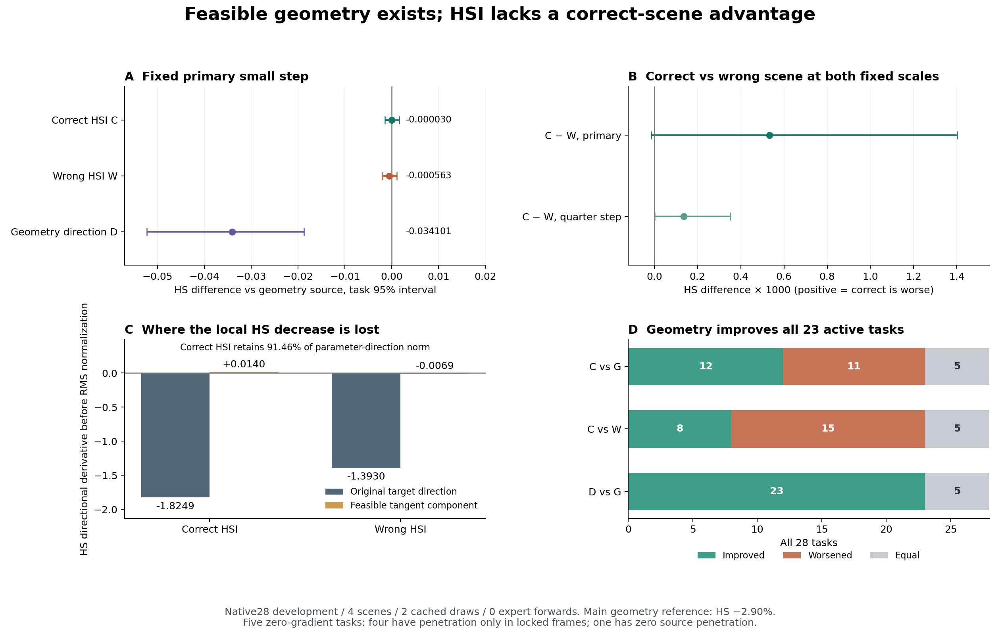

# Phase2.33 — 当前强解的可行方向诊断

**当前约束内存在可用的几何下降方向，固定HSI读出缺少正确场景优势。** 相同切空间和步幅预算下，纯几何方向使23条改善、0条退化，HS均值下降2.90%；正确HSI均值变化接近零，仍劣于错配。局部HSI信号条件失败，几何机会条件通过，分类为hsi_direction_misalignment。

## 全部28任务与固定步长

来源为2.32同一relation_20强几何动作，处于终点修复前。复用124窗口的正确/错配两次缓存预测，专家前向和训练均为0。首先将各非零切向方向归一为原生24点线性化RMS1mm，再用五方向共用的单任务缩放满足运动上界；主步1和副步0.25全部保留。几何方向和来源在两draw间共用同一结果。

| 固定28任务 | HS↓ | 相对G的HS变化 | 接触%↑ | 源地面近地足部% | 完成数 |
|---|---:|---:|---:|---:|---:|
|强几何来源G|1.177500173|—|66.8160|61.4245|22/28|
|正确HSI，0.25步|1.177497953|−0.000002220|66.8160|61.4245|22/28|
|正确HSI，主步C|1.177469796|−0.000030377|66.8160|61.4245|22/28|
|错配HSI，0.25步|1.177361570|−0.000138603|66.8160|61.4245|22/28|
|错配HSI，主步W|1.176936864|−0.000563309|66.8160|61.4245|22/28|
|纯几何方向，0.25步|1.168430183|−0.009069991|66.8160|61.4245|22/28|
|纯几何方向，主步D|1.143398905|−0.034101268|66.8160|61.4245|22/28|

全部OS均为11.607790，FS均约0.176571cm。C对G仅改善0.00258%，任务区间跨零；D改善2.90%，来自完整场景SDF的几何梯度。该参照检验局部可行机会，本轮没有把它升级为新的全469最优组合。

主步C对G为12改善/11退化/5相等，对W为8改善/15退化/5相等；D对G为23改善/0退化/5相等。C满足相对G的均值、其余27及覆盖条件，正确场景相对W的三项条件均失败。正确HSI及几何主步全部通过登记保护。副步也没有正确场景优势，未根据副步重新选择主方案。

## 配对区间与375敏感性

10000次seed42配对bootstrap，全体原生与方向指标分别按任务和场景归约。正式分母28，只有4个场景且任务已反复用于开发，区间描述当前固定数据。

| HS比较 | 均值差 | 任务95%区间 | 场景95%区间 |
|---|---:|---|---|
|C−G|−0.000030377|[−0.001452205,+0.001578777]|[−0.000401962,+0.000265393]|
|C−W|+0.000532932|[−0.000013515,+0.001401001]|[+0.000037152,+0.001363098]|
|D−G|−0.034101268|[−0.052257045,−0.018769041]|[−0.042774606,−0.018659249]|
|正确−错配，0.25步|+0.000136383|[+0.000001901,+0.000351696]|[+0.000014667,+0.000345341]|

预登记其余27：C−G=−0.000262309，任务区间[−0.001662941,+0.001330259]；C−W=+0.000162997，区间[−0.000075622,+0.000407467]。主步375的G/C/W/D分别为5.862796/5.869028/5.858506/5.715225。去掉375后，正确场景相对错配的均值方向仍未改善。

## 局部方向的根因证据

69个规范化坐标包含rootXYZ（5cm尺度）和22个右局部SO3增量（10°尺度）。原始HSI方向来自封存平滑目标与G的位姿差。以原生六锚点雅可比J计算P=I−J⁺J，投影几何方向为−Pg；六锚点是双手和四个足部点。首6/末3帧在所有方向中固定为0。以下导数是在每个方向原有参数幅度下、沿该方向走一个单位时的HS线性变化，投影前后使用相同参数尺度，尚未做等RMS归一。

| 方向导数，任务/draw均值 | 原始方向 | 保留的切向分量 | 去掉的法向分量 |
|---|---:|---:|---:|
|正确HSI|−1.824928|+0.013954|−1.838881|
|错配HSI|−1.392995|−0.006948|−1.386047|
|纯几何−g|−1.658185|−0.011929|−1.646256|

局部均值分解显示，正确HSI的HS下降贡献集中在改变被固定手足点的分量中。投影仍保留正确方向平均91.46%的规范化参数范数，剩余方向与可行几何方向的平均余弦为−0.002696（46个梯度非零的draw，另10个方向对应零梯度任务）；错配为+0.002961。正确方向23个下降、23个上升、10个零导数；错配29下降、17上升、10零。动作方向的幅度保留与场景有效性是不同量。

原始正确−错配导数差−0.431933，任务区间[−1.081208,+0.012169]、场景区间[−0.969383,−0.115308]；切向分量差+0.020902，分别[−0.004242,+0.059424]/[+0.002433,+0.052297]。这组区间保留了跨任务不确定性，分解结论限定在当前样本与当前局部方向。

几何梯度在23个非零任务中平均保留8.36%的范数，仍能逐条降低真实HS。故当前约束内有其他有效方向。该结果支持修正对“投影把所有有用运动压没”的理解：固定HSI读出的可行方向缺少正确场景优势，约束内的几何机会仍在。小步和导数已呈现这一现象，本轮没有为继续调同一读出的迭代数或幅度提供依据；全局非线性动作空间及其他教师读出方式仍属未验证范围。

## 数值核对与零梯度任务

来源16项原生指标及关节对封存G误差0。可微HS在q=0与原生HS最大差1.057342e−6；全部140个方向的解析导数、中心差分和主步真实变化符号一致，含零值。正确/错配/几何的中心差分绝对误差均值分别为3.645e−6/8.211e−6/1.200e−4，最大值2.769e−5/1.083e−4/1.885e−3。主步几何有限变化−0.034101与一阶预测−0.036788的差保留，体素插值、穿透边界和有限转动会产生曲率影响。

5个零梯度任务追加了同源完整表面的逐帧核对：374、420、425、15的全部残余穿透位于锁定开头帧（前4帧或前6帧），可编辑帧的HS贡献为0；19的来源HS为0。原生重建关节误差最多2.98e−7m。所有零任务均保留在28分母中，几何方向为精确零，HSI方向仍照常执行。

补充核对第一次命令从仓库根启动，原生SMPL相对资产路径要求code/工作目录，因而在产生核对结果前停止；改用原生工作目录后完成。audit_command_attempts.json记录两次命令状态，9个正式任务作业此前均已成功，原生结果和源码保持原样。

## 幅度与保护边界

13/28任务的共用尺度小于1，范围0.254519–1，均值0.804612。正确/错配主步平均线性RMS0.8046mm；几何平均0.6260mm包含5个精确零方向。在23个共同非零任务上三种方向每任务使用相同线性RMS。实际24点平均位移C/W/D为0.5568/0.5492/0.2220mm；RMS与平均位移、集中于少量帧的几何方向分别记录。

所有正步的原生六锚点最大误差1.350016e−6m；接触和源地面近地足部比例逐任务恒等，物体及首尾恒等。最大root变化4.9977mm、局部角变化2.0024°，修正速度最大29.9930cm/s，全帧/接缝均值的全局最大值0.5306/3.9958cm/s，满足最终登记界限。

正确HSI的112个正步和几何56个正步通过全部检查。错配的3个候选超过内部FK锚点1e−6m阈值：424/draw0/0.25步为1.0461e−6，376/draw1/主步为1.0341e−6，335/draw1/主步为1.2157e−6；它们的原生误差仍小于1e−5m。三个候选都保留在正式均值、配对对照和失败列表中，未重投影、筛除或更换幅度。

手部位置恒定仍允许表面变化。C相对G的hand_pen_loss差−0.000227，任务区间[−0.000671,+0.000223]；human_pen_loss差−0.002440，区间[−0.010160,+0.006669]。D对应差−0.0000173和−0.0001682，区间均跨零。完整手/人体—物体指标及所有区间保留，未把接触恒定扩大解释为抓握表面恒定。

## 实现、资源与封存

预登记7b6e38c，运行实现bf0837c，分支phase/02ad-hsi-feasible-direction。协议experiments/protocols/p2_hsi_feasible_direction_s42_20260908.json，配置config_sample_hosi_feasible_direction.yaml。mixer/body_projection.py增加切向速度、方向归一和原生HS微分工具；现有80步求解器保持原样。mixer/diagnostics.py中的命名诊断复用已有数据/评价入口，新增3项组件检查。core及两个专家目录保持原样。

正式前28组件检查通过（4.52s），全套1116 passed/4历史skips（207.07s），417条registry有效。全部9份Hydra配置完全解析，机器/输入引用及进程级THP关闭、4CPU线程上下文归档。375完整426帧首任务通过后，8GPU完成其余27条。

9作业全部exit0，控制器131.564s；28任务/124缓存窗口，392条task-draw-arm报告行、308次独立正步/来源原生评价、140次负步HS核对。主计算累计梯度15.900s、射线重建/评价379.768s，任务合计414.809s，单进程GPU峰值0.9373GiB。375梯度1.140s、完整任务20.744s，提供正式完整长度功能/性能记录。当前8×RTX3090与既有HSI训练共享，耗时仅描述实际环境；专家前向、训练、HOI生成、终点修复和469均为0，额外smoke和新hash机制均未添加。

运行results/experiments/p2-mixer-hsi-feasible-direction-s42-20260908的manifest已在干净bf0837c源码完成，所有lane起止源码一致。保留9份配置、日志、机器预检、输入引用、全部方向/梯度/正负步动作、原生及导数统计、失败候选、零梯度核对与命令失败记录。紧凑结果experiments/results/p2_mixer_hsi_feasible_direction_s42_20260908.json，一页报告/data/yujinlun/report/PriorHOSI_hsi_feasible_direction_20260908.md，图表提供PNG/PDF。

工程门槛为完整诊断封存，科学正结果独立判定。完成提交整合至本地phase/02-mixer，由exp/p2ad-hsi-feasible-direction-v1定位。下一会话先读本总结、OVERVIEW和Phase2计划。本轮结束于方向诊断；下一入口可按用户已表达的退化容忍偏好，具体登记现有HSI身体读出接入P15+guide、关系保持编辑和终点修复的全469对照，分别报告HSI参与程度与正确场景贡献。该全量接入及任何新的读出/训练均未在本轮执行。

最终封存检查：1116 passed/4历史skips，207.39s（authority-completion.log）；418条registry有效，正式manifest已在干净bf0837c上完成，图表已核对。Phase2.33工程门槛完成，局部HSI场景信号失败、几何机会通过。完成提交快进整合至本地phase/02-mixer，标记exp/p2ad-hsi-feasible-direction-v1。
