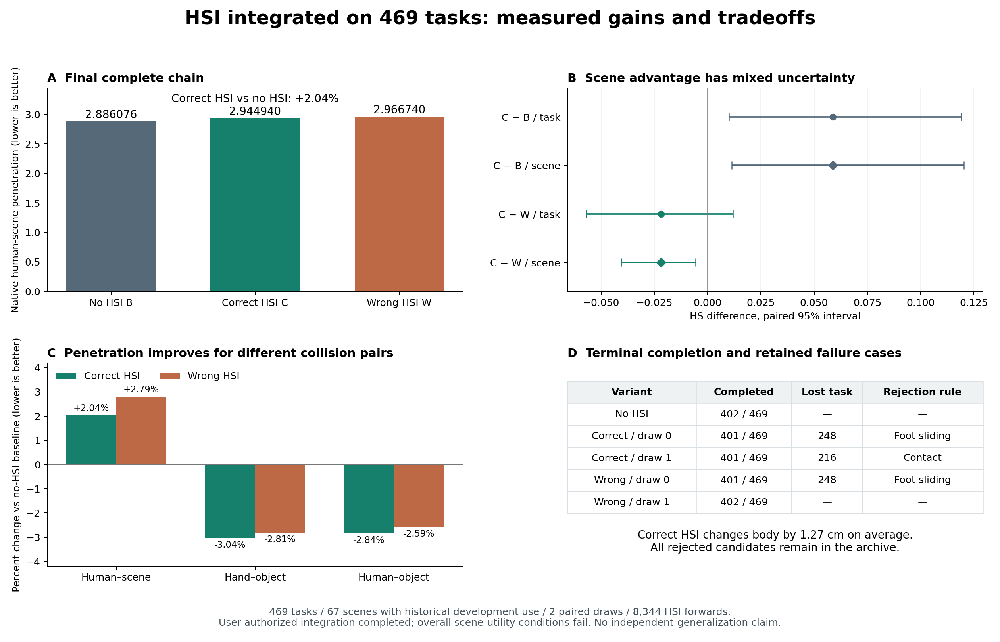

# Phase2.34 — HSI接入最优组合的完整469任务结果

**用户授权的HSI接入已完成，保留约定的质量取舍。** 正确HSI完整链HS为2.944940，相对无HSI完整基线2.886076退化2.04%；两个draw各完成401/469，基线402/469。手—物体穿透均值下降3.04%，人体—物体穿透下降2.84%。正确场景HS优于错配，场景级区间支持这一差异，任务级区间跨零；整体场景收益条件失败。

## 完整链与全部原生指标

固定链为P15+guide → relation-preserving edit → 受约束HSI身体读出 → terminal repair。正确/错配各两个固定配对draw，逐draw原生评价后平均；无HSI基线引用同一批封存输入和终点结果。全469任务、67场景、2086窗口、90426帧均保留。正确场景版本作为本次已批准接入的交付配置，无HSI结果继续承担原质量参照。

| 最终指标 | 无HSI基线B | 正确HSI C | 错配HSI W |
|---|---:|---:|---:|
|HS：人—场景穿透↓|2.886076|2.944940|2.966740|
|OS：物体—场景穿透↓|12.070963|12.071370|12.070963|
|FS cm↓|0.171446|0.171416|0.171409|
|接触比例↑|0.692397|0.692490|0.692487|
|完成比例↑|0.857143|0.855011|0.856077|
|手—物穿透均值 cm↓|0.382184|0.370555|0.371432|
|人体—物穿透（原生尺度）↓|6.100995|5.927422|5.943054|
|手—物穿透帧比例↓|0.192701|0.188500|0.189557|
|人体—物穿透帧比例↓|0.196303|0.192980|0.193979|
|HS s_max↓|35.358753|35.928285|36.614336|
|人景穿透帧比例↓|0.281594|0.285983|0.285952|
|OS s_max↓|112.391007|112.391007|112.391007|
|物景穿透帧比例↓|0.231422|0.231551|0.231422|
|人体终点误差 cm↓|3.563369|3.563369|3.563369|
|物体终点误差 cm↓|7.215026|7.223829|7.220357|
|原生地面估计 cm|4.017984|4.017821|4.017864|

正确完成率85.5011%，基线85.7143%，下降0.2132个百分点。错配两个draw完成401和402条，平均85.6077%。正确接触率69.2490%，基线69.2397%，变化+0.0093个百分点；FS变化−0.000030cm、OS变化+0.000407，均属很小的均值变化。HS退化与手/人体—物体穿透改善分别陈述，避免混淆不同碰撞对象。

| 终点修复前 | HS↓ | OS↓ | FS cm↓ | 接触%↑ | 完成数 |
|---|---:|---:|---:|---:|---:|
|关系保持几何G|2.890980|12.102161|0.171480|69.2011|357/469|
|正确HSI投影|2.948934|12.102161|0.171486|69.2011|357/469|
|错配HSI投影|2.971393|12.102161|0.171480|69.2011|357/469|

两项失败条件为最终C相对B的至少1%额外HS改善、完成率不下降。正确场景相对W至少0.5%基线HS优势、接触、FS、OS条件通过。scene_utility=false按预登记保留；用户已接受适度指标退化，工程接入交付与科学收益判定分开。

## 不确定性与场景贡献

所有原生指标采用10000次seed42任务/场景配对bootstrap。469条及67场景均有历史使用；原28条持续用于开发，其余441也有历史使用，不宣称独立未见泛化或跨训练种子结论。

| 最终比较 | 均值差 | 任务95%区间 | 场景95%区间 |
|---|---:|---|---|
|C−B / HS|+0.058864|[+0.010053,+0.119103]|[+0.011311,+0.120397]|
|C−W / HS|−0.021800|[−0.056996,+0.011839]|[−0.040532,−0.005661]|
|C−B / 手—物穿透|−0.011629|[−0.014332,−0.009007]|[−0.013803,−0.009469]|
|C−B / 人体—物穿透|−0.173573|[−0.215443,−0.132620]|[−0.208032,−0.138532]|

C对B：183条HS改善、208条退化、78条相等；场景为25改善/42退化。C对W：201改善/190退化/78相等；场景为44改善/23退化。因此正确场景有减少相对错配退化的证据，当前证据尚未建立相对无HSI的整体收益。

C对W的手—物/人体—物穿透差分别−0.000877/−0.015632，任务及场景区间均跨零。这些表面指标相对无HSI的改善不能全部归因于正确场景知识，通用身体修正也可能贡献。

预登记去掉375后的468条：C−B HS+0.058705，任务区间[+0.009523,+0.121460]；C−W−0.022194，区间[−0.057264,+0.012029]。原28条的C−W为+0.011450，余441为−0.023912，区间[−0.060366,+0.012273]；余441的C−B仍+0.061340，区间[+0.009737,+0.125978]。所有分组为描述性分析，未改变469正式分母或构造任务路由。

## 终点完成损失与拒绝候选

无HSI终点阶段从357恢复45条，达到402。正确每个draw恢复44条、均达到401；错配draw0恢复44、draw1恢复45。正确的完成损失发生在两个不同任务：

| 任务 | draw / view | 候选已恢复终点 | 被拒原因 |
|---|---|---|---|
|248 / smallbox|draw0正确、draw0错配|是|FS：输入0.156716cm，候选分别0.201687/0.200101cm，超过输入+0.02cm|
|216 / tripod|draw1正确|是|接触0.371212→0.348485，下降0.022727，超过0.02|

保护规则拒绝候选后保留其终点修复前动作，因而失去原无HSI基线可恢复的完成。候选、优化轨迹和拒绝原因全部保留，未放宽阈值或把被拒候选计为最终完成。

每种view跨两draw共224次终点尝试：正确88次恢复、136次拒绝；错配89次恢复、135次拒绝。拒因可重叠：正确为completion_recovery124、contact5、OS18、FS3；错配分别124、3、18、4。该耦合表明终点修复的收益依赖输入身体姿态，即使前一步锁定了首尾和手足位置。

## HSI影响与保护审计

8344次真实HSI前向全部完成。正确投影的24点平均身体位移1.2680cm，468/469条达到0.5cm；唯一低于该值为151号任务0.4338cm。最终正确链相对无HSI最终动作的24点平均差1.2694cm、28点差1.3749cm。HSI实际改变了身体动作。

正确938个投影的幅度为1×75、0.5×772、0.25×89、0.125×2；错配为1×69、0.5×761、0.25×102、0.125×4、0.0625×1、0.03125×1。全部为非零幅度。正确/错配逐任务draw平均保留平滑目标28点位移18.06%/17.81%，与24点主运动量采用不同分母。

投影前后接触逐任务恒等，物体与首6/末3帧恒等。最大原生六锚点误差1.441644e−6m，内部FK误差9.99156e−7m；全局root变化最大9.8217cm、局部角19.8383°，修正速度最大29.9968cm/s，全帧/接缝均值最大8.2138/9.1180cm/s，均满足固定界限。源地面近地足部比例均值0.612496906→0.612494279，保留原生阈值的末位变化。终点阶段允许原有目标修正，其动作变化另行记录。

每条G的原生16指标和关节误差0，终点缓存输入指标误差0；旧28条source/正确投影/错配投影全部原生指标与2.32误差0。19/358/375无HSI终点回放的原生指标、关节、物体误差0，接受/拒绝与封存结果一致。

2086个当前动作查询的human-goal位置误差0，其余参数和动态物体审计通过；世界位置编码往返最大6.26e−7m、直接粗帧原生身体最大7.15e−7m。原生时间插值的全帧往返最大偏差2.1936cm作为诊断保留；clean/预测差分还原的零残差恒等误差0，最终基准始终是精确原始30Hz几何动作。与旧HOI预测位置通道的窗口均值差4.0800cm，当前表示契约与2.32一致。

## 固定实现、运行与交付

预登记22ebd20，实现d806bd3。协议experiments/protocols/p2_hsi_integrated469_s42_20260908.json，交付配置code/config/config_sample_hosi_integrated469.yaml。原P15+ArmB来源、relation_20几何和无HSI终点均引用封存469产物。R2 epoch222 EMA、noise199、两配对draw、当前动作编码、完整身体差分还原和原80步六锚点投影固定；未加入2.33纯几何下降方向。

apply_terminal_repair复用原外部终点语义：从源姿态重建顶点；成功输入保持原样，失败输入使用最后一秒8cm目标裕量、5cm平移上限、20步原目标及原验收。组件检查覆盖固定步数、拒绝候选保存和成功恒等。动作先于完成指标写入，三个前置任务的落盘文件回读通过。core、两个专家及原投影求解器保持原样。

9作业全部exit0。2026-09-08 14:15:26–15:50:09 UTC完成运行与自动封存；控制器5657.189s，约94.3分钟。任务耗时合计39720.333s，其中投影30076.210s、终点5750.953s；教师查询592.948s，包含前向295.323s。这些是跨任务/设备耗时之和，不能与wall直接相加。单进程峰值显存1.8159GiB；8×RTX3090与既有HSI训练共享，耗时仅描述实际环境。该耗时从已缓存几何动作开始；完整从头生成的端到端延迟未测量。全程无HOI新生成、专家训练、参数搜索或运行失败。

正式前29组件检查通过（4.69s），全套1117 passed/4历史skips（204.41s），419条registry有效；9份resolved配置、硬件预检、进程级THP关闭及4CPU线程、输入引用、任务完整输出均保留。额外smoke和新hash机制均未添加。

manifest已在干净d806bd3源码自动完成，各lane起止源码一致。运行目录results/experiments/p2-mixer-hsi-integrated469-s42-20260908；completion_metrics.json包含正式全量统计，analysis/completion_secondary.json补充幅度、候选和查询审计，原manifest及指标保持原样。完整正确动作位于各任务motion.pt的correct_terminal_draw0/1，两个draw均保留，指标取两者均值。

紧凑结果experiments/results/p2_mixer_hsi_integrated469_s42_20260908.json；一页报告/data/yujinlun/report/PriorHOSI_hsi_integrated469_20260908.md；本图提供PNG/PDF。完成提交由exp/p2ae-hsi-integrated469-v1定位，整合至phase/02-mixer。按用户已批准的指标取舍交付HSI完整链，并保留无HSI质量参照。下一会话先读本总结、OVERVIEW和Phase2计划；本阶段截至完整接入封存，任何后续调参、训练或新方法均须另立具体实验。

最终封存检查（2026-09-09）：1117 passed/4历史skips，201.85s；420条registry有效，正式manifest已完成，图表已核对。Phase2.34按用户批准的质量取舍完成交付，科学整体收益条件保持失败记录。完成提交快进整合至phase/02-mixer，标记exp/p2ae-hsi-integrated469-v1。
