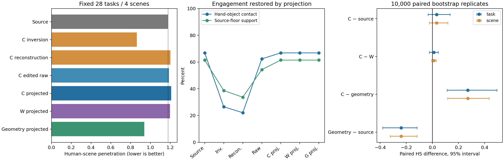

# Phase2.35：冻结R2的DNO编辑，重建与场景收益条件失败

2026-09-10封存。28条/4场景/124窗口/5376原生帧全部完成，复用r1的23条完整编辑结果，r2补齐5条。固定DNO配置未建立HSI场景编辑收益：源动作HS1.177500，正确投影1.209680（+2.73%），错配1.198180，纯几何0.938860（−20.27%）。最终接触、支撑、物体和首尾保护通过。300步源动作重建的身体平均误差15.5004cm，28条均未通过预登记重建条件。

## 任务范围与固定方法

用户目标是利用HSIPrior场景知识编辑HOIPrior输出，同时保持人—物交互。本轮授权试验的输入是HOIPrior经relation_20几何编辑后的强来源，优化人体未来216通道，物体轨迹固定。它检验该来源上的人体编辑；人体与物体共同改道仍未覆盖。全部28任务已有开发使用，4个场景的区间只描述当前集合，不构成独立泛化证据。

冻结R2 epoch222 EMA，使用本地官方DNO实现与infbagel环境。固定100步DDIM反演、10步可微DDIM、300步正确场景重建，正确/错配各300步编辑；Adam归一化梯度、lr .05、warmup50、去相关权重1000、seed42。全部窗口共同优化，生成历史跨窗反传；场景查询、动态物体体素与目标仍固定在源动作条件。两种编辑从同一正确场景拟合latent出发，共用真实SDF和源约束，并重置相同随机状态。

原生GPU可微插值、24帧分块SMPL-X全表面SDF与身体/六锚点/速度目标贯通至latent。只补偿clean编码与原生重采样差，不消去反演误差。原有平滑及80步精确锚点投影用于编辑和零编辑重建，保留完整XYZ/yaw目标，所有物理界限固定。纯几何参照在69坐标中优化300步同一物理目标；其计算开销与DNO不同。所有阶段均评价并保留。

## 原生结果与场景贡献

|阶段|HS↓|接触%↑|FS cm↓|源地面支撑%↑|身体28点变化cm|
|---|---:|---:|---:|---:|---:|
|源动作|1.177500|66.816|0.17657|61.424|0|
|正确反演往返|0.863382|26.548|0.05490|38.699|18.2593|
|正确300步重建|1.202375|22.097|0.05571|33.679|15.5004|
|正确重建后投影|1.201436|66.816|0.17657|61.424|1.5684|
|错配重建后投影|1.195450|66.816|0.17657|61.424|1.7616|
|正确编辑原始|1.187961|62.350|0.19401|54.312|5.9971|
|正确编辑平滑|1.249116|62.132|0.12192|54.960|5.0363|
|正确编辑投影|1.209680|66.816|0.17657|61.424|1.3882|
|错配编辑投影|1.198180|66.816|0.17657|61.424|1.6569|
|纯几何原始|0.687566|66.816|0.17660|61.428|0.1183|
|纯几何投影|0.938860|66.816|0.17657|61.424|0.0964|

18阶段全部原生指标及衍生指标见紧凑JSON。各阶段完成数均22/28；端点及物体固定，因此完成数保持不能证明重建的中间交互质量。正确原始重建接触下降44.719个百分点、支撑下降27.745个百分点；反演后较低HS/FS伴随交互与支撑损失。最终保护主要由精确投影恢复。

以下均为HS差，负值表示前者更好。10000次seed42配对bootstrap，任务与场景分别作为重采样单位。

|对比|均值差|任务95%区间|场景95%区间|
|---|---:|---|---|
|正确投影−源|+.032180|[-.033969,.135357]|[-.023175,.117522]|
|正确投影−错配投影|+.011500|[-.023107,.045675]|[-.006098,.029098]|
|正确投影−纯几何投影|+.270821|[.113075,.493908]|[.116734,.434155]|
|纯几何投影−源|−.238640|[-.380754,−.118186]|[-.323711,−.117596]|
|正确编辑投影−正确重建投影|+.008244|[-.011795,.028603]|[-.001349,.020272]|
|错配编辑投影−错配重建投影|+.002731|[-.034101,.045683]|[-.036152,.033118]|
|正确编辑变化−错配编辑变化|+.005513|[-.031153,.042156]|[-.011957,.033563]|

正确对源11改善/13退化/4相等，对错配13/11/4，对几何1/23/4。几何对源23改善/0退化/5相等。绝对C/W比较带有正确场景拟合初始latent的偏置；各自投影重建为起点的变化之差也没有建立正确场景优势。

375的源/C/W/G分别5.862796/7.075399/7.085483/4.525803，是全28均值退化的主要来源。预登记其余27的C−源为−.011539，任务区间[-.043224,.014357]；C−W为+.012299，C−G为+.186422。该敏感性分析保留，不据此剔除375。源改善与正确场景收益两个条件失败，六项保护条件通过，utility=false。

## 重建瓶颈与损失尺度

正确重建平均15.5004cm，范围9.4017–40.3576cm，身体<=1cm为0/28，完整重建门槛也是0/28。本轮源重建已经失败，因此关于DNO编辑能力的结论受这一上游问题限制。有限步优化、10步采样、100步反演与源固定条件共同定义了本次负结果。

直接从28条已保存trace读取第300次更新前目标：身体损失均值155.102，feature均值.05315，加权去相关均值808466.743、中位数7700.934；逐任务“加权去相关/身体”比值中位数57.6835、范围1.30035–19271.7164，28/28大于1。均值受到极端任务影响，所以同时保留逐任务值和中位数。官方trace的loss字段只记录criterion，去相关项另列，不能把该字段解释为总优化目标。

这是迁移默认权重的尺度疑点。当前日志没有分项梯度范数和夹角，损失大小不能推出梯度主导关系。正式前沿用作者1000权重，缺少针对R2反演latent的尺度审计，是本次实验设计的限制；不能据此认定R2不能表达源动作，或DNO/HSIPrior整体无效。

## 数据完整性与运行失败

504份阶段动作、84份300步优化检查点全部回读；全部物体平移/旋转及首6/尾3帧姿态、平移、关节逐项相同，latent与全部trace梯度有限。阶段指标与任务记录最大差0；源关节、源原生指标、clean恒等还原误差均0。正确投影原生六锚点最大1.07949e−6m，三投影臂总体最大1.24458e−6m。正确最大root7.6738cm、角19.9602°、修正速度28.4293cm/s，全帧/接缝均值上界5.51555/9.09858cm/s，满足固定界限。

第一次manifest建立后因tmux缺失失败，GPU与前向为0。r1采用独立持久进程，运行12071.06s，23条完成；371/421在source重复SMPL-X解码时因浮点差超过1e−5检查失败，余3条未启动。根因修复直接保留入口已验证source，保持阈值、优化输入及全部数值算法。r2保留23条编辑轨迹的原文件引用，仅将source记录恢复为同一封存原生参照；补跑18/331/371/421/423，五作业全部exit0。两个失败manifest、部分输出与逐项恢复说明均保留。

r2于2026-09-09 15:37:15–16:41:04 UTC完成并自动封存，补跑控制器3823.49s。完整28的任务耗时合计58342.14s，实际HSI前向2251840次（包含梯度检查点重计算），单进程峰值1.32527GiB，低于5GiB预算。原23条与补跑5条的分组、GPU分配和资源争用分别记录；这些耗时描述实际环境，不是公平速度对照，也不包括重新生成HOI来源。

## 验证、产物与交接

预登记20b6192，实现f1b28b8；启动失败治理0638d63；source根因修复b10a704。协议experiments/protocols/p2_hsi_dno_s42_20260909.json，配置code/config/config_sample_hosi_dno.yaml。实现位于code/mixer/diffusion_noise.py，现有诊断入口接入；body_projection的keep_planar默认值保留历史行为。core及两个专家源码保持原样。

37项组件检查通过，覆盖DDIM与跨窗反传、原生插值、分块物理目标梯度、实际DNO恢复与完整平面目标。修复后完整authority1125 passed/4历史skips，214.02s。正式完整任务承担功能/性能验证，未添加额外smoke或哈希机制。运行前配置完全解析，两个来源源码均干净，运行与完成版本一致。

运行根目录results/experiments/p2-mixer-hsi-dno-r2-s42-20260909；completion_metrics.json为自动封存主结果，analysis/completion_secondary.json为本次完整性、损失和范围核对，recovery_records.json指向全部复用来源。紧凑结果experiments/results/p2_mixer_hsi_dno_s42_20260909.json，最终报告/data/yujinlun/report/PriorHOSI_hsi_dno_final28_20260910.md；自动报告与23条阶段报告继续保留。输入身份和已有manifest记录按原引用保存。

工程门槛为完整28诊断封存，已达到；科学重建与收益条件失败。完成提交由exp/p2af-hsi-dno-v1定位，快进整合至phase/02-mixer。当前固定DNO方案停止，已有几何和完整HSI链作为参照保留。下一会话先读本总结、OVERVIEW与Phase2计划；建议先提出针对源重建的采样/反演一致性和分项梯度诊断，再决定编辑实验。任何新配置、训练、469扩展或人体物体联合改道须另立具体实验，本次没有启动。

最终封存检查（2026-09-10）：1125 passed/4历史skips，204.05s；424条registry有效，504阶段动作与84最终检查点核对通过，图表已核对。完成提交快进整合至phase/02-mixer，标记exp/p2af-hsi-dno-v1。工程诊断完成，科学重建与场景收益失败按原结果封存。
