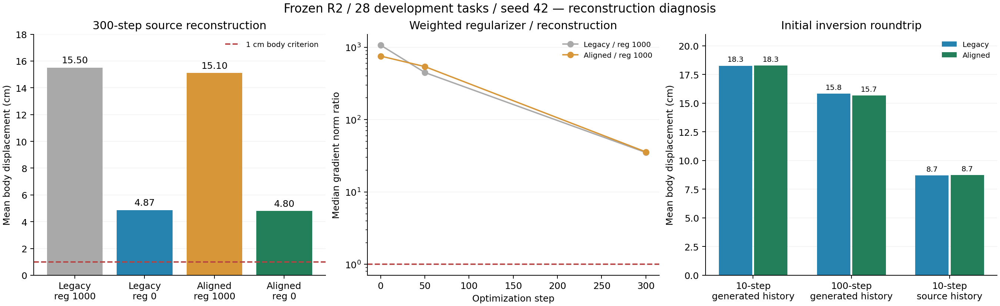

# Phase2.36：去相关主导源重建梯度，重建条件仍未通过

2026-09-10完成。28条/4场景/124窗口/5376原生帧，9作业全部exit0。旧反演端点下，关闭去相关将300步身体平均误差从15.5004降至4.8680cm，28/28改善；对齐端点并关闭去相关为4.8007cm。四臂均0/28通过原重建条件，工程诊断完整交付。

## 范围与固定方法

用户批准源动作重建采样/反演/分项梯度诊断。来源沿用Phase2.35：HOIPrior经relation_20几何编辑后的固定28条强解，冻结R2 epoch222 EMA，物体轨迹与原生首6/末3帧固定。当前交付是源重建诊断；用户的HSI编辑HOI并保持人—物交互目标仍待后续建立，人体与物体共同改道尚未覆盖。

端点（旧pure-noise/对齐R2第499步）×去相关（1000/0）固定2×2。原臂直接复用完整sealed结果，另三臂分别300步DNO；100步反演、10步可微DDIM、lr.05、warmup50、seed42，以及native28坐标MSE/(1cm)^2+216特征MSE保持。aligned反演在第499步状态结束；旧端点多做的alpha=0转移被单独隔离。两者仍共享clean作为t0的近似反演约定。

初始两端点各解码10/100步生成历史，以及10步源历史，均只作初始诊断。每臂初始/50/300步分别测身体、特征和去相关对latent的导数，保存恢复CPU/CUDA RNG，不改变优化序列。源场景网格、动态体素、文本与目标保持固定；生成历史仍贯通梯度。没有本轮场景编辑、重建后的硬投影、权重搜索或训练。

## 完整原生结果

|阶段|身体误差cm↓|接触%|源地面支撑%|FS cm|HS|
|---|---:|---:|---:|---:|---:|
|source|0.0000|66.816|61.424|0.17657|1.177500|
|legacy_ddim10|18.2593|26.548|38.699|0.05490|0.863382|
|legacy_ddim100|15.8117|38.354|32.427|0.04324|0.755634|
|legacy_source_history10|8.7019|49.661|24.198|0.05281|0.766486|
|aligned_ddim10|18.2623|26.030|38.761|0.05936|0.863864|
|aligned_ddim100|15.6645|38.415|32.352|0.04282|0.759297|
|aligned_source_history10|8.7246|48.478|24.196|0.05232|0.744340|
|legacy_reg1000|15.5004|22.097|33.679|0.05571|1.202375|
|legacy_reg0|4.8680|62.142|50.460|0.05005|1.937044|
|aligned_reg1000|15.1027|24.900|33.249|0.05210|1.448795|
|aligned_reg0|4.8007|63.170|49.496|0.04918|1.170419|

关闭去相关的legacy臂误差范围1.6372–13.5624cm；aligned臂1.5545–12.7054cm，身体<=1cm的任务仍为0。后者接触/支撑/FS分别11/7/26条满足原条件；四项全部通过为0。对齐+零正则的接触66.816%→63.170%、支撑61.424%→49.496%；FS下降应与交互减少共同解读。HS变化不是本轮场景收益证据，目标中没有场景编辑项。

物体及首尾固定使终点完成指标缺少动作内部交互的判别力；全帧手足保持未通过。关闭去相关只用于因果对照，不能凭重建下降宣称保留了原噪声/动作分布。其latent RMS均值6.7198→7.0699（legacy）与6.6945→7.0311（aligned），均明显偏离单位噪声尺度。

## 因果对照与不确定性

旧端点关闭去相关：身体差−10.6324cm，任务95%配对区间[−12.3370,−9.1905]、场景[−12.4339,−8.8308]，28改善/0退化。对齐端点关闭去相关同样28/0，差−10.3020cm，两单位区间均低于0。预登记其余27条方向一致（旧端点−10.7655cm）。

保持去相关1000时，端点对齐差−.3977cm，20改善/8退化；任务区间[−.7389,−.0072]，场景[−.7181,.0491]。正则为0时，端点差−.06734cm，15改善/13退化；任务[−.3070,.1774]、场景[−.1560,.0334]均跨零。因子交互+.33034cm，两单位区间跨零。数据支持默认去相关是本固定预算的主要障碍；端点修正影响较小，当前不能建立稳定额外收益。

统计沿用tools/paired_bootstrap.py的配对实现、10000次seed42任务/场景bootstrap，所有原生指标完整保留；四场景各7条，因此本集合两个加权单位的点均值相同。全28均已有开发使用，区间只描述本集合，不作独立泛化或跨种子主张。

## 实际梯度及采样/历史定位

旧reg1000的加权去相关/重建梯度范数比中位数：初始1066.72、50步447.12、300步35.13；三个时点均28/28>1。初始范围37.06–22891.96，300步2.99–2954.46。重建与总梯度余弦中位数−.00206/.00358/.01256，分别16/10/12条为负。aligned reg1000末步比值35.75，余弦中位数.00205。这里测的是Adam预处理前的梯度，不能当作Adam实际位移方向。

reg0臂也记录“若乘1000”的正则梯度，属于统一尺度审计；实际优化权重为0，总梯度与重建梯度同向。身体项与特征项独立记录于336个snapshot和完整records，原Phase2.35只测loss大小的疑点现有直接梯度证据支持。

初始旧端点10→100步解码误差18.2593→15.8117cm；替换源历史为8.7019cm。aligned相应18.2623→15.6645/8.7246cm，两种诊断的任务/场景差区间均低于0。该证据显示采样离散化和生成历史敏感性；源历史属于条件替换诊断，仍有约8.7cm误差，不能据此断言最终4.8cm全部由跨窗传播造成。

R2 alpha[499]=.0063527124，sqrt约.0797039，旧pure-noise与该状态不同；两端点latent差RMS均值仅.04606，旧latent RMS均值6.7198。对齐的物理契约正确性与实测收益分开报告。clean lift恒等28条误差均0，说明本层恒等补偿有效；有限预算未达标不能证明R2全局不可表达。

## 执行、核对与交付

正式run p2-mixer-hsi-dno-reconstruction-s42-20260910在干净bdee7db开始/结束，2026-09-09T17:05:38Z至22:18:12Z。9作业全部成功，控制器18742.29s（5.206h），任务合计80323.09s，2307516次实际HSI前向含重计算，峰值1.11261GiB。GPU4–7与既有任务争用，后四作业约3.55–4.11h，前四余量作业约1.42–1.56h；耗时只描述本次资源分配，不能当公平速度对比。

252新增动作、84最终300步检查点、336梯度snapshot全部回读；新臂初始latent精确对应登记来源，物体平移/旋转和首6/末3 pose/translation/joints精确保留，所有被核对张量有限。复用source、旧初始解码与旧重建指标差0。84条新重建与28旧臂完成四臂全量；没有科学失败触发加步或筛选。

验证：实现前10组件检查通过、完整authority1127 passed/4历史skips（196.47s），9份resolved配置及425条registry有效。完整375正式任务提供功能/显存/检查点验证。完成验证记录随后附于本文件。未改core、HOI或HSI专家代码，未添加额外smoke/hash机制或tools脚本。

预登记5add1f2，实现bdee7db；完成提交由exp/p2ag-hsi-dno-reconstruction-v1定位，快进至phase/02-mixer。协议experiments/protocols/p2_hsi_dno_reconstruction_s42_20260910.json；紧凑结果experiments/results/p2_mixer_hsi_dno_reconstruction_s42_20260910.json；原始manifest、全指标/配对区间、records和completion_secondary均在results/experiments/p2-mixer-hsi-dno-reconstruction-s42-20260910/。既有input_references指向封存输入身份，原2.35结果继续保留。

工程门槛完成，科学重建门槛失败。下一入口先提出生成历史下的源拟合诊断：隔离窗口内拟合与跨窗传递、使用固定预算验证剩余误差；本轮没有自动运行该方向。后续场景编辑须同时验证源重建、内部人—物交互及正确/错配场景贡献，当前结果不能直接外推。

最终封存验证：1127 passed/4历史skips（198.16s），426条registry有效，git diff --check通过；图表已核对。预登记占用正式run id，追加完成行使用独立completion记录id并显式指向原run_id；原假设和正式manifest保持。
