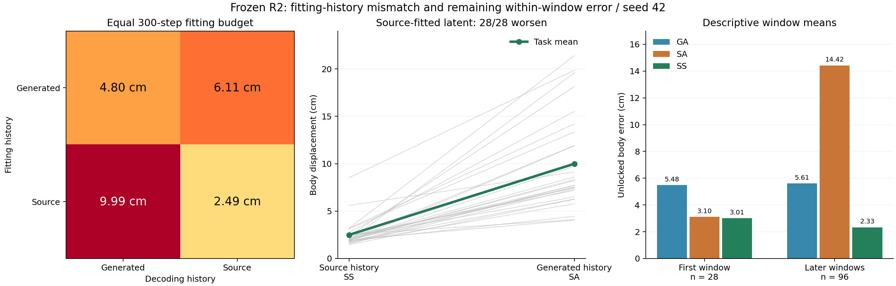

# Phase2.37：跨窗历史传递退化明确，源条件窗口拟合仍有残差

2026-09-10完成。28任务/4场景/124窗口/5376原生帧，9作业全部成功。源历史拟合、源历史解码（SS）身体平均误差2.4932cm；相同latent改用生成历史（SA）为9.9903cm，28/28退化。既有生成历史拟合/解码（GA）4.8007cm。四格均0/28通过原重建条件，工程诊断完整交付。

## 授权范围与固定对照

用户批准定位跨窗源拟合剩余误差。来源沿用2.36全部28条HOIPrior经relation_20几何编辑后的强解，冻结R2 epoch222 EMA。对齐第499步初始latent、10步DDIM、去相关0、lr.05/warmup50/seed42、原生28坐标MSE/(1cm)^2+216特征MSE全部保持。物体及原生首6/末3固定，源场景网格/目标/文本/动态体素条件保持。

G表示生成历史拟合，直接复用2.36的300步解；S表示新增源历史拟合，同一初始latent和300步预算。每个解分别采用生成历史（后缀A）或源历史（后缀S）解码：GA、GS、SA、SS。初始latent的两种历史读出也完整回放。全部窗口共同优化；源历史固定各窗输入前缀，原生插值仍连接相邻输出样本，因此这里的窗口拟合不等同于彼此完全独立的原生序列。

本轮只检验拟合/解码历史及残差。没有增加迭代、课程、重启、场景编辑项、输出投影、训练或469扩展。原方法和全部科学负结果保持。

## 完整原生结果

|阶段|身体误差cm↓|接触%|源地面支撑%|FS cm|HS|
|---|---:|---:|---:|---:|---:|
|source|0.0000|66.816|61.424|0.17657|1.177500|
|initial_A|18.2623|26.030|38.761|0.05936|0.863864|
|initial_S|8.7246|48.478|24.196|0.05232|0.744340|
|GA|4.8007|63.170|49.496|0.04918|1.170419|
|GS|6.1075|57.061|35.750|0.05060|0.838754|
|SA|9.9903|47.385|58.209|0.21202|1.117763|
|SS|2.4932|65.495|49.062|0.05525|0.908022|

SS身体误差范围1.4571–8.5115cm，原身体<=1cm条件仍0/28。SS的接触/支撑/FS条件通过数13/5/27；GA为11/7/26，GS为6/3/27，SA为4/14/17。所有四格身体及完整重建条件均失败。

SS接触65.495%接近源66.816%，但源地面支撑49.062%仍低于61.424%；平均手—物漂移2.5442cm，原生接缝速度76.8846cm/s高于源55.0803。物体与首尾固定使完成数维持22/28，其不反映内部交互是否保持。HS与FS变化须结合接触、支撑和运动幅度阅读；本轮没有真实SDF编辑目标或正确/错配场景对照，不能作为HSI场景编辑收益。

## 历史作用与配对证据

|对照（身体误差cm）|均值差|任务95%区间|场景95%区间|改善/退化/相等|
|---|---:|---|---|---|
|SS−GA|−2.3075|[−2.9890,−1.6728]|[−3.1321,−1.6928]|27/1/0|
|SA−SS|+7.4972|[5.9847,9.1617]|[5.6027,10.0956]|0/28/0|
|GS−GA|+1.3068|[.8467,1.7435]|[.8679,1.6792]|4/24/0|
|SA−GA|+5.1897|[3.9945,6.5040]|[3.5049,6.8846]|1/27/0|
|SS−GS|−3.6144|[−4.0084,−3.1989]|[−3.9999,−3.3644]|28/0/0|

交互(SA−SS)−(GA−GS)=+8.8040cm，任务区间[7.4292,10.3176]、场景[6.9836,10.8852]。拟合latent对历史条件的补偿有直接证据：改成源历史会改善未优化初始latent（18.2623→8.7246），却使已按生成历史拟合的latent平均退化（4.8007→6.1075）。源条件下更小的重建误差也无法直接转移到生成历史解码。

其余27条保持结论：SS−GA−2.1788cm，SA−SS+7.1001，GS−GA+1.3602，任务区间均保持方向。375的GA/GS/SA/SS为8.9719/8.8384/21.4052/3.1879cm；该敏感性完整保留，主要结果并非仅由375决定。

所有原生指标均用现有paired_bootstrap实现、10000次seed42任务/场景配对区间。四场景各7条；全部任务已有开发使用。区间描述当前集合，不作独立泛化或跨训练种子主张。

## 逐窗误差与梯度

已记录每个读出的124窗原生28点mean/RMS/解锁帧误差、root、216特征MSE、输入历史的关节特征误差、边界差，以及逐帧逐点数组。全原生帧分块连续无遗漏：首窗48帧，其后各42帧。窗口最后3帧插值依赖下一粗帧，首窗不同历史解码的末端也可能受此影响；相同latent首窗预测特征和前45帧原生误差均精确相等。

以下为窗口描述性均值，首窗28项、后续96项，权重与任务均值不同，不能将两列相减视作同样本的单独因果效应：

|读出|首窗解锁身体cm|后续窗解锁身体cm|后续输入历史关节特征偏差cm|
|---|---:|---:|---:|
|initial_A|9.5138|22.6175|19.5929|
|initial_S|9.2684|8.6818|0|
|GA|5.4816|5.6094|8.5723|
|GS|5.3926|6.9941|0|
|SA|3.1035|14.4164|12.8319|
|SS|3.0134|2.3345|0|

源前缀经reframe后的最大216特征误差仅3.5763e−7；坐标/帧对齐检查未发现此处的实现错位。生成历史的边界特征差为0，但其相对源历史有偏差；源历史输入相对源为0，却与上一窗实际生成的末两帧不一致（SS后续边界特征MSE均值.007449，GS为.012326）。这正是需要区分“输入使用源历史”和“输出历史自洽”的原因。

两个最终latent在两种历史下的body+feature导数均已保存。G的124窗梯度夹角中47窗余弦为负、中位数.05738；S为58窗负、中位数.003318。S解在源历史下平均目标梯度范数.03398，生成历史下71.8699；相应身体损失4.5307→85.5895。范数按任务汇总，余弦按窗口汇总；梯度反映当前目标局部敏感性，不能等同于Adam实际位移或唯一残差成因。

## 判断及下一入口

当前固定预算存在两层问题：源条件窗口拟合仍有约2.49cm残差；将这种拟合直接转成生成历史解码又产生明确额外误差。该诊断支持处理历史一致性，同时保留窗口内拟合问题，不能推断全局不可表达。

编辑既有HOIPrior完整动作时，源历史是可获得的条件。SS可作为源条件编辑的研究入口；使用它时需要显式约束输出窗口交界与人—物接触/地面支撑，并在最终输出链上验证。下一入口先提出这样的具体固定预算方案；本轮没有自动开启新编辑、训练或额外拟合。SS低误差与SA传递失败各自按其条件报告，不把二者外推为所有编辑方法的能力判断。

## 执行与封存

正式run p2-mixer-hsi-dno-history-s42-20260910在干净b4fc08b开始/结束，2026-09-10T02:42:33Z至04:25:31Z。9作业均exit0，控制器6163.79s（1.712h），任务合计26722.30s，761360次HSI前向含梯度重计算，新增峰值1.16288GiB。GPU4–7原有任务保留；并发作业受争用影响，耗时仅描述本次环境。

168动作、168逐窗/逐帧数组、28最终300步检查点、56组双历史梯度块回读通过。原生source/初始A/S/GA回放误差0，clean lift恒等0，同latent首窗预测/前45原生帧误差0；物体平移/旋转、首6/末3 pose/translation/joints精确保留。独立重算逐帧身体距离均值与存储指标最大差3.8147e−6cm（浮点归约次序差），完整帧归属及所有核对张量有限性通过。

预登记cda49ee、实现b4fc08b；实现验证12组件检查通过（1.73s）、完整authority1129 passed/4历史skips（199.14s），427条registry有效、9配置完整解析。完成复核结果随后附于本文件。core及专家代码保持，未新增额外smoke/hash机制或tools脚本。

完整数据：results/experiments/p2-mixer-hsi-dno-history-s42-20260910/中的manifest、analysis/summary.json、records.json、completion_secondary.json及逐任务文件。紧凑结果experiments/results/p2_mixer_hsi_dno_history_s42_20260910.json，协议experiments/protocols/p2_hsi_dno_history_s42_20260910.json；输入身份复用input_references的封存来源。工程门槛完成，科学重建门槛失败；完成提交由exp/p2ah-hsi-dno-history-v1定位并快进至phase/02-mixer。

最终封存验证：1129 passed/4历史skips（200.12s），428条registry有效，git diff --check通过；原生source指标回放误差0，图表已核对。工程诊断完整交付，四格科学重建条件均失败。
