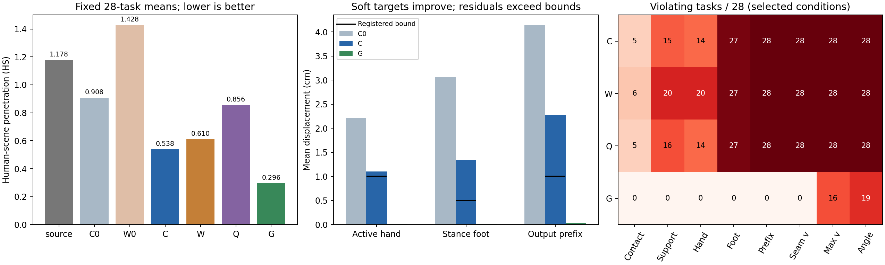

# Phase2.38：源条件DNO软目标改善交互与交界，整体收益条件失败

2026-09-10完成固定28任务/4场景/124窗口/5376原生帧，9作业均exit0。正确场景C的HS从source 1.177500降至0.537736，接触从66.816%升至70.874%；活动手、近地足及交界位置误差均较零编辑C0减少。完整保护仍0/28通过；几何参照G的HS更低（0.296251），完整保护9/28通过。正确场景的编辑增量优势失败，当前固定配置的HSI额外价值仍未建立。

## 范围、实现与配置

用户批准2.37之后的源条件编辑。冻结R2 epoch222 EMA，复用2.37正确场景/源历史拟合300步的latent。C正确场景、W错配场景、Q正确场景但真实HS目标权重0，三臂各300步，共用同一latent起点、seed42、lr.05/warmup50、10步DDIM、去相关0。各窗口均以已知完整源动作的历史为输入，全部latent块联合优化。源场景查询网格固定，W只改变HSI场景条件，真实物理场景目标保持。

G采用原生69坐标零增量、同样物理目标及300步预算，省去216特征项。G与DNO参数化、初始动作和计算成本不同，作为物理参照报告。源动作是既有HOIPrior经relation_20几何编辑的强解；对象轨迹固定，原生首6/末3帧固定。C0/W0零编辑动作完整保留。当前流程的源历史是编辑既有动作时可获得的输入。

物理项权重全部1：native28身体MSE/(5cm)^2；源5cm内接触手位置MSE/(1cm)^2；源近地四足位置MSE/(0.5cm)^2；输出交界前6帧身体MSE/(1cm)^2；全帧及接缝的source-relative速度分别MSE/(10cm/s)^2；完整人体表面HS/max(sourceHS,1)。C/W/Q另含216特征MSE，Q仅关闭HS项。所有条件直接作用于优化；末端直接评价输出。完整保护阈值沿用预登记。

实现扩展现有分块原生物理目标、DNO诊断入口、原生动作记录及组件检查。源与当前FK采用相同24帧加1帧重叠的分块，消除零增量处的FK舍入差；原生评价保留canonical source，DNO重建误差完整保留。配置为config_sample_hosi_dno_constrained.yaml；core及两专家代码保持。

协议method.conditions残留2.37四格说明；本轮method.temporal/source_history、diagnosis及已执行源码均明确所有窗口使用源历史。封存协议保留原文，实际比较按本节及resolved配置解释。运行中所有权重、预算与阈值保持预登记值。

## 原生结果与交互保持

|阶段|HS↓|身体位移cm|接触%|源地面支撑%|FS cm|源手接触保留%|
|---|---:|---:|---:|---:|---:|---:|
|source|1.177500|0|66.816|61.424|.17657|100|
|C0|.908022|2.4932|65.495|49.062|.05525|89.989|
|W0|1.428453|6.6274|55.101|46.947|.16925|59.164|
|C|.537736|2.7520|70.874|59.431|.17183|95.576|
|W|.609941|3.2412|71.473|57.607|.19107|94.809|
|Q|.856475|2.7522|70.557|59.019|.16221|95.623|
|G|.296251|.1642|67.059|61.969|.17750|99.987|

C相对source的HS下降54.33%，同时整体接触增加4.06个百分点；支撑仍下降1.99个百分点。接触均值升高仍可能同时丢失部分源接触，因此源手接触保留与逐任务接触条件一起报告。所有臂完成22/28，物体固定；完成数对人体中段质量的区分能力有限。

|阶段|活动手cm|近地足cm|交界前缀cm|接缝修正速度cm/s|全局平均修正速度cm/s|逐任务最大修正速度均值cm/s|逐任务最大局部旋转均值deg|
|---|---:|---:|---:|---:|---:|---:|---:|
|C0|2.2171|3.0600|4.1465|57.5617|14.2881|194.4553|48.9281|
|C|1.1013|1.3438|2.2747|20.7975|12.3848|162.1231|50.2347|
|W|1.4357|1.5884|2.8716|25.2995|13.8756|180.9829|52.5474|
|Q|1.1140|1.3582|2.3050|20.9796|12.3957|161.9380|50.4707|
|G|.0079|.0102|.0327|.0404|.6003|42.2556|57.2301|
|逐任务上限|1|.5|1|10|10|30|20|

原生绝对接缝速度source/C0/C为55.0803/76.8846/54.4897cm/s，C已接近源；source-relative修正接缝速度仍20.7975cm/s。绝对速度和修正速度测量不同，保护判据使用后者。局部旋转取全部关节/帧最大SO(3)变化，表中再按任务平均，含根与局部关节，不能解读为身体航向平均变化。

逐任务违反数如下，完整保护通过要求一条任务全部条件通过：

|条件|C|W|Q|G|
|---|---:|---:|---:|---:|
|接触下降>.2pp|5|6|5|0|
|支撑下降>.2pp|15|20|16|0|
|FS增加>.01cm|11|12|11|0|
|活动手>1cm|14|20|14|0|
|近地足>.5cm|27|27|27|0|
|交界前缀>1cm|28|28|28|0|
|接缝修正速度>10cm/s|28|28|28|0|
|平均修正速度>10cm/s|24|26|24|0|
|最大修正速度>30cm/s|28|28|28|16|
|root>10cm|2|5|2|0|
|局部角度>20deg|28|28|28|19|
|身体均值>5cm|2|2|2|0|
|物体/首尾固定失败|0|0|0|0|
|全部保护通过|0|0|0|9|

G的身体/手足位移很小，仍有局部旋转及最大速度超限。这显示均值位置目标对瞬时运动及局部旋转保护不足；几何参照同样按全部阈值保留失败。375的源近地足12个关节帧全部位于固定首尾，足部梯度为0；其余27条均有近地足位移超限，375不能代表活动支撑的保护表现。

其余原生代价完整保存。C相对source的手—物穿透.518462→.486159、人体—物穿透8.270208→7.787386改善；G为.518898/8.277238，略高于source。OS mean/max/frame ratio在所有臂均为11.607790/98.740490/.251190；物体路径及终点误差保持。全部16项原生指标、附加身体/接触/连续性指标与逐任务、逐场景区间见紧凑结果summary.means/contrasts及原始analysis。

## 场景控制与配对证据

|HS对照|均值差|任务95%区间|场景95%区间|
|---|---:|---|---|
|C−source|−.639764|[−1.297248,−.217673]|[−1.152986,−.283551]|
|C−W|−.072205|[−.181725,.018828]|[−.178328,−.011450]|
|C−Q|−.318739|[−.555385,−.125987]|[−.454301,−.246568]|
|C−G|+.241486|[.093412,.416666]|[.104584,.378184]|
|C−C0|−.370285|[−.623175,−.169055]|[−.509713,−.275298]|
|W−W0|−.818512|[−1.408402,−.347421]|[−1.181396,−.488683]|
|(C−C0)−(W−W0)|+.448226|[.015643,.994816]|[.125656,.878377]|

C对source为21改善/2退化/5相等，对W为17/7/4，对Q为21/2/5，对G为3/20/5；G对source为23/0/5。C−Q支持显式真实SDF目标确实移动HS。C−W绝对点条件通过，但初始正确拟合latent使C0的HS已比W0低.520431；优化后差距缩小为.072205，编辑增量条件失败。该非对称起点仍限制因果解释，结果支持本协议没有建立额外HSI场景编辑价值，无法外推所有初始化或HSI方法。

其余27条的C−W为−.092737，任务区间[−.196682,−.013162]；C−G为+.199029，区间[.070112,.353463]。编辑增量差+.266745，区间[−.046085,.636714]，点条件仍失败，区间跨零。375的source/C/W/Q/G为5.862796/3.924081/3.441929/6.114945/2.536254。剔除375改善正确/错配的绝对优势证据，降低编辑增量差的统计确定性，几何参照和保护失败的主要结论保持；其余27编辑增量另存completion_secondary.json及紧凑结果。

所有配对统计调用既有paired_bootstrap实现，10000次seed42，任务与场景单位分别报告；4场景各7条。全部28任务已有开发使用，区间描述当前集合。无新增训练种子，未测本轮分布级FID；本轮结论限定原生几何、交互与局部编辑诊断。

## 分项梯度与输出历史

以下为任务中位数，范数在Adam预处理前测量。约束组包含手、近地足、输出前缀、全局及接缝速度；body和feature单独保存。

|读出|总梯度范数|约束组范数|原始HS范数|约束—HS余弦中位数|负余弦/有定义任务|
|---|---:|---:|---:|---:|---:|
|C0|4.36286|4.96128|.03273|−.28464|14/21|
|W0|43.31268|43.20928|.06378|.06374|9/22|
|C|.07099|.12479|.03655|−.59249|20/23|
|W|.11414|.17326|.05229|−.61307|22/24|
|Q|.08297|.09135|.05825|−.02639|14/23|

Q的原始HS导数是反事实诊断，实际优化权重0。零HS梯度时余弦无定义，按缺失处理。C的近地足项中位数15.8581→3.6023，前缀4.1134→1.3867，接缝速度10.2871→1.5557；各项确实下降。末步约束与HS多为反向，同时Q也0/28通过保护，表明当前残差无法仅归因于HS目标与保护项冲突。有限预算与软目标不足是当前测量边界，无法据此判断全局表达能力或无限优化结果。

后续96窗输出特征边界MSE均值C0/C/W/Q为.007449/.006503/.007894/.006551，输入源历史特征误差均0。源历史输入精确仍允许输出之间不一致；显式前缀与速度目标减少了该问题，未达到预登记阈值。140组逐窗特征及逐帧28点距离、140组逐项梯度均保存，支持后续只读复核。

## 执行、验证与封存

正式run：p2-mixer-hsi-dno-constrained-s42-20260910。干净cd77ddf开始/结束，2026-09-10T05:33:57Z至10:54:31Z，9作业全部成功；控制器19216.44s（5.338h），任务合计87401.95s，2250600次HSI前向含梯度重计算，新增峰值1.11195GiB。GPU4–7的已有作业保留，争用造成作业耗时差异；计时只描述当前硬件环境。

三DNO臂共84条300步优化全部完成。G的23条完成300步，其余15/19/374/420/425在源零梯度处按既有stationary分支直接返回源姿态；19的目标为0，其余4条仍有.000769–.009044的HS目标，但当前可变参数梯度为0。完整轨迹保留，零梯度只说明该处局部驻点。工程完成指固定对照全部交付，科学utility=false。

预登记8ae26fd、实现cd77ddf。实现前14项组件检查通过（1.63s），完整authority1131 passed/4历史skips（193.65s），429条registry有效，9份配置完整解析。完整375正式任务承担实际新路径与性能验证，本次收尾仅分析保存输出和补齐报告；额外smoke及性能benchmark均未添加，每步执行路径保持。

封存资产为results/experiments/p2-mixer-hsi-dno-constrained-s42-20260910/中的manifest、resolved、机器记录、日志、优化器/随机状态检查点、analysis和completion_secondary.json。协议experiments/protocols/p2_hsi_dno_constrained_s42_20260910.json，紧凑结果experiments/results/p2_mixer_hsi_dno_constrained_s42_20260910.json。输入身份沿用input_references的封存来源；未新增摘要计算。

收尾回读196份动作、84个最终检查点、140组梯度块与140组逐窗数组通过。全部5376帧归属连续，124窗完整；C/W/Q各300条轨迹及初始latent与旧SS解精确对应。源动作与既有原生参照、物体平移/旋转及首6/末3 pose/translation/joints逐张量相等；源指标及C0旧SS指标回放误差0。原生身体均值独立归约最大差9.5367e−7cm，CPU/GPU梯度范数归约最大相对差2.1980e−6。源物理位移项全部0，sourceHS重算最大差1.1181e−6（原阈值1e−5），源FK参考最大偏差3.5763e−7m。后处理读取脚本的路径及归约尺度假设已按实际资产结构修正；正式运行、科学指标及门槛保持。

当前阶段完成后停止本固定配置；下一入口是先审阅这些输出、梯度和违反明细，再提出一个能同时处理输出可行性与HSI额外贡献识别的具体实验。当前未启动新方法、权重搜索、训练或469扩展。完成提交由exp/p2ai-hsi-dno-constrained-v1定位并快进至phase/02-mixer。

最终封存验证：1131 passed/4历史skips/298既有warnings（220.14s），命令为已验证infbagel Python执行`-m pytest tests`；430条registry、4 splits、2 evaluators、1 training protocol验证有效，`git diff --check`通过。完整日志completion_authority.log保留，图表已核对。
