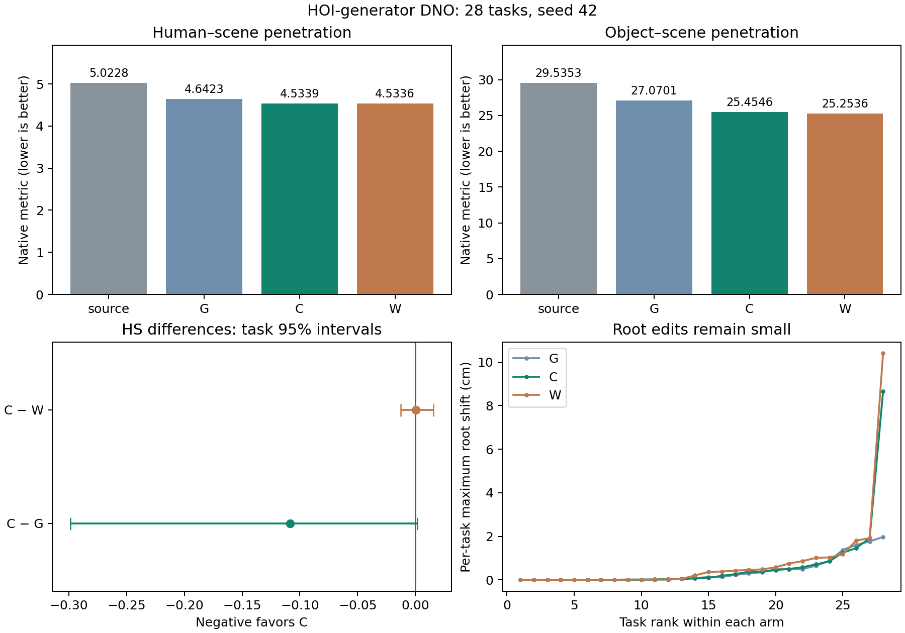
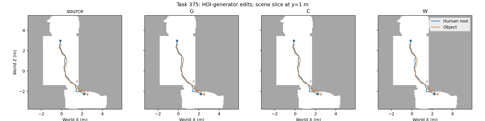

# Phase2.39a：HOI生成器DNO完成，编辑幅度小，正确场景优势未建立

2026-09-11完成固定28任务/4场景/124窗口/5376原生帧，5作业全部exit0，三臂各300步。正确HSI臂C的HS从5.022809降至4.533883（−9.734%），OS从29.535301降至25.454580（−13.816%）。总体保护通过，逐任务全部保护26/28通过；正确/错配HS几乎相等。人体/物体平均位移3.81/3.74mm，本轮交付了以HOIPrior为生成器的编辑通路，尚未展示明显绕障改道。工程交付完成，科学utility=false。

## 范围与方法

用户明确并批准HOIPrior始终负责生成，HSIPrior提供当前候选的场景指导。冻结P15 online与R2 epoch222 EMA；源动作由50步确定性HOI DDIM生成并保存噪声，旧DDPM500+ArmB保留为采样参照。G为同一HOI生成器的物理目标DNO，C加入正确场景HSI，W加入90°错配场景HSI。三臂共享初始噪声、条件、300步预算、lr.05、warmup50、latent保持.01、去相关0及seed42。HSI每步查询当前候选，level199的raw x0转为未来FK24局部目标，权重.25；目标刷新后按局部代理使用。真实SDF在三臂一致。

全部未来latent块联合优化，跨窗传递当前HOI生成历史；人/物换帧均可微。物体中间轨迹与人体根轨迹、落脚点均开放。保持项作用于root局部身体、物体坐标系活动手、源支撑高度和足速、局部速度、根/物体轨迹加速度及终点；人体/物体表面SDF和查询域代价共同参与。首2粗历史帧及相应首3原生帧保持；直接评价最终解码输出。参数、阈值和预算在执行中保持登记值。源和最终读出使用与优化一致的可反传Transformer路径。

实现位于code/mixer/hoi_diffusion_noise.py，既有HOSI Hydra入口调用mixer.diagnostics.run_hoi_dno，配置config_sample_hosi_hoi_dno.yaml。core与两专家源码保持。2.39a范围为本固定28诊断；2.39b完整469属于后续独立入口。

## 原生结果与保护

HS/OS为原生每帧顶点穿透深度和再平均的指标；FS单位cm，接触与支撑为百分比。DDPM参考与新source的采样协议不同；编辑收益以新source为起点。

|阶段|HS↓|OS↓|接触%|源地面支撑%|FS cm|完成数|
|---|---:|---:|---:|---:|---:|---:|
|DDPM_reference|4.764332|31.093625|66.816|60.466|0.173899|22/28|
|source|5.022809|29.535301|65.434|53.579|0.148801|22/28|
|G|4.642300|27.070103|65.727|53.674|0.150163|22/28|
|C|4.533883|25.454580|65.652|53.610|0.132536|22/28|
|W|4.533624|25.253618|65.755|53.654|0.150832|22/28|

C比source接触增加0.218个百分点，源手接触保留99.673%，活动手在物体坐标系的平均误差0.0854cm。总体接触/支撑/足滑、交互、局部动作、连续性及完成数的登记保护通过。三臂逐任务全部条件均26/28通过：331的FS source/G/C/W为.116477/.149823/.149321/.149114cm，均超过source+.02cm；329的C支撑由89.962%降至87.121%，W同时违反支撑和足滑，G违反足滑。

C的平均足滑改善集中于329：该任务FS下降.476015cm，28条差值之和为−.455404cm；其余27条均值变化+.000763cm。这是保存结果上的失败分析，主统计仍为全部28条。329支撑同时下降2.841个百分点，足滑收益须与支撑变化一起解释。

新DDIM源相对旧DDPM接触下降1.382个百分点；在新源固定地面高度下，支撑代理下降6.886个百分点，任务区间[−9.755,−4.364]个百分点。C保持的是新源的支撑水平。这项采样差异保留为限制；较低FS均值本身不足以建立源动作质量升级。

## 场景归因与不确定性

|对照|HS差|任务95%区间|场景95%区间|
|---|---:|---|---|
|C−source|-0.488926|[-0.981341, -0.111425]|[-0.808387, -0.169465]|
|C−G|-0.108417|[-0.298617, +0.001606]|[-0.247830, +0.000662]|
|C−W|+0.000259|[-0.012573, +0.015484]|[-0.016690, +0.020653]|

C相对G的HS点估计改善2.335%，任务和场景区间均跨零；OS改善5.968%，两种区间均支持改善。但C−W的HS为+.000259，区间跨零；OS为+.200962，任务区间[+.041007,+.407611]、场景区间[+.025427,+.376498]，错配更低。故当前结果尚未将额外避障收益归因于正确场景知识。C−W的FS区间低于0，主要由329贡献，作为单独的足部取舍报告。

C对source的HS为22改善/3退化/3相等，对G和W均14/11/3。C未达到source HS下降10%的点门槛：阈值4.520528，实测4.533883；差距0.013355。总体失败同时包括正确场景优势未建立，结论由完整对照决定。

所有配对统计采用既有paired_bootstrap实现，10000次seed42，以任务/场景分别为单位。初次汇总的任务completed为bool，被通用数值发现规则排除；收尾将汇总入口转换为0/1数值，并在completion_audit.json补齐所有任务完成率区间（差0、区间[0,0]）。封存运行的原始汇总保留，主指标和判定保持。4场景各7条，全部任务已有开发使用；区间描述当前集合。本轮没有分布级真实感或跨种子结论。

## 实际编辑幅度与优化读出

|臂|身体平均位移cm|物体平均位移cm|root局部身体cm|逐任务root最大位移的均值cm|非root局部角变化均值deg|
|---|---:|---:|---:|---:|---:|
|G|0.2624|0.2996|0.1822|0.3966|0.2471|
|C|0.3813|0.3741|0.2431|0.6418|0.3777|
|W|0.4281|0.3963|0.2716|0.7884|0.4190|

C最大的root位移为329的8.648cm，第二大为422的1.913cm。进一步按方向分解，逐任务root最大水平位移的均值/中位数为0.407/0.081cm，最大2.234cm（任务329）；最大垂直位移为8.361cm（任务329）。预选375的root最大变化仅.714cm，HS114.7043→110.1329，源手接触保持；该任务占C整体HS的86.75%。下面按真实世界尺度展示路径，曲线基本重合，未扩大位移供视觉展示。场景图为y=1m的SDF切片，完整碰撞结论来自原生人体/物体表面指标。

梯度记录确认HSI信号通过HOI生成链到达人/物噪声。375正确HSI的原始noise梯度范数.01632，物体平移/旋转块分别.00305/.00605。冻结模型参数保持，全部84条优化均执行300步且梯度有限。

末步C的非latent保持梯度范数中位数.010109，保持项范数.01，两者余弦中位数−.88534；W为.010122/−.97119。这显示保持项参与当前局部优化平衡。源处G/C/W分别6/4/3条的其余目标梯度范数不超过.01；对λ||z−z0||，该条件使源点满足相应局部目标的一阶驻点条件。C/W的HSI目标随查询噪声刷新，这个读出仅对应登记的源查询。

存在明显梯度离群：C末步420/16/422的非正则梯度范数为91.48/50.51/28.89，主要较大项为轨迹加速度（67.71/44.91/14.89），随后包括手部等项。因此当前不能用单一“保持项过强”解释全部小幅编辑；源条件、生成器敏感性、保持目标与固定300步预算仍需分开审阅。上述范数在Adam预处理之前测量，末步教师查询使用iteration300，和最后优化iteration299的噪声不同。

末次正确/错配教师查询平均越界比例约.196%/16.141%；实际输出人体与物体均在SDF域内。错配观测的覆盖差异限制精确因果解释，当前结论限定本对照和本读出。

## 执行、失败与验证

正式成功run为p2-mixer-hoi-dno-r1-s42-20260910，干净69a676b开始并结束，2026-09-10T13:13:02Z至23:08:23Z。先GPU0完整375，再GPU0–3四路执行其余27；GPU4–7原有作业保留。控制器35718.14s（9.922h），任务耗时合计111899.45s；11253000次HOI前向含重计算，75144次HSI前向，峰值2.3239GiB。计时反映当时资源争用。

首次p2-mixer-hoi-dno-s42-20260910在25.59s、0优化步时failed封存：源OS165.22把归一化float32的一个epsilon放大为原始量纲1.9696e−5，触发原始绝对1e−5检查。修复在实际归一化目标单位验证一致性，同时保存原始误差；r1的源噪声、预测、人体/物体动作及全部源指标与首次逐张量/逐值相同。所有失败资产保留。

预登记dec4668、实现02d325b、失败修复69a676b。实现阶段23项DNO组件检查通过；修复后authority1140 passed/4历史skips（203.45s），432条registry有效。首次测试命令未export解释器变量导致两项恢复测试初始化失败，修正命令后全套通过；日志保留。收尾只修正完成率统计的数值类型并增加回归检查，生成人体/物体、采样、目标和每步计算路径保持原运行版本；额外性能工作跳过，完整375及固定28已提供真实功能/性能数据。

收尾回读140份动作、84个最终优化器检查点、140组梯度、124组正确/错配查询通过。84条优化均300步，504份cadence检查点完整；配对噪声和首2粗历史/首3原生人体及物体精确保持。身体/物体位移独立归约与记录误差0，梯度范数复核误差0。原生输入资产身份沿既有input_references引用，本轮未添加摘要计算或额外smoke。

完整结果位于运行目录的manifest、resolved、日志、native motions、final/cadence checkpoints、analysis与completion_audit.json。紧凑结果experiments/results/p2_mixer_hoi_dno_s42_20260910.json；本阶段提交由exp/p2aj-hoi-dno-v1定位。

最终收尾验证：24项DNO组件检查通过（3.12s），完整authority **1141 passed/4历史skips/298既有warnings（184.24s）**；433条registry、4 splits、2 evaluators、1 training protocol有效，`git diff --check`通过。命令为导出已验证INFBAGEL_PYTHON、ROOT_DIR及单线程BLAS变量后执行`"$INFBAGEL_PYTHON" -m pytest tests`与`tools/experiment.py validate`。日志completion_authority.log保存；根部水平/垂直分解逐任务保存于analysis/root-route-by-task.json。工程gate对应固定28对照、原生结果、配对诊断、恢复资产和验证交付，均已完成；科学utility与2.39b推广条件仍为失败。

## 下一入口

本轮关闭2.39a工程诊断，保留HOIPrior生成、HSIPrior指导的分工。下一次先审阅已保存的编辑幅度、分项梯度、latent保持及固定窗口条件，再提出一个具体对照以解释有限改道和场景归因。2.39b、完整469、专家训练及新权重搜索均未启动。
