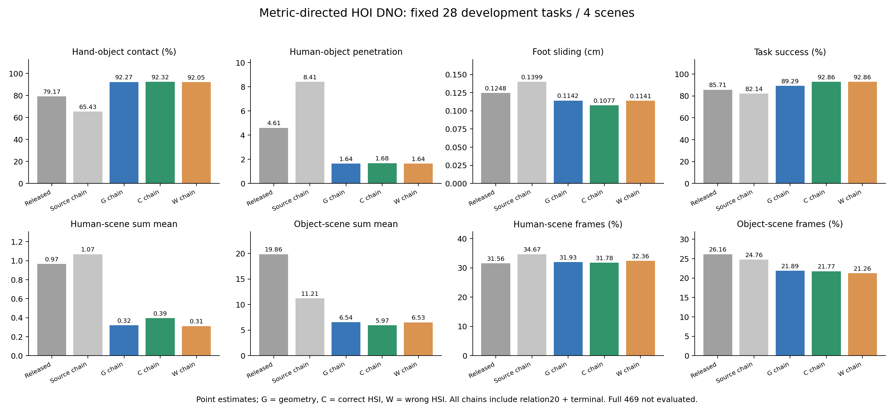
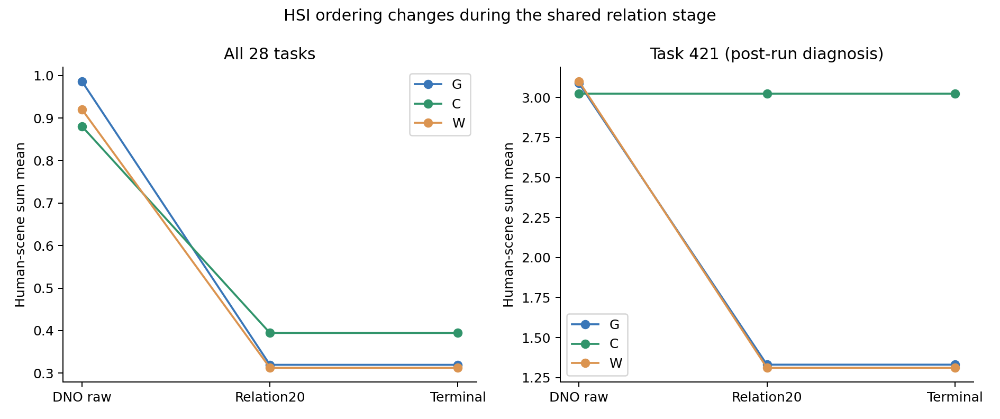
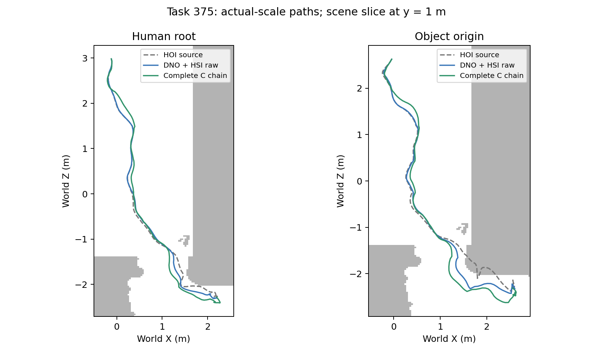

# Phase2.40a：指标目标DNO通过固定28进展条件，HSI独立场景收益仍未建立

固定28任务/4场景/124窗口/5376原生帧完成，9作业均exit0，耗时6.80小时。正确HSI完整链接触65.434%→92.318%，Pbody8.406645→1.682672（−79.98%），FS0.139874→0.107714cm（−22.99%），完成23/28→26/28；登记总体进展与保护通过。逐任务全保护C为7/28，完整失败保留。正确HSI最终HS比纯几何高23.44%、比错配高26.21%，HSI场景条件失败。

## 范围与实现

用户于2026-09-11批准指标目标修复。分支phase/02ak-hoi-dno-metrics；预登记aca5e84，实现/运行e8c651f。冻结P15 online、R2 epoch222 EMA，HOIPrior生成每个DNO候选，HSI提供当前候选的配对正确/90°错配场景目标。逐任务噪声和源预测与2.39a精确相同；DDIM50、DNO300、lr.05/warmup50、HSIlevel199/weight.25、seed42保持。去掉latent距离惩罚，去相关/噪声扰动仍为0。

MetricMotionObjective直接优化搬运区间活动手的3cm表面距离（超差1cm尺度）、物体系手速（10cm/s）、完整人体对物体SDF负深度和（1m原生sum尺度）、源相邻支撑足速（目标0、5cm/s尺度）、源支撑高度（1cm尺度）。保留root局部身体/速度、轨迹增量加速度、终点和域外目标；HS/OS沿旧归一化并加入每帧最深点2mm间隔（1cm尺度、权重.1）。主手/活动区间由源接触及物体速度确定，无GT、物体类别权重或任务编号规则。

接触使用完整物体网格；人—物穿透使用完整人体和原生物体SDF；HS/OS及间隔的物体点沿原生seed42最多10475点。所有新项进入逐步日志与分项噪声梯度。原生24帧分块带两帧重叠，四输入导数完整反传到HOI噪声。core及两个专家源码保持。

DDPM_reference、同源DDIM source、G/C/W均通过相同relation20（20cm各水平分量/20°yaw、原20或40步规则）与terminal（20步、8cm目标/5cm平移上限、原验收）处理。DNO固定取300末步；关系编辑沿原已登记目标最小迭代选择，所有终点拒绝候选保存。最终链属于包含几何后处理的系统，raw与final结果分列。

## 原生结果与登记判断

|处理阶段|接触%↑|Pbody↓|FS cm↓|HS mean↓|OS mean↓|完成数↑|源地面支撑%|
|---|---:|---:|---:|---:|---:|---:|---:|
|DDPM_reference|66.816|8.269917|0.173899|4.764332|31.093625|22/28|60.466|
|source|65.434|8.397130|0.148801|5.022809|29.535301|22/28|53.579|
|G|92.214|1.620420|0.113600|0.986342|13.655394|22/28|55.882|
|C|92.339|1.669309|0.107245|0.880623|13.137117|22/28|56.036|
|W|92.046|1.623931|0.113325|0.920309|13.794508|22/28|55.875|
|DDPM_reference_final|66.816|8.295519|0.176319|1.177500|11.607790|23/28|60.565|
|source_final|65.434|8.406645|0.139874|1.068814|11.210390|23/28|53.389|
|G_final|92.273|1.636366|0.114167|0.319582|6.543740|25/28|56.111|
|C_final|92.318|1.682672|0.107714|0.394497|5.971899|26/28|56.041|
|W_final|92.046|1.637184|0.114073|0.312581|6.527120|26/28|56.050|

HS/OS/Pbody保持原生顶点深度和的尺度。final为relation20后再terminal；完整15项原生指标、完成与附加运动指标在紧凑JSON中覆盖全部15个阶段。C_final相对source_final的接触至少+2pp、Pbody至少−10%、FS至少−10%及总体保护均通过，metric utility=true；HSI额外HS和正确场景条件均失败，hsi_scene_utility=false。判定未因结果改动。

|C_final−source_final|均值差|任务95%区间|场景95%区间|
|---|---:|---|---|
|接触（pp）|+26.884233|[+19.937880, +33.812804]|[+20.453870, +33.314596]|
|Pbody|-6.723973|[-12.780589, -1.801916]|[-7.980533, -4.434293]|
|FS cm|-0.032159|[-0.085442, +0.008199]|[-0.060945, -0.003373]|
|HS|-0.674317|[-1.342045, -0.215413]|[-1.302125, -0.204112]|
|OS|-5.238491|[-11.755121, -1.053435]|[-9.850285, -1.667525]|
|完成（pp）|+10.714286|[+0.000000, +25.000000]|[+0.000000, +32.142857]|

所有区间均为既有paired_bootstrap的10000次seed42任务/场景配对。FS任务区间跨零，场景区间低于零；成功率区间含零。因此点条件通过与各指标不确定性分别陈述。只有4场景，全部任务反复用于开发；区间描述固定集合，未修正开发选择，也不代表跨训练种子。

## 与July released的同28任务比较

收尾发现并读取原July完整469的逐任务资产，按scene_name/test_idx/object_name三键精确匹配这28条，独立汇总与配对；该比较属于结果后的历史系统参照，登记进展门槛仍对同源DDIM链。原released模型/表示/采样/按场景随机流与当前修复表示/P15/DNO/精细SDF离线后处理不同。

|指标|July released，同28|C_final，同28|点估计|
|---|---:|---:|---|
|T_h cm|7.230488|3.485582|改善|
|T_o cm|10.442274|6.610755|改善|
|S%|85.714286|92.857143|改善|
|FS cm|0.124803|0.107714|改善|
|C%|79.172161|92.318491|改善|
|Pbody|4.608470|1.682672|改善|
|HS Pmean|0.966081|0.394497|改善|
|HS Pmax|19.243227|5.741299|改善|
|HS Pf%|31.562239|31.782980|退化|
|OS Pmean|19.858497|5.971899|改善|
|OS Pmax|130.083231|50.992949|改善|
|OS Pf%|26.161683|21.766717|改善|

**11/12项点估计更好；人景穿透帧率31.783%高于31.562%，差+0.221pp。完整469尚未运行，不能将这行并入469正式表。** 对released28，接触/Pbody/OS均值的任务区间支持改善；部分其他区间跨零，未声称11项均显著。原始对齐及所有区间：运行目录analysis/released28_comparison.json；引用源位于/data/yujinlun/InfBaGel-release/results/experiments/p0-atomic-hosi-baseline-r2-s42-20260712/evaluation/overall_evaluation_summary.json。

## 失败、支撑与任务分布

总体保护通过，G/C/W逐任务全保护仅5/7/6条；全部违反均保留在completion_audit.json及compact failure_details。这里总体通过没有被解释成逐任务保证。C违反统计：

|保护项|违反任务数|
|---|---:|
|hand_retention|6|
|local_body|1|
|hs|7|
|os|3|
|hs_frames|6|
|os_frames|5|
|foot_sliding|4|
|contact|1|
|support|3|

任务19接触100%→92.22%同时Pbody16.522→4.137；任务16局部身体变化超过5cm并增加HS/OS；这些取舍完整计入均值。所有场景域外比例为0，三臂raw/final首3原生帧保持同源初态。

FS改善约66.01%由329贡献：FS0.643863→0.049456cm，但其固定源地面支撑89.773%→70.833%（−18.94pp）。去掉329后的描述性均值仍从0.121207降到0.109872cm；全28始终是主分母。全体支撑相对同源DDIM链增加2.65pp，却仍比DDPM参考链低4.52pp。因此足滑下降需要结合采样支撑差异和逐任务支撑损失解读。

接触与Pbody收益符合先前定位：clothesstand接触36.47%→75.75%，tripod38.34%→88.22%；suitcase Pbody45.840→6.173，smallbox11.702→4.122。其他5类Pbody略增，所有类别和任务保留。

## HSI增量与后处理反转

C raw的HS0.880623低于G0.986342、W0.920309，两个差的任务/场景区间均跨零。进入relation/terminal后，C_final HS0.394497高于G0.319582和W0.312581；C−G +0.074915、C−W +0.081916，任务和场景区间均高于零。C_final的OS和FS点估计更好，C比G多完成1条、与W相同；这些均未建立整体正确场景优势。

任务421贡献C−G最终HS差约80.82%、C−W约74.77%。该任务raw G/C/W HS3.0893/3.0258/3.1016，C略好。20步关系编辑的G/W选择第18/19步，C选择源第0步；第1步三者目标均明显上升，C在固定预算内未找到优于源的目标。于是relation后的HS变成1.3304/3.0258/1.3108。该证据定位了后处理收益差异；未在本轮调整学习率、预算或选择规则。

421终点候选的物体误差G/C/W为10.0646/9.7398/9.9933cm，所以G被原规则拒绝，C/W成功。六条原失败任务中source/DDPM各恢复1条，G恢复3条，C/W各恢复4条；最终C仍失败的两条floorlamp（15、330）保留。

## 编辑幅度与轨迹

C raw逐任务最大水平根位移均值5.775cm，最大14.017cm（375）；C_final对应7.856/24.827cm。最终人体/物体平均修改5.550/5.600cm，root局部身体3.012cm、非root角变化3.959°。这轮产生了比2.39a毫米级输出更大的修改；G也实现相近幅度，不能把幅度归于HSI。

图中场景是y=1m的SDF切片；碰撞结论采用完整原生表面指标。此图展示实际轨迹位移，不能替代完整网格视频或独立真实感评价。本轮未建立分布级真实感或盲评结论。

## 执行、核对与交付

2026-09-11T02:45:09Z启动，09:33:18Z完成；源和所有lane结束时提交均为e8c651f。控制器24484.66s（6.801h），任务耗时合计121126.51s；G/C/W DNO分别36919.40/39300.56/39433.25设备秒，关系/终点阶段1407.54/256.08秒。11253000次HOI前向（含梯度重计算）、75144次HSI前向，峰值2.4156GiB。启动快照GPU4–7曾有外部负载，资源事件保留；耗时描述实际共享环境。

420动作、84最终检查点、504个cadence文件、140梯度块、124正确/错配查询对、140终点候选核对通过。全部84优化执行300步且loss/梯度/优化器状态有限；原噪声/源预测与2.39a精确一致。身体/物体位移与保存梯度范数重算误差0，均值归约最大2.22e−16。所有参考/编辑输出初态最大差3.58e−7（含DDPM参考）；实际编辑三臂初态精确保持。终点接受/拒绝对应最终保存动作逐张量一致。

首个收尾核对命令在完成数值检查后读取lane字段时误用git_commit；实际字段是commit/git_commit_at_completion。修正读取后完成独立核对，正式运行及指标未改动。正式工作负载无操作失败；所有科学负结果保留。没有新增hash机制、smoke或tools脚本；沿用持久controller模式，分析复用已保存输出。

预运行完整authority1147 passed/4历史skips，188.81s，434条registry有效。源代码本次收尾保持运行版本；完成验证记录见下文。紧凑结果experiments/results/p2_mixer_hoi_dno_metrics_s42_20260911.json；原manifest、resolved、日志、轨迹、检查点、分析、completion_audit.json均位于results/experiments/p2-mixer-hoi-dno-metrics-s42-20260911。

## 下一入口

本阶段交付固定28完整对照、真实输出、配对区间、失败与可恢复资产；工程gate和登记指标进展通过，HSI场景gate失败。当前链值得冻结后做完整469验证，尤其检查人景帧率、逐任务保护和FS支撑。完整469是Phase2.40b，在下一session审阅并批准；本轮不启动下一实验。

建议下一份具体协议固定C作为目标方法，保留同源G作消融及原July469系统参照，不根据28结果继续调权或逐任务选臂。须将当前强制previous_inputs匹配扩展为复用已有28、为其余441保存同一固定DDIM源与噪声，完整C/G使用相同源和完整链。按当前累计设备时间线性估算，独占8卡只C约24小时、C/G约48小时，额外审计与共享负载另计；这些是预算估计。W保留当前28的负对照，是否扩至469应在该协议中明确。每一最终方法仍保留全469分母与固定seed42。

## 最终封存验证

首次收尾authority在真实LINGO加载时中断，保留469 passed/2 skipped、375.20s日志。10s观察中该进程user/system耗时.05/9.39s，同期系统compact_stall增加311次；采用仓库既有的进程级THP设置重跑。第二次完整 **1147 passed/4历史skips/298既有warnings，214.21s**；435条registry、4 splits、2 evaluators、1 training protocol有效，git diff --check通过。

执行使用已验证INFBAGEL_PYTHON及ROOT_DIR，OMP/MKL/OpenBLAS各1线程、NUMPY_MADVISE_HUGEPAGE=0，解释器内设置PR_SET_THP_DISABLE=1后以runpy运行pytest tests；registry由tools/experiment.py validate验证。两次日志及verification_attempts.json保留，正式GPU实验与运行源码保持e8c651f。本次收尾未改变采样、目标、预算或评价。图表已核对；完成提交由exp/p2ak-hoi-dno-metrics-v1定位，快进整合phase/02-mixer。

下一阶段执行入口为mixer.diagnostics.run_hoi_dno及mixer.hoi_diffusion_noise.hoi_dno_task。当前循环固定G/C/W；完整469协议应先明确正式臂和对照预算，再使调用与汇总对应，并保留上述28输入精确回放条件。
