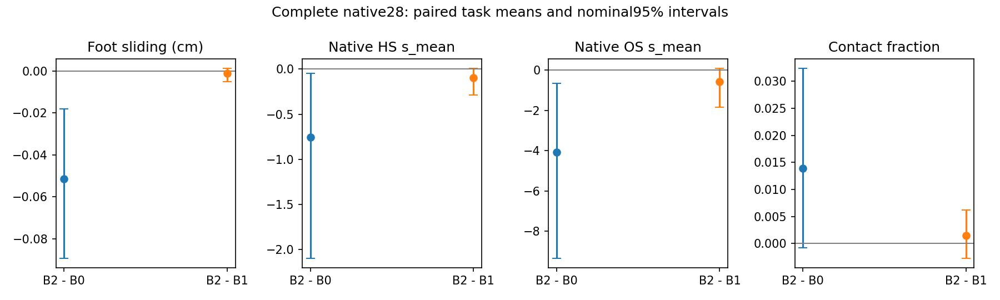

# Phase 2.15 — native scene-prior conditional repair (2026-09-07)

**NO-GO for full469. The corrected repair runs and changes motion, but its extra
benefit over the shared geometry editor is unestablished.** The complete method
improves the original HOIPrior on this fixed native28 development subset. Most
of that improvement is already present without HSI. This phase closes the
implemented candidate and its registered one-interface correction; it does not
establish superiority over InfBaGel or promote a learned mixer.

## Scope and final protocol

The latest handoff was found at
`/data/yujinlun/report/PriorHOSI_scene_prior_transfer_codex_plan.md` (the supplied
`papers/` path was absent). The user subsequently directed development to
`data/hosi_test`, with the ultimate goal of surpassing InfBaGel on its metrics.
The initially proposed24 LINGO development tasks were superseded before any run.
The user-supplied InfBaGel-release `Scene_sdf` resolves to the same directory as
our native asset:67/67 benchmark scenes have SDF. There is no native benchmark
asset blocker and no new mesh/SDF work was performed.

Use the existing native shard bins0/22/44/66, all7 objects in each:28 tasks,
124 autoregressive windows per method. The exact UUIDs/task identities are in
`experiments/tasks/conditional_repair_native_development_s42_20260907.json`.
These tasks were already exploratory in earlier work and are used for development
again. Any subsequent469 report must disclose test-set development.

Frozen P15 online HOIPrior, ArmB500, and R2 EMA HSIPrior; seed42. The new config
`config_sample_hosi_conditional_repair.yaml` enables per-episode seeding. B0 is
therefore generated for this campaign rather than borrowed from the older
per-scene seed protocol. All methods generate future candidates from their own
actually submitted histories; no cached future is played back.

- B0: original HOI pipeline, exact raw-source return; no geometry teacher/HSI call.
- B1: existing lambda0 eight-refresh geometry proposal, followed by the same
  deterministic pose-fit budget with proposal targets; no HSI calls or repair RNG.
- B2: same geometry, with five complete-condition HSI targets from a partial-noise
  DDIM chain. Known-empty object/contact input follows the existing forward-noise
  trajectory; the geometric world query retains the actual object.

Canonical500-step linear betas0.0001..0.02, x0 prediction, existing
DDIMSolver(500,25), timesteps[99,79,59,39,19], eta0, full condition/CFG0. Each
query uses the latest accepted clean candidate for both geometry-query states.
The corrected x0 is used to derive epsilon and the next DDIM state, including
noisy future locked channels; history is pinned according to training semantics.
The solver's float64 output is returned to float32 before the next expert call.
There is no DP/cond-minus-uncond gradient or HSI posterior guidance.

Four projected pose-fit iterations per target; summed local-rotation chord loss
scaled by10deg plus0.25 proposal residual penalty. Local Armijo initial step0.25,
shrink0.5,10 trials,c1=1e-4; inherited10deg/component local bounds. The final
6x63 SVD operates exclusively on free local coordinates, with existing float64
rtol1e-6/atol1e-10 and no damping. Common/history coordinates are exact zeros.
Root trajectory/orientation and object/contact channels copy the proposal.
Source hand anchors and source contact>0.95 masks stay fixed.

Finite FK guards: each active hand error<=max(proposal error,5mm)+1mm; HS voxel
RMS<=proposal+0.01cm; stance correction increment RMS<=0.05cm; foot displacement
<=2cm; inherited pointwise scene-domain nonexpansion. Proposal anchor error>5cm
would mark task failure. These are window guards, separately named from native
mesh/SDF evaluation. The native scale3/IK/SMPL-X decoder and all15 original metric
definitions remain unchanged; `task_failed` is additional repair metadata.

## Final native28 results

FS retains native centimetres. HS/OS below are original `s_mean`: frame-average
sum of penetrating vertex depths in native units, not mean depth per vertex and
not voxel/FK residuals. Completion requires both endpoint errors<10cm.

| Method | FS | HS s_mean | OS s_mean | Contact | Completed |
|---|---:|---:|---:|---:|---:|
| B0 HOI |0.173899|4.764332|31.093625|66.816%|22/28|
| B1 geometry |0.123737|4.104416|27.597258|68.064%|22/28|
| B2 HSI repair |0.122530|4.011171|27.022055|68.211%|22/28|

Primary comparisons are task paired,10000 seed42 bootstrap replicates,
nominal95% intervals. Four-scene sensitivity is also published; frames are never
independent resampling units. All15 native fields, completion, endpoints, motion
and mechanism logs, all three contrasts and all7 object strata are retained.

| B2 minus comparator | FS delta [95% CI] | HS delta [95% CI] | OS delta [95% CI] |
|---|---|---|---|
| B1 |−0.001207 [−0.005108,+0.001331]|−0.093245 [−0.290010,+0.011178]|−0.575203 [−1.857078,+0.094102]|
| B0 |−0.051369 [−0.089222,−0.018156]|−0.753161 [−2.097838,−0.045490]|−4.071569 [−9.341245,−0.661410]|

The primary FS improvement fails the pre-run0.01 practical threshold and its CI
crosses zero. HSI-specific HS/OS point estimates are favorable but unresolved.
OS's upper bound0.0941 also exceeds the registered0.02 protection margin; this is
failed uncertainty protection, not a measured worsening of its mean. Scene-unit
HSI contrasts also cross zero. Contact/completion protections pass versus both
B0/B1; all methods complete the identical22 tasks. B2−B1 contact is+0.001467
[−0.002729,+0.006216]. Object endpoint error rises0.013976cm
[+0.002194,+0.031179], within the registered1cm protection margin.

Before any new outcomes, the provisional FS improvement threshold0.10 was
corrected to0.01 using sealed2.12 B1 FS0.1208:0.10 would demand an82.8% decrease.
The dated correction is retained in the plan. No gate changed after these
candidate outcomes, including after the implementation correction below.

## Actual repairs, bottleneck and closure gate

B2 issues620 HSI forwards and accepts331/2480 fit steps. It changes122/124
windows; only2 windows return the proposal exactly. However, only15/124 windows
(12.10%) reach the registered1mm future-FK coordinate RMS threshold, versus50%
required. Task-balanced mean RMS is0.6283mm; window mean0.6139, median0.4989,
p95 1.2645, max5.3340mm. Maximum local angular component is3.561deg.

There are24219 trials:331 admissible/accepted,23888 rejected;2149 fit steps exhaust
the10-trial budget. Among rejected trials,22828 include the stance guard and14727
fail that guard alone. Other co-occurring failures: feet7220, scene2784, contact2021,
domain276. There are zero common-coordinate or finite-value guard failures.
These are descriptive trial counts, not independent statistical evidence.
The shared line-search step restricts every pose coordinate when stance binds;
this measured bottleneck is consistent with the small realized repair amplitude.
It does not establish that stronger repairs would be beneficial or that the HSI
teacher itself is ineffective.

All final history/common/contact-channel and finite FK guards pass; no invalid
proposals or nonfinite steps. Largest source-anchor error is1.973cm. Maximum world
history discrepancy is7.15e-7m. B2 root path length257.70cm versus B1 257.82cm,
mean joint frame displacement1.4513 versus1.4529cm, and near-stationary-root
fraction6.883% versus6.827% do not indicate whole-motion freezing. This does not
establish perceptual naturalness.

**Failed final gates:** sufficient repair amplitude; practical/statistical FS
benefit; task/scene OS uncertainty protection. Full469 was not started. No noise,
weight, view, solver-budget or constraint-margin search follows this closure.

## Preserved failures and the one interface correction

1. The first manifest's detached nohup launch left no controller, worker, job log
   or motion. The empty log and failure are retained. A new r1 run used `screen`.
2. r1 completed84 episodes/372 windows with all12 jobs exit0, but B2 rejected all
   24800 trials and exactly reproduced B1. A6x67 zero-common-column SVD can produce
   approximately2.5e-16 nonzero common output entries; strict common-coordinate
   checks then reject the update. Its original summary and videos remain intact.
3. The registered one-interface correction solved only the63 free coordinates,
   reconstructing fixed coordinates as exact zeros and recording per-guard reasons.
   The component regression exposes the original rounding leakage. r2 reruns all
   28 B2 tasks with the same science settings, reusing r1 B0/B1 by reference.
   All2480 saved B1 gradients were exactly zero; all124 B1 outputs and repair
   parameters equal the proposal/zero exactly, proving compatibility with the
   free-coordinate correction. B0 never enters this solver.

Across r1/r2, all28 first sources, first proposals and first HSI fit losses match
exactly, and all124 window seeds match. All96 later sources differ and all28 final
actions differ after the correction: actual edited history is propagated. Final
scientific conclusions use corrected r2 B2, not the broken all-rejection attempt.
There are112 actual generated episodes across both complete attempts; the final
comparison contains84 episodes, including56 reused B0/B1 episodes.

Initial pre-run unit failures (DDIM dtype and an invalid empty-budget fixture),
the suite interrupted by the user-directed task-scope change, and a read-only
historical completion-field extraction error are retained in logs/schema notes.
They changed neither metric definitions nor scientific candidate parameters.

## InfBaGel target and limits

The same28 identities have historical July InfBaGel metrics: FS0.124803,
HS0.966081,OS19.858497,contact79.172%,completion24/28. These are explicitly
**historical pre-P12, protocol-mismatched reference values**, not a controlled
same-decoder model comparison. Paper Hybrid1:0.5 full469 remains a separate
external reference (FS0.15,HS3.17,OS12.45,contact76.96%,success81.45%).
The new result establishes neither full469 performance nor superiority over
InfBaGel. No released model was rerun or loaded into the repaired codec.

## Verification, artifacts and next entry

Final authority suite: `INFBAGEL_PYTHON=/data/yujinlun/anaconda3/envs/infbagel/bin/python`,
`ROOT_DIR=/data/yujinlun/InfBaGel-mixer`, OMP/MKL/OpenBLAS threads4, then
`"$INFBAGEL_PYTHON" -m pytest tests -q`: **974 passed,4 historical skips,167.34s**.
The core and expert source trees are unchanged. Registry validation passes all373 rows. Four GPU lanes0..3 handle complete native tasks; GPU7 handles float64
statistics. r1 sampling wall714.07s; corrected B2 wall359.29s. Peak allocation
1.18GiB. Concurrent per-window B2 editor time5.345s includes geometry1.496s,
HSI queries0.130s and fitting3.662s; B1 editor3.322s. Native timing is explicitly
marked sharded/contended, not an isolated throughput claim.

- Compact result: `experiments/results/p2_mixer_scene_prior_transfer_s42_20260907.json`.
- Corrected run: `results/experiments/p2-mixer-conditional-repair-native-r2-s42-20260907/`.
  Its B0/B1 directories are read-only references to retained r1 artifacts.
- Earlier attempts retain the same run stem without suffix and with`-r1`.
- Analysis: `summary.json`, `paired.json`, `task_metrics.json`, `scene_metrics.json`,
  `object_means.json`, `window_records.json`, `motion_audit.json`,
  `repair_diagnosis.json`; manifests/resolved configs/commands/input references
  and exact checkpoint identities are archived beside them.
- Full videos select test_idx0 in each fixed native scene: tasks014,329,371,420.
  `visualizations/` contains all four complete B0/B1/B2 clips, final frames and
  the paired-interval figure. Skeleton/object views use native SDF surface samples;
  complete numerical motion/seam checks accompany them. Large motion stays local.
- Reanalysis: `mixer.scene_calibration.summarize_conditional_repair` with the run
  root, a **fresh** output directory, tracked task manifest and`device='cuda:7'`.
  Exact invocation is also archived in`launch.sh`; existing analyses are immutable.

Provenance: base44a33a6; prereg7330565; user native scope c98dff9;
implementation d4c5a55; failed-start record0eaaa50; interface amendment70431ed;
final runtime2a87165. Branch`phase/02o-scene-prior-transfer`, integrated into
`phase/02-mixer`; completion is sealed by`exp/p2o-scene-prior-transfer-v1`.

**Next entry:** read this summary, OVERVIEW and the latest Phase2 plan. Review the
measured compatibility of the HSI pose target and stance/contact constraints,
with the unchanged InfBaGel/native469 objective. A new experiment needs a separate
preregistration; this session starts no further candidate, training or469 run.
