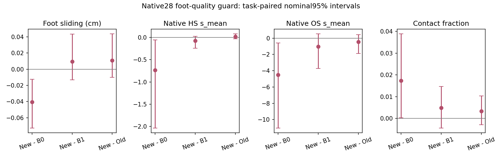

# Phase 2.16 — fixed-reference foot-quality guard (2026-09-07)

**NO-GO. The new guard permits substantially larger HSI repairs, but the HSI
quality gain over shared geometry remains unestablished and completion declines.**
All28 new native episodes finish, with124 windows, four jobs exit0 and complete
native evaluation. No interface correction, parameter search, static-condition
ablation,441 confirmation or full469 run follows this result. Phase2.15's
previous NO-GO and all of its artifacts remain sealed.

## Scope and frozen protocol

User handoff: `/data/yujinlun/report/PriorHOSI_next_experiment_Codex_af8f0d1.md`
(the supplied `papers/` path was absent). Base `af8f0d1`, branch
`phase/02p-foot-quality-guard`. The sole method change is the repair-local foot
acceptance predicate. The geometry editor, native15 metric definitions, frozen
core and both experts are unchanged. P15 online HOIPrior/ArmB500 and R2 EMA HSI,
full dynamic conditions, CFG0, five DDIM levels[99,79,59,39,19], four fit steps
per target, all other guards, source hand anchors, history/root/object/contact
locks, seed42 and actual submitted-history rollout stay fixed.

Use the same development-used native28 manifest, four scene shards0/22/44/66 and
all seven objects. B0/B1 and corrected r2 B2 are immutable references. B2_quality
is the new28-task rollout;112 episodes enter the four-arm table,84 reused.
The additional441 tasks have previously been used in older phases; no future
claim of completely untouched evaluation is licensed by this development split.

`ConstrainedPoseFit` defaults to `foot_guard_mode=increment`, preserving the
old .05cm correction-increment RMS guard. The new override config selects
`quality` with `foot_energy_epsilon_m2=1e-12`. It averages squared X/Z foot
movement over the fixed **proposal-derived** support mask; Y is world vertical,
FK coordinates are metres. Joints7/8 use8cm and10/11 use4cm above the proposal's
source-floor estimate, both ends must be low. Frame pairs are1->2 through14->15,
including the history/future boundary. The proposal energy is cached once,
not updated after an accepted step. Empty support gives energy0/count0 and
vacuous acceptance, with no evidence of improvement. Float64 differences and
reductions operate on the same float32 FK for proposal and candidate.

The new guard replaces the old predicate; the old increment remains logged.
Neither the shared geometry stance objective nor the native evaluator changes.
Every trial records both predicates, reference/candidate energies, active count,
other guard failures and acceptance; final records also contain displacement
range and fixed-motion audits. No added optimization loss or random call.

Before outcomes, register native HS `scene_human_penetration_s_mean` as primary:
new minus B1 <=−0.2052208121 (5% of sealed B1), task95% upper<0, scene mean<=0.
OS versus B1 retains point<=0 and upper<=.02; total HS/OS versus B0 retains both
points<=0 and at least one negative upper. FS becomes a protection with upper
<=+.01cm versus B0/B1. Contact/completion lower>=−.02 and endpoint upper<=1cm
remain. These protections apply to task and scene units. Hard guards, complete
native metrics, finite execution and history continuity must pass. Repair
amplitude/coverage are diagnostics, with no minimum editing quota. Statistics
use10,000 seed42 task-paired bootstrap replicates and four-scene sensitivity,
float64 CUDA7, nominal95% intervals; no cross-seed claim.

## Complete native28 results

FS uses native centimetres. HS/OS `s_mean` are frame-average sums of penetrating
vertex depths in native units, not per-vertex mean depth or local voxel energy.
Completion requires both endpoint errors<10cm. All original15 fields, completion,
execution-failure metadata and time remain in the native task table.

| Arm | FS ↓ | HS s_mean ↓ | OS s_mean ↓ | Contact ↑ | Completed |
|---|---:|---:|---:|---:|---:|
| B0 HOI |0.173899|4.764332|31.093625|66.816%|22/28|
| B1 geometry |0.123737|4.104416|27.597258|68.064%|22/28|
| B2 old r2 |0.122530|4.011171|27.022055|68.211%|22/28|
| B2 quality |0.133272|4.027397|26.576071|68.549%|21/28|

| New minus comparator | FS delta [95% CI] | HS delta [95% CI] | OS delta [95% CI] |
|---|---|---|---|
| B1 |+0.009536 [−0.013094,+0.043544]|−0.077019 [−0.242772,+0.024704]|−1.021186 [−3.727114,+0.519325]|
| Old B2 |+0.010742 [−0.010140,+0.043688]|+0.016226 [−0.030706,+0.076685]|−0.445984 [−1.869467,+0.439955]|
| B0 |−0.040627 [−0.072721,−0.012278]|−0.736935 [−2.033159,−0.056135]|−4.517553 [−11.025578,−0.593640]|

HS improves only1.88% over B1, versus the registered5%; its interval crosses0.
The old repair had2.27% improvement. The four-scene new−B1 HS interval is
[−0.248819,+0.032865]. FS's task/scene upper bounds0.04354/0.04425 exceed .01;
OS's0.51932/0.61703 exceed .02 despite its favorable mean. Completion falls
1/28 (−3.571 percentage points), interval[−10.714,0]pp, failing protection
against both B0/B1. These are the failed scientific gates. Contact protections,
endpoint mean protections, total scene gains vs B0 and all hard/numerical checks
pass. Task new−B1 contact is+0.004849[−0.004403,+0.014682]. Root endpoint delta
is+0.019389cm[−0.039871,+0.084508]; object endpoint+0.075184cm
[+0.013644,+0.160276], both within1cm. An average endpoint margin can pass while
an individual task crosses its binary completion threshold.

The complete system still improves B0 on FS/HS/OS, but the extra HSI target is
unestablished relative to B1 and a completion is lost. This candidate establishes
neither superiority over InfBaGel nor full469 performance. Historical/paper
InfBaGel reference limitations remain exactly as recorded in Phase2.15; no
released model was rerun or loaded into the repaired representation.

## Mechanism: larger changes, changed bottleneck, unresolved utility

620 HSI calls;411/2480 accepted fit steps versus old331. New94/124 windows change,
88/124 (70.97%) reach1mm versus old15/124 (12.10%). Task-balanced RMS rises
0.6283->2.7991mm; window mean2.8607, median2.8242, p95 7.0540,max10.8633mm.
379 accepted steps fail the old increment predicate while satisfying all new
and unchanged guards. Thus the intended acceptance change actually participates.

Exact proposal fallback rises2->30 windows. The quality predicate allows
sliding cancellation and also rejects even small energy increases; larger
repairs in fewer windows are consistent with this changed acceptance rule.
There is one empty-support window, explicitly excluded from energy-improvement
evidence. All123 active-reference windows meet the final energy guard; the mean
proposal energy0.00165668 falls to0.00159982m² (window-weighted diagnostic).
Maximum final energy delta is0,87 final windows violate the old increment guard,
maximum increment0.67074cm. No numerical epsilon budget is visibly consumed.

23,559 trials,411 admissible/accepted and23,148 rejected;2069 fit steps exhaust
their line-search budget. Rejections can carry multiple labels:

| Guard | Co-occurring rejected trials | Sole rejection reason |
|---|---:|---:|
| Foot displacement<=2cm |16191|10850|
| Fixed-reference support energy |9584|5332|
| Human-scene residual |2657|1385|
| Source hand/contact anchors |2047|0|
| Scene-domain nonexpansion |285|0|
| Common coordinates / finite FK |0|0|

The measured dominant limiter changes from correction increment to foot
position range. Largest final foot displacement1.999924cm approaches its2cm
limit; largest source-anchor error1.92354cm stays within its applicable bound.
This licenses a bottleneck description, not a claim that relaxing2cm would help.
There is no further guard/solver/target search in this phase.

Across new/old r2,28/28 first raw sources, proposals and first HSI fit losses
are exact;124/124 window seeds match.94/96 later raw sources and28/28 final
motions differ. Actual changed history propagates. Root path length changes
B1 257.8248->new257.6081cm, joint/frame displacement1.45293->1.44361cm and
near-stationary-root fraction6.827%->6.575%. These measurements do not indicate
whole-motion freezing. A post-run jitter diagnostic gives mean joint second
frame difference2.5023->2.4605mm/frame²; it is auxiliary, not a promotion metric
or a physical jerk measurement.

## Failure localization and visual evidence

**Task420, clothesstand, becomes incomplete.** B1 object endpoint9.756907cm,
old9.778547cm,new10.041490cm; root error6.540982cm still passes. The root/object
locks hold within every repair window. The endpoint change arises in the full
closed rollout whose later HOI source depends on edited human history. No direct
HSI object-planning claim follows from this effect.

**Task329 is the largest HS worsening vs B1:**8.658385->8.992977 (+0.334592),
while its FS improves0.559459->0.443011 and completion remains successful. The
representative frames show pronounced crouching across all four arms, with no
established perceptual improvement.

**Task372, floorlamp, dominates the native FS worsening:**0.144430->0.538747.
Its native floor estimate (`feet_height` field) changes4.276669->6.630552cm.
The unchanged native FS estimator uses candidate-specific floor estimation,
height-dependent weights, one-frame low-foot masks and interpolated/IK joints.
The repair proxy uses fixed proposal support pairs and squared horizontal
motion on coarse FK; monotonicity of one does not guarantee the other.

A post-run read-only counterfactual uses the unchanged native FS function on
saved motions, substituting only its scalar floor reference. New motion with
B1's floor gives FS0.160034; with its own floor it gives0.538747. All four own-floor
recomputations exactly match saved native metrics. This localizes substantial
floor-reference sensitivity for this task; it does not replace any official
metric, exclude the task, establish physical improvement, or change NO-GO.
HS and completion gates independently fail. Full counterfactual matrix is saved.

Five full four-arm videos are retained: preselected014/329/371/420, covering
the worst HS and newly failed completion, plus post-run FS-localization372.
Manual review used eight evenly spaced frames/video and final frames; full
videos are provided. Skeleton/object/native-SDF samples support coarse posture
review, not proof of submillimetre sole clearance or naturalness. All native mesh
metrics retain authority. No gross new freeze/discontinuity is apparent in the
sampled frames, while existing crouching persists. Numerical seam maximum is
below1e-5m and all exact history/root/object/contact audits pass.

## Verification, provenance and artifacts

Preregis `84c732e`; implementation/runtime `ea161ca`. The added config is
`code/config/config_sample_hosi_foot_quality.yaml`. Tests extend the existing
component test file; analysis extends the existing summarizer. No new tracked
experiment scripts. Core, experts, relational geometry and original evaluator
remain unchanged. No hash mechanism, training, new surface asset or separate
smoke suite was added.

- Component suite:15 passed. Full authority suite:981 passed,4 historical skips,
  169.63s, canonical infbagel Python, ROOT_DIR=current checkout, OMP/MKL/OpenBLAS4.
- Baseline numerical audit:124 B1 outputs exactly equal proposals,2480 zero
  fit gradients, exact-zero repair parameters and no-HSI/RNG unit regression.
  Energy identity delta0; maximal reordered float64 reduction difference
  8.67e-19m², below the preregistered1e-12. Four fully resolved configs differ
  from r2 only in run/output identity and the two foot options.
- Manifest created with `tools/experiment.py start` on the clean runtime commit.
  Persistent screen controller completes all4 jobs; first45-window/7-task scene
  passes interface checks before remaining three lanes run. No sampling execution or
  numerical failure, no candidate rerun, no missing task. Seven tasks fail the
  native completion endpoint criterion; `task_failed` records execution/invalid
  proposal status separately and is0 throughout.
- Controller elapsed620.70s including paired analysis; lanes356.27,250.33,221.80,
  179.86s. New editor/window5.281s (geometry1.442,HSI0.126,fit3.655), peak allocated
  1,271,632,896 bytes (~1.18GiB). Native timing is explicitly sharded/contended,
  with rendering overlapping part of execution, not isolated throughput.
  No training/full-microbatch benchmark applies to this batch1 inference change;
  the actual synchronized native path records timing and memory.

Run root: `results/experiments/p2-mixer-foot-quality-guard-s42-20260907/`.

- `manifest.json`, `resolved/`, `execution_plan.json`, `launch.sh`, `logs/`,
  `execution_status.json`, `machine_preflight.json`, `input_references.json`,
  `initial_scene_interface.json`; reused arms are symlinks to sealed artifacts.
- New generated episodes, original15 metrics and audits under `B2_quality-shard*`.
- `analysis/summary.json`, `paired.json`, `task_metrics.json`, `scene_metrics.json`,
  `object_means.json`, `native_task_table.csv` (28 tasks; all15 native fields plus
  completion/failure/time and all new-minus-baseline differences),
  `window_records.json`, `motion_audit.json`, `repair_diagnosis.json`.
- `analysis/comparison_audit.json`, `joint_motion_diagnostics.json`,
  `foot_sliding_failure_diagnosis.json`; auxiliary diagnostics are identified.
  Older arms lack the new per-trial foot fields: their corresponding new-only
  diagnosis counters are recorded-event counts, not retrospectively measured
  counterfactual acceptance rates. Compare the379 count within the new arm.
- `visualizations/selection.json`, five complete videos, frame sheets, review,
  `paired-native.png`. Large motion/video/per-task data remain outside Git.
- Pre-run regressions and suite log:
  `results/foot-quality-preflight-s42-20260907/`.
- Compact tracked result:
  `experiments/results/p2_mixer_foot_quality_guard_s42_20260907.json`.

Post-run bookkeeping: the first main-registry registration was refused because
its canonical id already belongs to the planned hypothesis. Preserve that row
and the completed manifest; append the unique
`p2-mixer-foot-quality-guard-completion-s42-20260907` completion event with an
explicit canonical `run_id`/manifest link. This is one workload, not a rerun.
The registry validates375 rows. `postrun_operations.json` also records the final
visual selection manifest's correction of the supplemental372 template label.

Reproduce analysis with `mixer.scene_calibration.summarize_conditional_repair`
using this run root, a fresh output directory, the unchanged native28 task
manifest, `device='cuda:7', foot_quality=True`. Full command is in `launch.sh`.
The engineering closure preserves a valid negative experiment; the scientific
promotion gate fails. Seal at `exp/p2p-foot-quality-guard-v1` and integrate the
completed record into `phase/02-mixer`.

**Next entry:** read this summary, OVERVIEW and the latest Phase2 plan. The user
may review the current HSI pose-target utility, finite foot/contact constraints
and native foot-metric compatibility. Phase2.17/static ablation/441 is not opened:
its prerequisite failed. Any new mechanism requires a new dated preregistration.
Continue to use native data/hosi_test when authorized, with the same ultimate
InfBaGel benchmark goal and explicit test-set-development disclosure.
