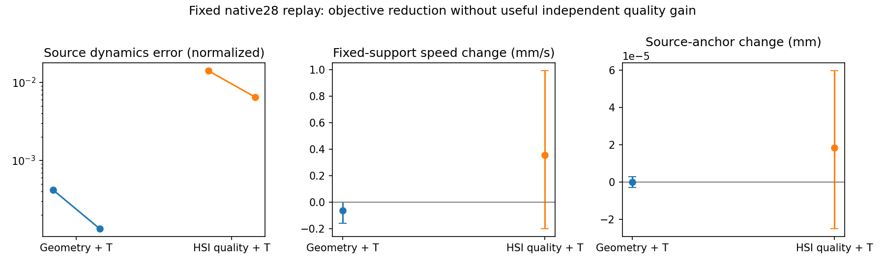

# Phase 2.17 — Source-dynamics Temporal preservation（2026-09-07）

**NO-GO：源动态误差显著下降，独立质量收益不足以升级。**
实现及固定输入离线验证完成。248/248窗口有效，四个场景作业全部exit0；
完整保留28任务的对照视频、曲线与失败分析。未启动G1/H1闭环native28、
追加441或full469。H-T的独立运动质量收益尚未确认，H-S的闭环额外场景收益
尚未检验。原Phase2.15/2.16 NO-GO保持封存。

## 范围与资产

用户方案实际路径：
`/data/yujinlun/report/PriorHOSI_next_experiment_Codex_90ea106_HTD_temporal.md`；
用户给出的papers路径不存在。基准90ea106工作区干净，分支
`phase/02q-temporal-preservation`。实现前拆分：本阶段A0/A1/A2；
有条件的2.18才执行两组闭环56条任务，之后再考虑2.19追加确认。

固定native28来自`data/hosi_test`，四个原场景shard0/22/44/66及全部七类物体。
复用B1和B2-quality各124窗口，各自使用原rollout的同窗口raw_source。
两组后续历史不同，因此离线H1−G1不能作为同源HSI因果对照。
本轮0次专家调用、0次新任务rollout、0次新native15评价。
P15/R2检查点、噪声/采样、原几何编辑、native evaluator、两专家和core均保持原状。
这不是HTD-Refine直接复现；没有PVA-Net、视频真值或新训练。

56条缓存均有动作/提案/参数，但248窗口全部缺少replay context/rest offsets。
从原任务data_idx→sequence恢复修正后的rest offsets；从保存的世界/局部旋转
方程恢复mat及物体prefix/reference，并恢复实际保存的源手锚点。
248个原接触mask、124个H0缓存支撑mask一致。B1的124窗口未保存repair_stance_mask，
按原proposal与既有定义恢复支撑mask，不能声称和不存在的缓存mask逐位比较。
恢复日志中B1的stance_exact=true对此项是空检查；可用性单独归档。
全部输入guard通过，重新编码输出逐位一致。
最大FK误差4.7684e-7m，源锚点恢复误差6.5565e-7m，物体位置误差4.7684e-7m，
旋转元素误差7.7486e-7，均小于预注册1e-5容差。
物理回放使用这个容差；关闭/零权重旁路直接返回缓存原张量，要求bitwise一致。

时间依据为已有原生30Hz数据约定、loader stride3和evaluator interp_s3：
粗窗口dt=.1s。16帧中前2帧为真实可用历史，速度stencil结束于t2..15，
加速度首项为0/1/2；不使用插值评价帧或插值尾部padding。
保存显式timestamps/frame/link masks及实际拼接区间：非末窗口保留0..13，
最后窗口保留全部16帧。独立窗口回放每16帧重置旧历史，视频明确标识。

## 实现与冻结配置

新增`mixer/temporal_preservation.py`及默认关闭的
`config_sample_hosi_temporal.yaml`，在现有editor之后应用相同Temporal模块。
可微FK采用同一世界坐标下root旋转逆变换后的21个非根关节；它表示身体局部
构型动态，不是世界速度或GT误差。源动态参考固定为raw_source；keep项固定
为进入模块的局部修复参数；所有几何保护固定为原proposal；源手锚点独立保存。

尺度仅由冻结源动作统计一次：等权两组、任务、窗口、关节/坐标的平方均值开根。
sV=0.2047062398122251m/s，sA=1.6846152474941332m/s²；预注册下限.001/.01未触发。
lambdaV=lambdaA=1。keep为局部SO3弦长平方/(2×10deg²)，对未来帧/21关节平均。
同样20次外迭代、初始步长.25、最多10次回溯、折半、Armijo c1=1e-4。
使用原梯度与实际投影方向的内积计算充分下降条件；旧求解路径保留原算术。

只优化63个非根局部坐标。历史/root/物体/contact固定，原proposal的10deg角度
范围、2cm足部位移、quality足部能量1e-12m²、接触/domain/HS/finite guards保留。
新阶段不重置预算，双方统一quality guard。零权重/关闭立即返回原动作/参数；
损失计算直接走enable_grad下的decode，零参数不会切断初始梯度。
新增回放/分析函数复用scene_calibration，无新增tracked实验runner。

## 完整离线结果

下表V/A为**任务平衡平方误差均值的平方根**，每坐标的源参考误差；
支撑速度为固定proposal mask下世界足部X/Z速度，均不是native FS或GT动态指标。

| 离线组 | 源V RMS m/s | 源A RMS m/s² | 支撑速度 m/s | 源手锚点误差 cm | HS voxel residual cm |
|---|---:|---:|---:|---:|---:|
| G0，B1原输入 |.00202814|.0302513|.169614861|.005520705|.142162665|
| G1，B1+Temporal |.00127961|.0164091|.169552372|.005520691|.142469060|
| H0，quality原输入 |.01411771|.1627643|.167365905|.014561488|.128753636|
| H1，quality+Temporal |.01050865|.1046743|.167719884|.014563317|.129297504|



G1−G0归一化V+A下降68.154%，H1−H0下降53.900%；两组任务配对95%区间均支持
源误差下降。这是目标参与性证据。以下为独立指标的任务配对差值，10000次seed42 bootstrap：

| 比较 | 支撑速度delta m/s [95% CI] | 源锚点delta cm [95% CI] |
|---|---|---|
| G1−G0 |−.000062489 [−.000160831,−.0000000474]|−.0000000136 [−.0000003067,+.0000002738]|
| H1−H0 |+.000353980 [−.000200728,+.000989683]|+.000001829 [−.000002502,+.000005959]|

G组支撑速度仅改善**.03684%**，远低于预注册5%实用幅度；H组均值恶化.2115%，
区间跨零。两组接触均未确认改善。没有一个独立质量比较满足升级条件。
HS voxel residual均值分别增加.000306395cm和.000543868cm，区间分别
[+.000143905,+.000486888]、[+.000174112,+.001008293]；增幅在.01cm保护界限内，
但方向是轻微损失已有几何收益。占据率G略降、H完全相同。H平均脚趾相对固定地面
上升.009146cm，在.1cm保护界限内；G近似不变。
关节世界速度保留率G99.998%、H100.067%，历史及root/object/contact逐位固定。
全部硬约束、有限性、覆盖和运动/场景保留门槛通过；**独立质量门槛失败**。

四场景敏感性、全部28任务及七物体分层均保存。H1−G1离线描述性HS voxel差值
为−.0131716cm，任务95%[−.0211267,−.00607143]；由于输入/历史不同，且该代理在
此前已经不能建立原生HS收益，此项不能升级为HSI闭环有效的结论。
原生15项、原生FS地面估计、终点和完成标准均保持不变，本轮未计算其新组成绩。

## 求解与失败定位

| Arm | changed windows | accepted /2480 steps | window RMS mean mm | task-balanced RMS mm | median/p95/max mm |
|---|---:|---:|---:|---:|---|
| G |98/124|796|.030018|.024929|.000039/.131504/.978647|
| H |120/124|1447|.556178|.534955|.420073/1.585921/2.565606|

G26、H4窗口精确no-op。G18786次trial、H12945次；全部finite/common/contact有效。
G的拒绝主要含support-quality10849次、HS370、domain200；H主要含support-quality4972、
2cm feet2725、HS1566、domain200，标签可共同出现。两组分别1684/1033步耗尽回溯预算。
原始梯度、投影斜率和每次候选完整目标/guard/接受状态均在trace中。
以上解释固定方案的限制，不授权放宽guard、加权搜索或提高计算预算。

源动态误差可以大幅相对下降，同时实际空间改变仍很小，特别是G组原误差已小。
H组源导数更接近HOI，没有对应的足部/接触改善；场景代理略回退。
因此本轮没有测得“只差时序保护即可让HSI迁移有效”。这也不是对所有Temporal
方法的普遍否定：本结论限定于这个冻结权重/预算/自由度/guard的后处理候选。

## 可视化与局限

全部28任务都有G0/G1/H0/H1并排完整缓存窗口视频（10fps）、物理V/A曲线、
方法映射和最终帧。六任务014/017/329/371/372/420各抽查8个均匀帧；017包含
本轮最坏支撑速度窗口，372/420保留旧失败案例。抽查未显示清晰的前后质量改善；
329在四组中持续蹲伏。骨架/物体采样图不支持亚毫米足底判断，未绘制完整身体/场景
mesh，也无法判断整条闭环的完成效果。视频每窗口重置历史不是新闭环连续性证据。
`visual_review_pending=true`明确表示尚无独立人类盲评；没有自然性打分或人类偏好结论。
独立数值gate已经失败，盲评待完成不会触发继续采样。

## 验证、耗时与归档

- preregistration fe2ac5e；implementation/runtime b87bd8e；封存tag
  `exp/p2q-temporal-preservation-v1`，工程关闭后整合至phase/02-mixer。
- 组件29通过；完整authority **995 passed,4历史skips,171.96s**。
  初轮两个测试fixture问题（十进制浮点严格相等、末端head旋转不改变选定关节位置）
  已按正确解析测试输入修正，原失败日志保留。无正式采样失败或候选重跑。
- 使用canonical infbagel Python，ROOT_DIR当前checkout，OMP/MKL/OpenBLAS4。
  `tools/experiment.py start`在干净提交创建manifest，各replay入口另查clean worktree。
  提前归档fully resolved config，4×3090计算、其余GPU用于后续渲染/配对分析。
- controller393.29s含分析；四lane389.96/281.62/260.07/195.38s。
  同步Temporal时间G4.665/H3.890s每窗口。这是并行争用环境计时，不是隔离吞吐。
  nvidia-smi运行中观测每计算GPU约931–932MiB，含CUDA上下文；本轮没有记录
  allocator峰值，因此不将该观测称为峰值。batch1推理没有训练microbatch benchmark。
- 四个渲染任务全部exit0，28视频及28曲线覆盖完整；完成后8GPU全部空闲。

Run：`results/experiments/p2-mixer-temporal-preservation-s42-20260907/`。
包含manifest/protocol/resolved config/input references/asset manifest/calibration，
`commands.sh`、`render_commands.sh`、execution/render status、机器快照；
`scene-*/per_window.jsonl`及全部before/after/source/proposal/参数/context动作记录；
`analysis/summary.json`、task/scene metrics、object_strata、additional_comparisons、
solver_diagnosis、window_input_provenance；visualizations的全部视频/曲线/selection/review。
预检与测试：`results/temporal-preflight-s42-20260907/`。
紧凑结果：`experiments/results/p2_mixer_temporal_preservation_s42_20260907.json`。

复现固定输入分析：
```python
from mixer.scene_calibration import replay_temporal_scene, summarize_temporal_replay
# 完整冻结命令、四个scene/device映射和resolved config在run/commands.sh。
# 使用新输出目录；不要覆盖旧scene或analysis。
```

一次明确的治理格式修正：fe2ac5e假设行漏填created_at/config/results/conclusion，
validator拒绝后在实现提交补全四项，原假设/门槛不变，原行保留在首次提交。
这是对字节级append-only规则的一次已披露例外。终态使用不同的canonical run ID
正常append注册；没有再次复用上阶段的重复ID处理。最终377行registry通过。

**下一入口：**先读本总结、OVERVIEW和Phase2最新计划。2.18闭环前提未满足，
不启动native28新组、441/469、候选重排或训练，也不自动调整Temporal参数。
等待新的机制/诊断交接。目标仍是在原生`data/hosi_test`上超越InfBaGel，目前尚未
建立该结论；native28是开发用数据，其余441也有历史使用，不能称完全未见测试。
