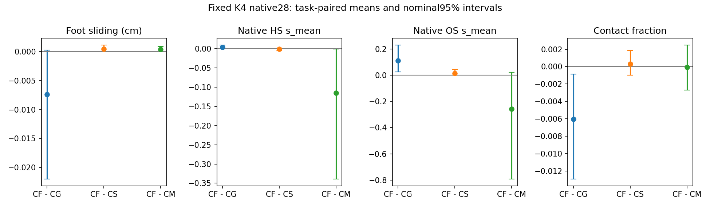

# Phase 2.20 — 固定完整 HOI 候选池与 HSI 场景兼容性选择（2026-09-07）

**NO-GO：完整 HSI 评分没有超越同池几何选择，同时测得候选覆盖有限。**
112条完整候选、496窗口全部有效；12个生成作业和4个评分作业均exit0。
CF相对CG的原生HS恶化0.0935%、OS恶化0.4027%，完成数22/28→21/28。
接口与工程交付完成，开发质量门槛失败。封存当前评分接口，停止在native28；
未扩大441/469、训练、改变评分方向/权重/K、修复或拼接候选。

## 范围与冻结协议

交接实际路径：`/data/yujinlun/report/PriorHOSI_dd993d7_Codex_Next_Experiment_Handoff.md`；
用户给出的papers路径不存在。基准dd993d7，分支phase/02r-candidate-selection。
新阶段编号2.20覆盖A–D；旧Temporal2.17 NO-GO和未获前置通过的2.18/2.19保持封存。

协议：`experiments/protocols/p2_candidate_selection_s42_20260907.json`。
配置：`code/config/config_sample_hosi_candidate_pool.yaml`，继承封存B1配置。
数据仍是`data/hosi_test`的固定native28，shard0/22/44/66，每场景七种物体。
开发使用测试集明确标记；其余441有历史使用。P15 HOIPrior online、Arm B500、
R2 HSIPrior EMA的实际路径和已有校验值沿用封存配置，全部生成入口验证权重身份。
core、两个expert目录和原生`test_infbagel_hosi.py`均未改变；没有新checkpoint。

C0复用兼容的28条B1，124窗口；新增候选1/2/3共84条、372窗口。
任务初态/目标/文本/规划/终止规则与B1相同，各条候选沿自己的真实自回归历史生成。
原生任务和评价seed始终42；候选生成种子为
`42+canonical_ordinal+candidate_offset+window_index*1000003`，window_index从0开始，
offset固定0/100000000/200000000/300000000。偏移只作用于采样器的私有生成流。
候选池包含失败动作，技术重试预算0；没有补采、删任务或挑物体。

以下为本轮新设并在结果前固定的决定，并非历史配置：

- HSI噪声级别50/157/264/300，每级2次；同任务/窗口/重复/级别公共噪声，分支严格配对。
- 主分数为最终B1人体的归一化84个位置坐标MSE；训练代码使用ind=-1、两帧历史mask，
  这些未来位置坐标均有效。模型原始full/static输出在CFG合并前读取，旋转L1只作诊断。
- 场景查询基于干净的最终候选；保留原occupied物体视图，KnownEmptyObjectView及
  object-condition mask保持。静态分支保留goal/anchor场景、文本/目标/历史。
- 每窗口只计local2..15，对应global14*w+2..14*w+15，覆盖不重复；按有效坐标总数加权。
  dt=.1s；原生30Hz插值尾部不进入评分；零有效值/非有限值直接报错并保留运行失败。
- CG能量为未来人体24 FK关节与固定128物体表面点到原voxel最近自由点的平方距离，
  两组各自均值相加后除以3×.05²。HSI允许预算为max(.1×CG能量,.006666667)。
- 共同保护使用原editor有效性/锁定/历史、外部目标的粗帧XZ终点、手到物体几何距离和
  接触比例、proposal/source-floor支撑速度。完整公式和阈值见协议。
- 错配CM仅将动态occ_list[1:]的X维循环平移16格；static/anchor/goal/occ_pos、真实几何
  和评分噪声固定。此分支保留occupied物体标签约定，没有更换场景视图。
- 确定性并列取较小候选编号；A空时全方法共同回退C0；保存拒绝、预算和选择记录。

主门槛CF−CG：HS相对下降至少5%，任务配对95%上界<0、场景均值delta≤0。
对CG及C0保护OS point≤0且上界≤.02、FS上界≤+.01cm、contact/completion下界≥−.02、
root/object终点上界≤+1cm；任务和场景单位均检查。10000次seed42、CUDA float64
paired bootstrap，28任务及4场景分别报告，不把112候选或噪声重复当独立任务。

## 实现与数据流验证

新增`mixer/candidate_selection.py`：隔离的CandidatePoolSampler、只读窗口scorer、
整候选selector、缓存条件恢复与原生结果汇总。旧类和默认路径不修改。
新增17项组件测试；最终authority **1012 passed，4历史skips，174.35s**。
完整测试覆盖旧B0/B1/Temporal行为，组件验证私有随机流、关闭/零偏移、full/static
配对、历史/padding/重叠、分数非有限处理、排序/并列/回退和共同保护。
真实28任务按反向候选顺序重做纯选择，结果和集合完全一致。模型评分只正式执行一次；
重复评分确定性的专项断言在组件级完成，没有声称重复整池真实HSI运行。

496/496窗口恢复/读取成功。124旧B1缺完整context，通过原生sample_step的条件构造
和已验证的世界/局部方程恢复；372新窗口直接保存context，并逐项对照同一恢复过程。
最大新缓存条件误差1.43051e-6，world/FK误差4.76837e-7m，物体旋转元素误差8.94070e-7，
源锚点误差6.55651e-7m，输出重编码误差严格0，均通过1e-5容差。
旧B1没有保存支撑mask的124次比较是空检查，其支撑mask来自原proposal重建；
372新支撑mask与实际缓存比较一致。此前的可用性限制保留披露。

112个动作文件评分前后内容校验一致。CG/CS/CF/CM/C0共140个选中输出是原候选的
文件链接；没有重新编码、平滑、混合或修复。选择函数只接收推理特征和冻结分数；
全部28选择落盘后才加载native15用于汇总及oracle。所选指标直接来自对应候选原生
报告，评价算法及其随机采样seed保持42。全部112候选和28任务留在分母。

## 原生结果

HS/OS的s_mean沿用原生定义：逐帧穿透顶点深度**和**的时间均值。
它们不是平均单顶点深度；下表没有将voxel/FK代理当成mesh指标。
完整native15、task_failed、四场景和七物体分层在紧凑JSON及分析文件中。

| 方法 | HS s_mean↓ | OS s_mean↓ | FS cm↓ | 接触比例↑ | 完成数↑ |
|---|---:|---:|---:|---:|---:|
| B0，HOI参考 |4.764332|31.093625|.173899|.668160|22/28|
| C0，B1单样本 |4.104416|27.597258|.123737|.680641|22/28|
| CG，几何选择 |3.993035|27.182240|.124655|.682496|22/28|
| CS，静态HSI |3.998277|27.277246|.116788|.676178|21/28|
| CF，完整HSI |3.996770|27.291705|.117262|.676477|21/28|
| CM，动态错配 |4.111686|27.549260|.116861|.676550|21/28|
| 保护定义下oracle |3.991383|27.127566|.124208|.682335|22/28|

CF−CG任务配对差值：

| 指标 | 均值delta | 95%区间 | 判定 |
|---|---:|---|---|
| HS s_mean |+.00373478|[+.00003460,+.00927786]|方向恶化，5%主门槛失败|
| OS s_mean |+.10946594|[+.02440425,+.22930376]|保护失败|
| FS cm |−.00739276|[−.02205097,+.00029768]|保护通过，改善未确认|
| 接触比例 |−.00601906|[−.01294313,−.00083978]|略下降，在2pp保护内|
| 完成率 |−.03571429|[−.10714286,0]|保护失败|
| root终点 cm |+.01247588|[−.01480633,+.03970612]|保护通过|
| 物体终点 cm |+.04682264|[+.00286307,+.09972663]|保护通过|

场景配对的HS/OS区间分别[+.00063149,+.00726211]、[+.06510078,+.17673004]，
方向同样恶化。对C0，CF的HS均值下降2.62%，任务区间跨0；OS/完成保护仍未全部通过。
CG相对C0的HS下降2.71%，区间[−.33569183,+.00206480]跨0；OS下降.41501829，
区间[−1.00042931,−.07779817]。多采样几何收益不能归于HSI。

CF选中的平均L_full从CG的.003549899降至.003515384；这个直接选择分数的下降没有
转成独立原生场景收益。没有翻转符号、以DP差值替换主分数或重新挑选指标。

## 场景归因、候选覆盖和失败定位

26/28任务可选多候选：23任务A/B各4条，3任务各3条，2任务各1条；A没有空集。
9次候选排除均由支撑速度保护触发，几何预算没有额外缩小A。
CF与CG/CS/CM/C0分别有8/21/16/7个任务选择相同。

CF−CS的HS delta−.00150702，任务95%[−.00559287,+.00122226]，动态条件的额外效益
未确认。CF−CM的HS delta−.11491594，任务95%[−.33957501,−.00090697]；
四场景区间也为负。但约97%的总差来自任务375（该任务delta−3.11801147）。
这说明评分/选择会响应动态观测错配；结合CF未胜CG、CF−CS未确认，证据不支持
“已有可部署的动态场景选择收益”，也不支持无场景HSI的表述。

注册oracle在A内、逐任务保护完成/接触/FS/OS/终点后，只按原生HS选一条真实候选，
回退CG；没有拼接不同指标的最小值。7任务有更低HS，整体相对CG仅改善**.04137%**，
delta−.00165210、95%[−.00405726,−.00002684]，远低于5%目标。
该结论限定于注册保护定义；它没有测量所有可能生成分布的上限。

84条新候选与同任务C0在全部新预测帧的坐标RMS差异：人体平均3.633mm、
中位2.954mm、最大13.398mm；root平均1.632mm；物体平均3.384mm、最大24.150mm。
不同随机流主要产生小范围变动。池内保护后的提升空间和当前评分均构成限制，
不能将负结果全归于HSI没有场景知识，也不能因oracle的小幅收益立即蒸馏这个分数。

最坏CF−CG HS任务331：CG1.457705→CF1.522739。新增完成失败是任务420：
CG选候选2（物体终点9.631516cm），CF/CS/CM选候选1（10.080928cm）。
**共同终点保护存在代理缺口**：注册规则只看粗帧XZ，候选1水平误差6.420175cm，
垂直误差−7.772160cm；前者通过10cm筛选，三维范数超过原生阈值。
这是一项已实现且预登记的有限保护，并非原生完成保证。保留此次负结果，
没有在看结果后改成三维保护重新选分数。后续协议应明确三维目标及评价时刻。
即使单独解释这一完成失败，本轮HS主门槛与OS保护仍然失败。

## 可视化、耗时与治理

五个完整四面板视频：固定014/329/371/420及最坏HS331；包含物体和稀疏场景表面。
每任务检查8个均匀时间帧。没有观察到清晰的跨选择器质量改善，329的持续蹲伏保留。
图像为骨架和128物体点，不能据此认证毫米级接触、足底滑动、细微抖动或自然性。
独立人类盲评尚未进行，`visual_review_pending=true`；数值失败已独立决定NO-GO。

- controller全流程672.47s；先单GPU完成7任务136.96s，再8×3090生成，四GPU评分。
  每个评分进程43.77–78.70s含加载；没有技术失败、源转换或候选重跑。
- 方法计入全部K4生成2615.86累计秒，平均93.42s/任务；其中实际新增1968.60s。
  累计几何编辑732.15s。缓存C0的生成成本计入方法成本。
- 三分支HSI查询含场景查询/私有噪声准备共153.26累计秒；加恢复约175.78s。
  CF必需3968个forward，static/mismatch各额外3968个，共11904；没有额外专家查询。
  单独每个raw head未计时，不能将总时间除3称为实测CF延迟。
- 选择28任务共.006882s。评分allocator峰值305.15–305.27MB（十进制）；
  nvidia-smi观测显存另存，含CUDA上下文，与allocator峰值区分。
  这些都是并行/sharded环境的实测成本，原生全局wall-clock吞吐仍标记不可用于模型对比。
- 首轮authority1012通过173.23s；补完GPU数据放置和分项计时后最终1012通过174.35s。
  组件没有测试失败。最终registry379行验证通过。
- preregistration b5eb005；implementation/runtime38fcaa3；工程关闭后整合phase/02-mixer，
  不可变标签`exp/p2r-candidate-selection-v1`。工程关闭依据是完整实现/验证/保留证据，
  与开发质量升级分开。

两项结果前更正完整披露：初始假设行用id而非experiment_id，被validator拒绝；
实现提交只改为所需字段名，原行仍在b5eb005，是一次schema-only append-only例外。
初始种子公式误写window_index+1；从代码与124旧窗口种子核对后改为从0开始，
全部新生成前已更正，候选offset和科学门槛未变。context配置由editor移至隔离sampler，
同样发生在任何新动作/评分之前。没有隐瞒已存在的候选结果或回写旧阶段。

## 产物与下一入口

Run：`results/experiments/p2-mixer-candidate-selection-s42-20260907/`。
包含manifest/protocol、12个resolved配置、execution_plan/commands/controller/日志，
candidate0兼容审计、112候选manifest和原动作、逐窗口/候选分数及恢复审计、28选择、
140个selected文件链接，全部native15、配对/scene/object表、oracle/diversity、
completion_proxy_gap/diagnosis/selection_order_audit、五视频/40抽帧及配对图。
正式manifest已completed；render.exitcode为0。大动作和逐样本结果留在本地，不进入Git。

紧凑结果：`experiments/results/p2_mixer_candidate_selection_s42_20260907.json`。
预检/测试：`results/candidate-selection-preflight-s42-20260907/`。
复现入口为`mixer.candidate_selection.score_candidate_scene`及
`summarize_candidate_selection`；精确命令在run/score_commands.json和execution_plan.json。
使用新的输出目录，引用原候选，保持原始结果。

下一session先读本总结、OVERVIEW和Phase2最新节。等待新的交接讨论有实质多样性的
人—物共同候选生成、三维完成保护和兼容性表示；目前不扩大441/469，不改本轮
评分方向/阈值/噪声预算，不加旧后处理正则，不训练/蒸馏这个未通过的分数。
尚未建立完整469超越InfBaGel的结果，也没有新的scene-aware HOI checkpoint。
