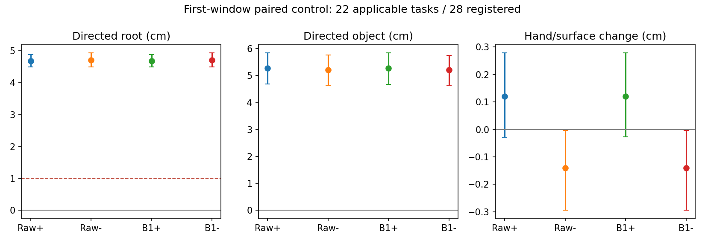

# Phase 2.21：Waypoint 可控性、候选来源与三维终点（2026-09-07）

**方向可控性成立，联合质量门槛 NO-GO。** 冻结 HOIPrior 对 ±10cm 中间 waypoint
产生稳定的厘米级人体与物体响应；B1 保留该响应。但接触锚点与部分场景代理的
置信上界超过注册保护，正负两侧同时满足全部实用条件的任务只有4/22。
本轮完成A/B/C，停止D结构化完整路线池、E同池HSI评分以及441/469。
H1的方向响应部分得到支持，包含操纵质量的完整H1门槛未通过；H2/H3未检验。

## 范围与协议

基准ccd02dc，分支`phase/02s-waypoint-control`。交接实际位于
`/data/yujinlun/report/PriorHOSI_Codex_Handoff_after_ccd02dc.md`；papers路径不存在。
实现前拆分2.21=A/B/C，条件2.22=D完整路线池，条件2.23=E同池HSI选择。
旧Phase2.20负结果与所有原始文件保持封存。

冻结协议：`experiments/protocols/p2_waypoint_control_s42_20260907.json`。
配置：`code/config/config_sample_hosi_waypoint_probe.yaml`，默认关闭，继承B1。
继续使用native28、四场景、七物体；这仍是用于开发的测试集子集。
P15 online、Arm B500、R2 EMA身份继承Phase2.20已验证配置与checkpoint metadata。
core、两个expert目录、原生evaluator、B1编辑器和HSI评分机制均未修改。
没有新训练、新checkpoint、完整任务生成或HSI forward。

新增`mixer/waypoint_control.py`，复用已保存的第一窗口条件与原始采样器。
`candidate_selection.py`增加实际输出末帧的终点计算，`native_retained_v2`显式选择，
历史`legacy_XZ`默认行为保留。测试和分析以新协议记录，不回填旧候选选择结果。

## A：候选差异来源

复用112条旧候选、496窗口，raw_source/proposal/edited、FK与变换均可恢复。
其中124个旧B1窗口缺显式replay_context，沿用已验证的世界/局部变换方程恢复；
372个新候选窗口已有完整条件。旧B1缺失的支撑mask仍按原proposal重建，不能
声称和不存在的缓存mask做了逐位比较；该历史可用性限制保持披露。
比较候选1/2/3与同任务C0；第一窗口有相同真实初始历史，后续历史已经分叉。
每窗口对全部14个未来帧计算坐标RMS，再等权候选和任务；局部人体使用21个
非root关节在各自root坐标中的位置。以下是坐标RMS毫米，不能称平均关节距离。

| 第一窗口 | HOI raw_source | B1 proposal/edited | 后/前比 |
|---|---:|---:|---:|
| 世界人体24关节 |0.989559|1.020925|1.03170|
| 世界root |0.587514|0.625286|1.06429|
| 世界物体平移 |1.364709|1.388305|1.01729|
| root-local人体21关节 |0.695151|0.696401|1.00180|

B1没有把较大的原始差异压小；在这些相同条件下，raw_source本来就很接近。
后续窗口描述性人体RMS为3.601831→3.609005mm，局部人体2.528119→2.529734mm。
它们不能作为历史相同的单步编辑因果对照，也不能直接等同于上轮整条动作RMS的
3.633mm，因为聚合顺序和覆盖不同。原proposal与edited均相同，符合无HSI的B1。
所有逐窗口值和低于1微米分母时的未定义比例处理均保留。

raw_source是已运行Arm B的HOI输出。本缓存不能进一步分离模型本身、Arm B与
统一条件的影响；本阶段没有执行关闭Arm B诊断，因此不作模式坍缩归因。

三层oracle均从同一旧池选择一条实际完整候选；原保护oracle逐任务精确复现。
后两项允许整个K4池，只有已登记的完成保护或完全无质量保护。它们是描述性
候选覆盖诊断，不是部署方法，也不是允许跨任务权衡的所有选择器的数学上界。

| Oracle定义 | HS s_mean | 相对旧CG的HS改善 | OS s_mean | FS cm | 接触 | 完成 |
|---|---:|---:|---:|---:|---:|---:|
| 旧CG参考 |3.993035|0|27.182240|.124655|.682496|22/28|
| 原登记逐任务保护 |3.991383|.04137%|27.127566|.124208|.682335|22/28|
| 仅保护完成 |3.966732|.65875%|27.431238|.124493|.679372|22/28|
| 无质量保护 |3.966732|.65875%|27.431238|.124493|.679372|22/28|

宽松oracle的HS delta−.026304，任务95%[−.066463,−.003643]，仍远小于5%实用目标，
且OS与接触均值有代价。不是只有原严格保护把一个大幅HS改善的候选挡在外面。
原生HS/OS仍是逐帧穿透顶点深度之和的时间均值；完整native15在oracle结果中保留。

## B：实际末帧与三维完成保护

新接口直接接收预测输出轨迹和实际保留帧数，不接收native结果表。
人体使用实际保留的SMPL-X root，复制后令Y=0再与原目标比较；物体使用实际
保留的插值后三维平移。两者均严格小于10cm才完成，边界没有增加epsilon。
原生evaluator不修改。

当前完整任务按固定预算生成，没有提前终止；非末窗口保留local0..13，末窗口
保留0..15，随后scale3插值，最后三帧保持末值。新接口显式使用实际输出长度，
支持截断后的末帧；测试覆盖插值中间帧、截断、held tail、严格10cm边界，以及
XZ达标但3D失败。该模块对未来提前终止的责任是接收实际输出长度，而不是假设
原来的预算长度仍有效。

全部112条旧完整动作的root/object终点与封存native数值比较，最大误差均为
**0cm**，完成分类112/112一致。任务420的旧问题由新三维定义正确检出。
这里检查的是旧动作的计算语义，没有重选Phase2.20动作或改判旧实验。

## C：固定第一窗口控制

原任务waypoint沿路径局部法向±.10m，变更进入原pelvis条件入口。
保持原世界初态、局部frame、两帧历史、文本、物体目标、进度、采样/编辑与时间预算。
三分支均以`42+canonical_ordinal`设种子、sample_calls归零。实际模型输入hook验证
pelvis目标进入`goals[:3]`，单位为局部米、Y强制0；物体目标`goals[6:9]`保留原归一化。
世界/局部目标、模型目标和第一次模型调用的latent/text/BPS/progress全部保存。

22任务适用；015/016/019/331/420/423的原前瞻点已经到达路线终点，因此只运行W0。
这些6任务保留于覆盖表和可视化，没有换任务或给终点编造侧向导航条件。
全部适用偏移在初始pelvis高度的静态占据检查通过；这是点级条件可行性，
不提供整个运动中人体和物体联合通行保证。

成功运行75个第一窗口：28W0、44有向变体、3次W+精确重复（014/329/371）；
420因不适用没有重复。28个W0的raw/proposal/edited与旧C0逐位一致，配对初始
模型latent、文本、BPS、progress一致；3次重复的动作和模型输入逐位一致。
全部有限值、历史、common/contact锁定与原editor最终guard通过。

方向响应统计使用固定未来local2..15的平均世界位移在法向上的投影，负分支乘−1，
因此正值表示跟随控制方向。22个任务配对，10000次seed42 CUDA float64 bootstrap，
另报四场景均值；未把帧、重复或候选当独立任务。

| 阶段/分支 | root有向响应 cm [95% CI] | 物体有向响应 cm [95% CI] |
|---|---|---|
| raw W+ |4.6802 [4.4861,4.8837]|5.2804 [4.6857,5.8459]|
| raw W− |4.7102 [4.4969,4.9319]|5.2184 [4.6490,5.7641]|
| B1 W+ |4.6806 [4.4856,4.8837]|5.2787 [4.6787,5.8468]|
| B1 W− |4.7030 [4.4924,4.9251]|5.2114 [4.6428,5.7575]|

全部22任务两侧root方向均正确，四场景每组均为正，平均root响应超过预注册1cm。
B1后世界人体坐标RMS W+/W−为36.535/36.414mm，root-local人体RMS6.596/6.334mm。
这表明存在真实运动响应与局部姿态调整；不能只凭这些幅度宣布运动自然或场景收益。

### 质量门槛

所有保护相对同阶段W0，固定它的支撑mask及活动手物锚点；以下为粗窗口代理，
不是完整任务的nativeFS/meshHS/OS或完成率。注册contact anchor/surface容差1cm、
接触比例5pp、支撑速度.01m/s，human/object场景voxel RMS容差.1cm、占据率.005；
使用任务配对95%界限，世界关节速度平均保留率至少95%。

| B1质量差值 | W+均值 [95% CI] | W−均值 [95% CI] |
|---|---|---|
| 活动抓握锚点偏移 cm |.9562 [.7826,1.1533]|.9621 [.7886,1.1790]|
| 手到物体表面距离 cm |+.1207 [−.0274,+.2787]|−.1400 [−.2946,−.0036]|
| 接触比例 |+.00974 [−.00325,+.02597]|+.00325 [0,+.00974]|
| 固定支撑速度 m/s |−.001305 [−.005280,+.002136]|+.002551 [−.001535,+.006715]|
| 人景voxel RMS cm |+.04275 [−.01170,+.11252]|−.00332 [−.04973,+.05638]|
| 物景voxel RMS cm |+.02468 [−.06070,+.10028]|−.02262 [−.08066,+.02356]|
| 物景占据比例 |+.003627 [−.000685,+.008827]|−.002207 [−.004515,−.000253]|

两侧抓握锚点偏移的均值小于1cm，但95%上界超限；W+人景/物景RMS及物景占据率
上界也超限。raw阶段同样有这些限制，另有人景占据率上界超限。
表面接触、接触比例、足部速度的总体保护通过，世界关节速度保留100.34%/100.82%。
因此本轮证据是“联合质量未通过”，不是所有有向变体都失去接触或模型不能控制。
抓握锚点定义约束的是相对W0的对应关系，不能将锚点变化直接等同于真实失去接触。

逐任务每侧还须root响应≥1cm、物体方向≥0并满足全部质量容差。
W+通过9/22，W−通过8/22，同时通过仅4/22（018/334/374/375，18.18%），
低于冻结的50%门槛。失败标签可共同出现：锚点13次、足部速度6、人景RMS6、
物景RMS5、物景占据4、关节速度保留4、人景占据3、表面距离1、接触比例1。
无root方向/幅度或物体方向失败。最坏锚点：329 W−，2.6231cm；最坏人景代理：
426 W+，RMS增量.60145cm。没有按结果改幅度、选一侧替换双侧门槛或放宽质量容差。

## 失败、验证和成本

初次正式运行`p2-mixer-waypoint-control-s42-20260907`失败：接口断言错误地只计
500次扩散调用，遗漏原B1的16次HOI参考查询。首任务014的W0已生成，尚未保存
该动作就触发断言；其动作张量无法从该失败输出找回，日志、manifest、task014的
缓存A及终点B记录保留。没有产生有向变体或可控性质量结论。

按根因修正计数为500+实际B1参考调用，并在断言前保存动作/trace。新增516次
调用的回归检查；新r2目录重新运行，保持原条件、幅度和门槛。原协议技术重试预算0，
此次实现错误后的新编号重启作为显式运行例外记录；发生的额外计算是一条失败W0，
成功75窗口与它分开计数。没有将失败覆写为成功或隐去缺失张量。

- preregistration `5ae8ec3`；初实现/失败runtime `f439dbb`；修正runtime `05b781d`。
  完成后整合至phase/02-mixer，封存标签`exp/p2s-waypoint-control-v1`。
- 初组件32项通过；初authority1027通过、4历史跳过169.78s。
  修正后authority **1028 passed、4历史skips、173.91s**，新增模型计数回归通过。
  registry终态382行有效；本阶段假设行schema正确，全部新注册事件正常append。
- r2四场景作业均exit0，controller245.45s；单场景101.27/141.09/109.07/127.82s含加载。
  首场景单GPU验证后其余三GPU并行；使用GPU0–3，CUDA7做bootstrap，未使用全部八卡。
- 成功窗口生成累计386.73s，37500次扩散HOI调用、1200次B1参考调用，共38700；
  HSI调用0。B1几何编辑108.36累计秒，其中参考网络查询4.29s。
  失败首场景额外16.29s含加载，未把缺失的失败调用trace作为精确性能证据。
- 分支计时均CUDA同步；allocator峰值422.68–427.18MB（十进制），并行环境成本，
  不是隔离的完整任务吞吐。batch1推理，无训练microbatch基准。

所有reportable入口通过experiment.py及自身clean-worktree检查，fully resolved配置
在运行前归档。没有新增tracked实验runner或哈希机制。物理计算在GPU，绘图/编码
使用CPU matplotlib/ffmpeg；源资产与已验证checkpoint按引用复用。

## 可视化与下一入口

28任务均有真实保存的第一窗口动画及root/object轨迹图；6个不适用任务明确标注。
共112个固定抽帧，重点检查014/329/371/420及最坏人景426各0/5/10/15帧。
root/object轨迹随条件分开，raw和B1形状相近；329各侧仍进入蹲伏。
动画是独立16帧控制，不是完整闭环；骨架/128物体点、无完整身体与场景mesh，
不能据抽帧认证自然性、细微滑动/抖动/接触。独立人类评估仍pending，数值失败
已经独立阻止升级。渲染exit0，28/28视频与轨迹完整。

成功run：`results/experiments/p2-mixer-waypoint-control-r2-s42-20260907/`。
包含manifest/protocol/resolved配置、commands/controller/执行日志；各scene的
cache_recovery/cache_differences/endpoints/applicability/control_results与全部动作、
条件、模型trace；analysis的完整summary/contrasts/oracle_per_task/endpoints/diagnosis；
visualizations的28视频/28轨迹/112帧/review，及渲染与诊断命令。
失败run：`results/experiments/p2-mixer-waypoint-control-s42-20260907/`。
测试：`results/waypoint-control-preflight-s42-20260907/`。
紧凑结果：`experiments/results/p2_mixer_waypoint_control_s42_20260907.json`。

下一session先读本总结、OVERVIEW和Phase2最新节。**唯一优先问题是已确认的
waypoint响应如何满足人—物关系与场景质量的联合可行性。** 应在新的有限协议中
定义条件侧的人—物联合几何保护并验证其作用，暂不扩大完整路线候选或重训模型。
当前未通过的门槛不授权直接启动2.22/2.23；不调整本轮幅度/门槛，不执行441/469，
不将这些第一窗口结果写成HSIPrior额外收益或完整benchmark超越InfBaGel。
