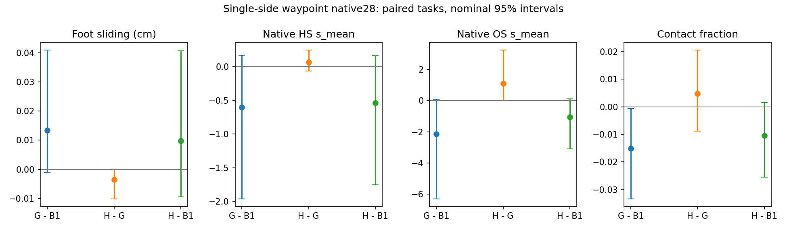

# Phase 2.23: Single-Side Waypoint Decisions (2026-09-07)

**Engineering completion PASS; native quality and HSI added-value NO-GO.**
Completed the cache analysis, isolated candidate sampler, interface verification,
G28/H28 closed-loop generation, native evaluation, paired statistics and fixed
visualizations. This is a complete generation experiment, beyond the previous
filter-count diagnostic. Phase 2.21/2.22 conclusions remain sealed.

## Scope and Frozen Mechanism

User handoff: `/data/yujinlun/report/PriorHOSI_5557dbf_single_side_waypoint_codex_handoff.md`.
Baseline5557dbf; branch `phase/02u-single-side-waypoint`. Protocol:
`experiments/protocols/p2_single_side_waypoint_s42_20260907.json`.
Config `code/config/config_sample_hosi_single_side.yaml`, policy off by default.
Implementation: `code/mixer/single_side_waypoint.py`. Frozen core, experts, native
evaluator, B1 editor, score_window, margins and old double-side functions unchanged.

Each window generates W0 and each independently valid +/-10cm waypoint with
the same history, frame, object goal, text, progress and private generation seed.
Each side must pass the old single-side quality conditions. W0 remains available
as the original pipeline fallback, with no collision-free claim. G minimizes
the existing human24/object128 nearest-free-voxel squared-distance energy.
H minimizes frozen raw L_full within G's original max(10% E_G, .0066667) allowance.
Exact ties prefer W0, then positive, then negative. Scoring receives W0's original
context for every candidate and each candidate's clean dynamic scene queries.
Only full scores select; existing static/mismatch queries are counted but do
not produce a new ablation or score search. HSI never edits candidate motion.

Sampler/editor/audit states and call inputs are branch-local; Python, NumPy,
CPU/CUDA RNG is restored before trials and to W0's post-generation state after
selection. One selected output and one sample-call increment reach the original
native evaluator. Rejected motions, model input traces, conditions, quality checks,
scores and per-hand diagnostics are retained. Later G/H histories diverge, so
the identical-pool claim applies only to their first window.

## Cache and Native Results

72 unique cached windows verified across all28 tasks.17 qualified sides occur
on13/28 tasks; accepted strict geometric improvements occur on333/372/376/421/424.
This justified the new closed-loop comparison without changing the old coverage
gate. All28 cache rows, side failures, deltas and per-hand traces are retained.

| Native28 method | HS s_mean | OS s_mean | FS cm | Contact | Completed |
|---|---:|---:|---:|---:|---:|
| B0 reused |4.764332|31.093625|.173899|.668160|22/28|
| B1 reused |4.104416|27.597258|.123737|.680641|22/28|
| G geometry |3.503154|25.450680|.137065|.665498|22/28|
| H HSI |3.569920|26.543228|.133584|.670256|22/28|

HS/OS retain native per-frame sums of penetrating vertex depths, averaged over
time; they are not per-vertex mean penetration. All15 native metrics plus
completion/task_failed are saved for every task. B0/B1 provenance and config
compatibility reuse the sealed Phase2.15/2.20 artifacts.

G-B1 HS point improvement14.65%, delta-.601263, task95%[-1.965563,.168232].
OS point improvement7.78%, delta-2.146578[-6.328759,.096606]. Both intervals cross0.
Contact delta-.015143[-.033503,-.000676] violates the-.02 lower-bound protection;
FS+.013329[-.001092,.040970] violates the+.01 upper-bound protection. Scene-unit
OS/FS/contact uncertainty protections also fail. Thus conditional decisions show
localized benefits, with aggregate quality promotion unestablished.

Primary H-G HS delta+.066767[-.062630,.248655], a1.91% point worsening; OS
+1.092548[-.001722,3.251467], a4.29% point worsening. Scene-unit intervals also
cross0, with positive HS mean direction. FS-.003481[-.010242,.000115] and
contact+.004758[-.008850,.020607] do not establish an independent scene benefit.
H also fails OS/FS/contact uncertainty protection against B1. HSI added value
is unestablished, and the registered5% HS primary fails. All28 completion outcomes
are identical across B1/G/H, not merely equal aggregate counts.

## Decisions and Failure Concentration

G:124 windows,260 generated candidates,41 qualified offsets,12 offsets selected
in8 tasks.112 W0 selections comprise56 input-inapplicable,36 without a qualified
offset and20 where W0 wins. H:124 windows,260 candidates,40 qualified offsets,
14 offsets selected in11 tasks.110 W0 selections comprise56 input-inapplicable,
36 without a qualified offset and18 W0 wins. Input proposals equal generated
counts in this cohort: no independently invalid side was encountered at runtime;
unit tests cover that condition. H changes its own contemporaneous G choice14
times; this is not a comparison to the G policy's already-diverged later pool.

G's HS improvement concentrates on375: HS90.911186->73.041916, delta-17.869270.
The other27 tasks have a net positive HS delta. Task333 instead increases
HS2.689880->4.659415 and loses13.64 contact points. Task376 loses15.67 contact
points;421 loses12.21. Task20 raises FS.074875->.455292cm. H-G's OS increase
concentrates on375:100.732002->130.620483. These are failure diagnoses on the
complete reported cohort, not alternative favorable-subset results.

Passing local anchor/stance/scene proxies therefore does not establish complete
native contact/sliding preservation. Per-hand distances and relative motion
remain descriptive and never change acceptance or selection.

## Verification, Cost and Artifacts

Formal run: `results/experiments/p2-mixer-single-side-waypoint-s42-20260907/`.
Eight authority3090 jobs exit0; controller653.53s.56 episodes,248 committed
windows,520 candidate windows,268320 HOI forwards (260000 diffusion plus8320
B1 reference),1584 HSI forwards. G/H cumulative candidate generation1383.68/
1384.50s; H scoring24.44s. Native generation timers include all trials and
decision work:1466.21/1492.51s; episode end-to-end1492.40/1518.85s. Costs come
from concurrent jobs, not isolated throughput comparisons.

Registered interface validation adds13 HOI windows/6708 HOI forwards, counted
separately (all new HOI forwards275028). Its complete wall time was not archived.
Task372 verifies off-policy B1 identity, signed candidate order invariance,
G/H paired motions, RNG restoration and one commit. **Its geometry budget is
a singleton, so HSI score repetition is not exercised by that interface**;
the earlier plan's score-equality statement concerned empty score dictionaries.
Active scoring is covered by the existing clean-query/private-noise/raw-head
component tests and1584 formal calls, with zero scoring exceptions.

Both policies reproduce all72 first-window caches:144 exact checks.56 retained
root/object endpoint comparisons have maximum error0cm and exact completion
classification. All37 completely fallback episodes (G20,H17) reproduce full B1
motion and evaluated joints bitwise. Selected-motion serialization and one
logical counter increment per window pass across all248 windows.

Focused tests28 passed. Full authority1039 passed/4 historical skips178.03s;
final repeat1039 passed/4 skips175.78s. Logs and interface artifacts:
`results/single-side-preflight-s42-20260907/`. Registry validation is through
`tools/experiment.py validate`, not JSON parsing alone. It detected inherited
Phase2.22 metadata `phase=p2.22`; commit8360fa2 corrects only its phase enum to
p2, retaining subphase2.22, all numbers and NO-GO. No GPU run failed in this phase.

Run contains resolved8 configs, config compatibility, manifest, execution plan,
commands/logs, all candidate captures/decisions, native motions/audits, cache
tables, endpoint checks and full task/scene bootstrap contrasts. Compact result:
`experiments/results/p2_mixer_single_side_waypoint_s42_20260907.json`.
Five fixed/failure-task videos (014/329/371/375/420),20 frames and paired plot
render successfully. Inspected329/375 frames retain visible motion/object/scene;
329's crouched configuration persists. Skeleton/128 object points and sparse SDF
are insufficient for fine contact or naturalness certification; human blind review
remains pending. Checkpoint and asset identities reuse sealed references.

Commits: preregistration0b52cd8, implementationd65639b, registry repair/runtime
8360fa2; completion commit on `phase/02u-single-side-waypoint`, integrate to
`phase/02-mixer`, immutable tag `exp/p2u-single-side-waypoint-v1`.

## Next Entry

Read this summary, OVERVIEW and the latest Phase2 plan. Stop this fixed policy
with NO-GO; do not search score signs/weights, offsets, DP, Temporal or contact
thresholds. A future proposal must address complete-task joint feasibility and
engagement under generated histories. No further phase, HSI attribution ablation,
training, InfBaGel rerun or441/469 evaluation starts in this session. The full
benchmark superiority claim remains open.
