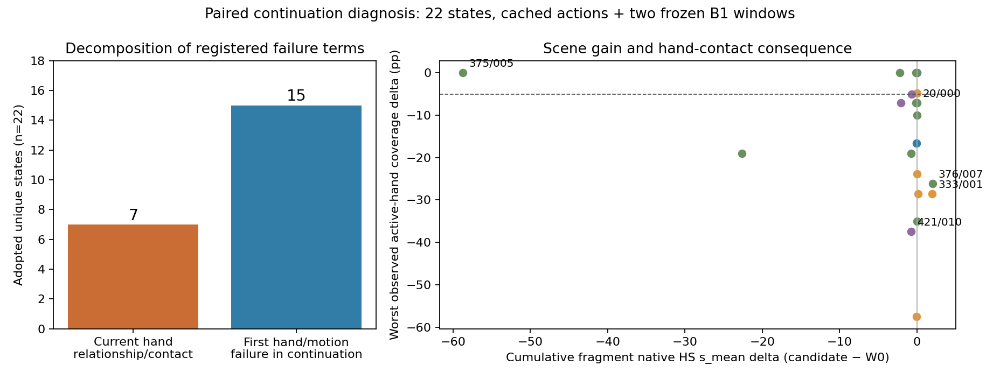

# Phase 2.24 — 配对续生成后果诊断（2026-09-07）

**诊断工程完成；轻量结果预测头的进入条件未满足。** 本轮恢复了26条真实偏移采用记录，
去重为22个状态，比较66个分支，新增132个冻结B1窗口。当前候选的即时问题与后续历史
风险同时存在。按手部关系/接触分项，7个状态在实际当前提交片段已超出登记保护；另1个
在当前缓存末两帧已出现超限；剩余14个需要观察B1新增预测帧才能发现相关超限。
44个偏移候选中18个保留了登记方向的场景收益，满足全部保护的候选为0个。
这支持优先解决生成历史下的联合可行性；本轮结束于后果证据与分流，不进入预测头训练。

## 范围与输入恢复

用户方案：`/data/yujinlun/report/PriorHOSI_f202825_next_experiment_plan_codex.md`。
基准`f202825`，工作区开始时干净。分支`phase/02v-continuation-outcomes`。
协议：`experiments/protocols/p2_continuation_outcomes_s42_20260907.json`；恢复清单：
`experiments/tasks/p2_continuation_states_s42_20260907.json`。

G12/H14条采用记录来自12个任务、4个场景。78个源候选缓存全部存在，代表66个独立
当前候选；缺失与近似替代均为0。去重比较实际历史、原始条件、物体参考、任务进度和
预算、所有候选以及已提交前缀，保留每条G/H来源。四个重复来源是H20/w1、H333/w0、
H372/w0、H424/w0。G/H375/w5保留为不同状态：root历史平均相距1.890cm，物体历史
平均相距2.506cm；相同任务号/窗口号不足以合并它们。

HOIPrior P15使用online权重；HSIPrior R2使用原`init_model`载入的保存state dictionary。
checkpoint路径与身份直接继承`experiments/protocols/p2_candidate_selection_s42_20260907.json`
的`checkpoints`字段，并在本轮紧凑结果中保留。P15、R2、Arm B、B1、seed42、16/2帧
表示、10Hz粗动作/30Hz原生插值、目标与坐标规则均冻结。原始环境解释器为
`/data/yujinlun/anaconda3/envs/infbagel/bin/python`，运行在8卡RTX3090权威主机。

## 实现、状态与评价语义

`code/mixer/continuation_outcomes.py`提供缓存恢复、隔离分支、有限续生成、分项评价、
汇总与固定渲染入口。`config_sample_hosi_continuation.yaml`默认关闭。
`code/test_infbagel_hosi.py`原有输出解码和后续历史准备被提取为`decode_sample_window`
与`prepare_next_window`，原路径和新诊断共同调用；路径lookahead、条件和进度仍由原
`sample_step`计算。专家、core、B1编辑器及原生评价公式均保持原样。

每个分支提交一个现存W0/W+/W−，再生成两个B1窗口。每分支使用新的sampler/editor/
缓存，保留固定物体参考；HOI私有随机流由`42+task+absolute_window*1000003`确定。
原快照未保存ambient RNG；冻结B1的私有随机流可按登记规则恢复，42次同状态原B1
未来缓存的动作与条件比较全部逐位一致。22次当前选中窗口的原生world-history解码
比较逐位一致，132个后续B1编辑器的历史/common/contact与最终guards全部有效。

原生流程按固定`seg_len`结束；没有到达目标即提前退出的控制。18个分支到达原终点，
属于6个状态：每个状态的三个分支完成判定一致，5个状态完成，任务330保持未完成。
其余48个分支为预算截断。这个18分支计数属于本诊断，不作为新任务总体完成率。

粗帧按原生规则保留：非终窗0..13，原终窗0..15，统一world坐标拼接。current/next1/
next2/cumulative使用真实保留帧；共同前缀配对与实际终止信息同时保存。诊断截断末端
只保留真实末帧，原生重复末帧仅用于真实原终点。下一窗口前两帧承接当前缓存尾部，
因此额外检查了B1真正新增预测帧，避免把缓存尾部损伤归因于新采样。

HS/OS采用原生surface SDF公式，单位为每帧穿透顶点深度和的时间均值；逐手接触使用
SMPL-X关节与完整物体表面，保留两手距离、5cm覆盖和物体坐标相对运动。FS使用原
地面估计及公式在实际片段上计算，明确命名为native-compatible fragment FS（cm）。
FK/voxel、固定W0支撑、接触预测和固定来源锚点单列；片段数值与历史全任务表分开。
人体目标为水平距离，物体目标为完整3D距离；完整完成标签仅在真实终点出现。

## 结果与机制分解

| 口径 | 当前损伤 | 延迟损伤 | 恢复 | 有益且全保护 |
|---|---:|---:|---:|---:|
| 原采用的22个独立状态，登记主类别 |16|5|1|0|
| 全部44个偏移分支，登记主类别 |30|11|3|0|

恢复可以与先前损伤重叠：原采用分支的布尔字段为17次当前损伤、5次延迟损伤、1次恢复。
登记主类别包含目标推进保护，17次当前损伤中10次只有人体/物体目标偏差项。
因此机制解释进一步展开原始分项，保持登记类别和可行性判定不变：

- 7/22个原采用状态在当前提交片段已有手部关系/接触保护失败；其中4个有原生逐手覆盖
  或表面距离保护失败，另外3个由关系偏差触发。
- 15/22个状态的当前提交片段手部/运动分项尚可，续生成后出现相关超限。
  排除后续窗口承接的两帧后，这15个状态仍在B1新增预测部分出现手部超限。
  其中376/state007在当前缓存尾部也已超限，剩余14个体现新的后续风险。
- 原采用分支中14个在后续出现逐手覆盖/活动手表面距离保护失败，9个出现支撑速度
  保护失败，21个出现关系偏差超限。这些是相对同状态W0的登记诊断分项。
- 44个偏移分支中27个原本通过局部guard，17个为原guard拒绝的诊断分支。
  18个偏移分支有累计HS下降且OS不增加，满足全部登记保护的候选为0/27；
  将所有44个诊断分支展示出来仍为0。22个状态均未找到登记意义上的有益可行替代。

即时漏检有明确的口径来源：旧`control_metrics`在local2..15上使用FK手部、128个物体
表面点及“任一手距离<10cm”的接触代理；当前诊断在实际提交帧上使用原生SMPL-X手部、
完整物体表面和逐手5cm接触。原有平均关系保护也可能掩盖单手变化。这些接口差异能
解释H1的代理缺口；H2的后续风险仍需要实际生成历史证据。本轮保持旧guard原样。

关系偏差并不等价于真实失接触。375/state005的W−在后续获得很大场景收益，原生接触
覆盖保持或改善，仍因关系/运动/推进分项超限而排除。可行性结论限定于当前有限提案、
保护定义和冻结B1时域；更广的生成能力与有效重抓握语义仍需独立验证。

| 固定案例，原采用分支 | 观察 |
|---|---|
|333/state001 W+|当前任一手接触覆盖相对W0下降28.57pp；next1 HS由当前−0.1796转为+5.8632，累计+1.9695。|
|376/state007 W−|当前任一手接触覆盖差0pp；next1/next2为−26.19/−15.00pp，next2 HS+8.1662；缓存尾部也有关系超限。|
|421/state010 W+|三个片段HS差均为负；next2接触覆盖下降37.50pp，场景收益与后续接触风险并存。|
|20/state000 W−|累计HS/OS差−0.0514/−6.8776，当前已有右手关系偏差超限；不同片段的接触变化方向不同。|
|375/state005 W−|累计HS/OS差−58.7041/−192.0244，接触覆盖保持，但关系、运动与推进保护未满足；属于已知高影响开发案例。|

表中HS/OS与接触均为本次片段配对值，pp表示百分点。任务375保留于全量结果；12个任务
的状态均值和4个场景的任务均值均已输出。样本来自已知采用状态，统计采用描述性配对
分项与嵌套汇总；本轮没有总体无偏效果、跨种子或全任务保护保证的推断。

H1有直接证据；H2在新增预测帧上更普遍；固定来源关系与分支接触预测支持继续追踪H3，
但释放时机不足以确定参考漂移的独立因果作用。H4在当前登记候选/保护定义下成立。
本轮优先分流到生成历史下的联合可行性问题，轻量预测头的候选空间进入条件未满足。

## 不确定性、失败与成本

所有66分支均保存current/next1/next2/cumulative动作、分项、W0差值、guard、终止和成本。
60个slice-hand条目缺少活动手证据，15个切片缺少有效支撑速度参考，均保留N/A；
7个偏移分支有预测接触下降的释放/失接触歧义。48个分支的全任务结论为截断未知。

两次运行失败都封存：首次`ecea024`在加载数据前被Hydra结构化配置拒绝，0个生成窗口；
第二次`8c1b09e`生成12个有效窗口后，片段评价因SMPL-X关节索引导入位置错误中止。
修正后`5bf15b7`直接复用六个完整分支，仅新增剩余120个窗口。总新增数始终为132，
低于156上限；没有重复生成、候选重建、额外重复性调用或延长到终点的补跑。

总计68,112次HOI forward（66,000 diffusion +2,112 B1 reference）、0次HSI forward。
同步生成累计687.15s，分支累计wall740.24s，当前缓存读取0.453s，片段评价25.68s；
最大记录allocator约912.06MiB。三次控制器wall分别4.02/79.76/223.43s，合计307.20s。
并发累计工作量与控制器wall分别报告；渲染wall与纯CUDA-kernel时间未单独测量。

两个恰好覆盖原完整任务的区间（333、330）复核六项原生汇总量，最大差5.37e−7（各自
单位）。GPU片段运动学与原CPU运动学在333固定首帧派生关节上最大相差0.738mm；
原动作、条件与world-history逐位一致的结论独立于这一派生关节误差。详情见最终
`analysis/native_verification_final.json`，其中明确纠正了早期关节检查说明文字的过强表述。

## 验证与交付

25项续生成组件检查通过。完整权威套件`1064 passed, 4 skipped`，169.61s；
日志位于`results/continuation-preflight-s42-20260907/authority-r3-final.log`。
Hydra八条配置完整解析，生成函数与r2逐AST相同，sampler/dataset配置一致；
registry通过`tools/experiment.py validate`。本轮没有单独smoke或训练microbatch路径；
实际登记分支提供运行验证，同步计时与显存测量覆盖推理路径。

主产物根目录：`results/experiments/p2-mixer-continuation-outcomes-r3-s42-20260907/`。
`lanes/*/state-*`保存动作和完整outcomes；`analysis/paired_components.csv`、
`summary.json`、`attribution.json`、`frame_ownership_attribution.json`保存配对与机制分解。
`resume_inputs.json`记录复用动作身份。两个失败run的原manifest、日志和动作完整保留。

固定333/376/421/20/375的5段三分支动画、20张帧图与总览图位于`visualizations/`，
首次渲染入口为`render_continuation_outcomes(run_root, device='cuda:7')`；已有产物可直接复查。
本次检查333和375的代表帧可见人体、物体和场景；骨架/128物体点/稀疏场景支持时序
对照，细接触判断依据完整表面的数值。独立人工盲评仍未进行。

紧凑结果：`experiments/results/p2_mixer_continuation_outcomes_s42_20260907.json`。
一页中文结论：`/data/yujinlun/report/PriorHOSI_f202825_continuation_outcomes_20260907.md`。
提交：预登记`5e3d3e1`；实现`ecea024`；两次实际失败修复`8c1b09e`、`5bf15b7`。
完成提交由标签`exp/p2v-continuation-outcomes-v1`定位，完成后整合回`phase/02-mixer`。

## 下一次session的精确入口

读取本总结、`docs/plan/OVERVIEW.md`与Phase2计划。设计一个新的有界生成端联合可行性
方案，以真实生成历史、逐手接触和支撑后果为验证对象，并明确有效释放/重抓握关系的
诊断语义。当前0/27候选未满足轻量结果预测头进入条件，阶段B协议与训练均保持未启动。
新的具体实验经用户批准后再登记与实施。当前L_full、guard和waypoint幅度保持封存；
Phase2.23 NO-GO保持，441/469及完整基准优越性问题继续开放。

封存前再次执行完整套件：1064 passed、4 skipped，240.41s；日志为
`results/continuation-preflight-s42-20260907/authority-completion.log`。
最终registry校验389条有效。末次改动为结果、总结与计划导航，运行代码保持`5bf15b7`。
