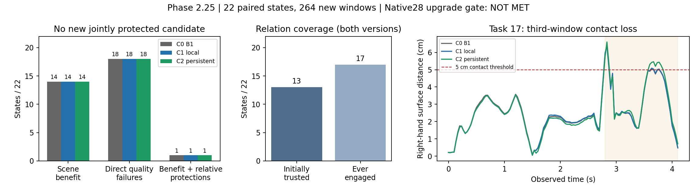

# Phase 2.25 — 跨窗口关系条件采样（2026-09-07）

**有界生成实验完成；固定关系采样修正的升级门槛未满足。** C1窗口局部参考与C2跨窗
参考各完成132个窗口，共264个独立新窗口。C0、C1、C2在本轮相同的直接质量口径下，
均为14/22个状态保留场景收益、18/22个状态违反至少一项直接保护、1/22个状态同时
有收益并通过相对保护。那个状态在C0中已经成立；新增合格候选为0。

C2相对C1没有新增达到登记改善幅度的合格任务，任务17的第三窗口右手接触覆盖退化。
本轮停止这组固定采样修正及其权重搜索，未进入native28完整策略或任何训练。

## 范围与预登记

用户最新方案：`/data/yujinlun/report/answer.txt`。基准7027ccb；
分支`phase/02w-relational-sampling`，协议
`experiments/protocols/p2_relational_sampling_s42_20260907.json`。

沿用Phase2.24的26条来源、22个独立真实状态、12个任务、4个场景。每状态比较原W0
条件和此前实际采用的±10cm条件；C1/C2重新生成当前动作，再沿新历史生成两个窗口。
C0对应44个分支直接复用2.24缓存。本轮132个总观察分支包含88个新分支及44个C0分支。
P15 online、R2保存权重、Arm B500、B1编辑、seed42、原生16/2帧与终止规则保持封存。
HSI模型载入后冻结，实际前向调用0次。全部输入与专家身份沿用封存协议/清单的引用。

本轮只关闭2.25。方案中的条件性完整native28策略分为2.26；本轮升级门槛失败，因此
2.26未启动。native28属于已使用的开发数据，后续441/469也保留既有使用历史。

## 实现与关系语义

新增`code/mixer/relational_sampling.py`及一个Hydra覆盖配置；继续使用既有
CandidatePoolSampler、原生decode/prepare_next_window/sample_step和片段评价函数。
ComposedSampler增加默认关闭的关系guidance接口；core、两个专家、原生评价公式与
B1损失保持原样。没有新增tools脚本、预测头、足部控制器或训练参数。

关系证据来自真正提交的末两帧（前窗12:14），首窗使用原始固定2帧。前窗14:16仍是
原采样器的承接历史，单独用于生成条件。二者的帧归属明确区分。

逐手可信规则：两帧FK手掌到完整物体表面的距离均≤5cm、两帧contact均>0.95、
物体坐标系中手掌位移≤2cm。C1与C2使用同一接触状态转换规则；C1从实际历史刷新
锚点，C2保留首次可信锚点。接触预测下降本身不能解除关系。两帧同时距离>10cm且
contact≤0.95时，记录未知并暂停；之后重新建立关系标记为重抓握歧义。

明确释放需要带已执行时间条件的逐手任务依据。现有native任务没有该字段，所以
本轮确认释放为0；这不意味着这些任务没有真实释放，也不验证通用释放能力。
“可信”是上述规则的标签，仍受FK几何与接触输出的有效范围限制。

新增能量为未来14帧、两手固定均值的
`m * (10 relu(d_surface - .05)^2 + 10 relu(d_anchor - .02)^2)`。
在与Arm B相同的9..1九个去噪步，对clean prediction求负梯度，乘1000与原posterior
variance，逐元素更新上限1；原Arm B先执行，历史随后保持原值。C1/C2的能量、预算和
权重相同。保存实际编辑前输出、B1最终输出、每步能量/梯度/更新与逐窗关系状态。

## 结果

| 原采用方向，22个状态 | C0 B1 | C1局部参考 | C2跨窗参考 |
|---|---:|---:|---:|
| 累计HS下降且OS不增加 |14|14|14|
| 至少一项直接质量保护失败 |18|18|18|
| 有场景收益且通过本轮相对保护 |1|1|1|
| 新增且达到后续改善幅度的合格任务 |—|0|0|

唯一通过本轮相对保护的是376/state008，三个版本均成立。它的第三窗口右手5cm覆盖
仍只有22.5%；**相对W0的保护并不证明绝对接触质量合格**。这也说明应保留绝对指标。
本轮将锚点偏差和中途目标距离单列为代理诊断。Phase2.24原有0/27、0/44严格结论
保持不变，当前1/22绝不能归因于新生成机制。

C1/C2初始建立关系的状态均为13/22；整个观察期间曾启用为17/22，另5个一直未知。
每版本132个窗口中94个启用guidance，各846次更新，非有限梯度为0；暂停/重抓握
歧义事件均为0。最大逐元素更新达到登记上限1，机制确实执行。

C1/C2原采用分支相对C0的原生关节世界位移，按状态平均后分别约0.409/0.581mm；
最大单关节位移分别51.184/51.530mm。平均改变量小，局部存在较大变化，不能只靠
稀疏动画判定接触是否改善。

- **任务17/state012，第三窗口右手覆盖：** C0 87.5%、C1 82.5%、C2 72.5%。
  C2比C1下降10个百分点；平均表面距离从3.349cm增至3.510cm。轨迹在5cm阈值附近
  的变化造成明显覆盖差异，图中展示连续距离，避免把二值指标误读为全程失接触。
- **任务375/state005：** C2唯一达到登记改善幅度的后续分项是第三窗支撑速度，
  C0/C1/C2为0.45743/0.45969/0.44532m/s。但原生片段FS由C0的0.58540增至
  0.61863cm；累计HS/OS相对C0分别增加6.41156/7.18643（原生每帧穿透深度和单位）。
  单项支撑代理改善没有形成联合质量收益，也没有通过多任务升级门槛。
- **W0条件：** 两个新版本均未在任何任务触发相对C0的登记直接质量退化。
  C2对C1的额外合格任务为0，直接退化任务为1（任务17）。

B1编辑后，关系能量增加的窗口为C1 52/132、C2 54/132；下降分别39/132、39/132。
这是采样后处理的能量诊断，不能等同于同数量的原生接触损伤，也不能用来单独归因
本轮全部失败。接触、FS、场景穿透始终由最终动作的原生接口判断。

每版本12个分支到达真实原终点、其中10个完成，与C0相同；另外32个分支为时域截断。
没有完整任务总体完成率或三个窗口以后的保护结论。新分支352个评价切片中，支撑
速度N/A为20项，非活动手项为80/704；原始值及参考状态全部保留。

状态配对、按任务均值及场景分解均已输出。这是定向选择的22状态开发证据；264窗口
不作为独立样本，不报告总体显著性或跨seed置信区间。

## 运行失败、恢复与验证

首个运行在35830de生成4个当前窗口后，被编辑前快照检查终止。记录发生在SO3投影
之后、原历史恢复之前，历史旋转最大差1.78814e−7；未来raw输出与全部4个最终动作
均与C0缓存逐位一致（该状态初始关系未知）。原manifest、日志和4个输出完整保留。

修复只把记录点移到实际B1输入边界，并添加500步真实采样链的历史恢复检查。
r2直接复用4个动作，补齐其后续窗口并生成剩余状态，总计260新窗口；两次运行共
264个独立新窗口。复用记录修正的是raw快照的历史字节，真实动作保持原值。
显式resume来源、绝对sampler计数和继承/新增成本均保存，没有重采样、改权重或阈值。

- 全套：`1079 passed, 4 skipped`，193.18s；相关组件72项通过。
  命令为`INFBAGEL_PYTHON=/data/yujinlun/anaconda3/envs/infbagel/bin/python`后
  `"$INFBAGEL_PYTHON" -m pytest tests -q`，日志在
  `results/relational-sampling-preflight-s42-20260907/authority-r2.log`。
- 8条最终resolved配置的sampler/dataset与封存B1一致。88组当前条件/历史检查通过；
  44组C1/C2当前动作逐位一致；复算1056个C0原生标量与2.24逐值完全一致。
- 8条r2作业均exit0，22状态没有遗漏或最终运行/评价错误。工程gate通过，方法升级
  gate失败。既有manifest生命周期和registry校验完成。

累计136,224次HOI前向、0次HSI前向；264窗口同步生成时间1490.284s，分支wall
1567.312s，片段评价41.816s。r2控制器574.589s，含首次失败总608.364s。
最大测得allocator为1,208,637,440 bytes（约1.126GiB）。首lane通过后七lane并行，
硬件为8×RTX3090。首窗直接调用sampler，后续调用sample_step；规划/准备包含于
branch wall，没有独立planning/kernel-only计时。C0延迟来自历史运行，因此这些数值
用于计算量报告，不构成同环境匹配的额外延迟估计。没有训练microbatch路径或额外运行。

## 产物与封存

运行根目录：`results/experiments/p2-mixer-relational-sampling-r2-s42-20260907/`。
`lanes/*/state-*`保存6个分支、完整原生tracks和outcomes；`analysis/`保存完整配对CSV、
状态/任务/场景表、C0同口径核对、采样与编辑后能量、运动改变和原生复算。

固定333/376/421/20/375各一段三版本动画、共20张帧图位于`visualizations/`。
复现入口为`render_continuation_outcomes(run_root, device='cuda:7', comparison='relation',
tasks=[333,376,421,20,375])`。检查了375/376代表帧和机制汇总图；骨架、128物体点和
稀疏场景用于时序对照，细接触以完整表面数值为准。人工盲评未进行。

紧凑结果：`experiments/results/p2_mixer_relational_sampling_s42_20260907.json`；
中文一页报告：`/data/yujinlun/report/PriorHOSI_7027ccb_relational_sampling_20260907.md`。
预登记4e000e8，实现35830de，记录/恢复修复533b587；完成提交由
`exp/p2w-relational-sampling-v1`定位，工程封存后ff整合至`phase/02-mixer`。

## 下次session的精确入口

读取本总结、OVERVIEW和Phase2计划。停止这组固定关系采样修正的追加权重搜索。
若继续生成端路线，先形成新的具体轻量适配方案与独立训练域监督契约，明确修改历史
对应的正确未来；native28缓存保持开发用途。任何HSI学习接口须保留同构无HSI对照。
当前结果未建立HSI迁移价值，2.26完整策略、训练和441/469保持未启动。

封存附加核对：C2的107段持续活动手跨窗转换中，锚点逐位保持；C1对应107段参考
发生刷新，最大刷新距离0.23759m。全部264个B1编辑记录的历史/common/contact与
最终guards有效。记录在运行目录`analysis/relationship_integrity.json`；参考位移仅作
操纵有效性检查，不能据此断言107次刷新都是错误交互。

最终封存检查：1079 passed、4 skipped，171.42s，日志`authority-completion.log`；
registry392条有效。core、HOI、HSI与原生评价/引导公式相对7027ccb保持原样。
