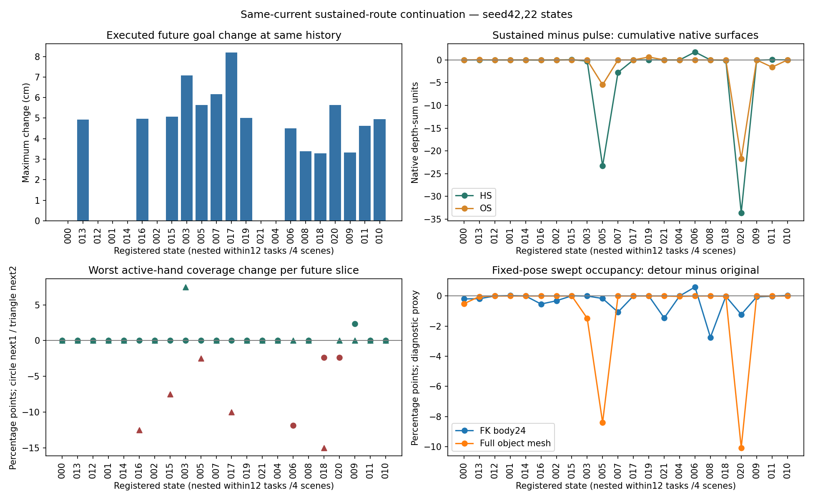

# Phase2.27 — 同当前动作的持续绕行续生成（2026-09-08）

**44个新窗口完成；持续绕行的联合改善升级门槛未满足。**
新路线在15/22状态产生达到登记幅度的命令和实际运动变化，后续root平均位移28.35mm。
场景收益覆盖从14/22增至16/22，仍有18/22触发至少一项直接保护。
同时通过对W0和原偏移续生成保护的状态为1个，达到登记后续改善幅度的合格任务为0。
5个任务、8个状态相对原偏移续生成触发登记退化。本轮停止这一条固定曲线的搜索。

## 范围与预登记

用户在同一会话批准了从7fe9fa4出发的实验。Phase2.26保留为2.25未获升级的完整策略；
本轮单独登记2.27，分支phase/02x-route-continuation，协议
`experiments/protocols/p2_route_continuation_s42_20260908.json`。

沿用26条来源、22个独立状态、12个任务和4个场景。W0与原采用偏移的完整三窗分支
各22条直接复用2.24缓存；新方法提交同一个原采用当前动作，随后生成两个B1窗口。
共22个新分支、44个新窗口，当前动作重生成0、额外重复0。P15 online、R2保存权重、
Arm B500、B1、seed42、16/2帧与原生终止/目标保持固定；实际HSI前向0次。
这些缓存属于已用开发数据，训练用途仍禁止。441/469和完整native28策略未启动。

## 实现和唯一干预

`mixer/route_continuation.py`实现固定曲线、GPU几何检查、实际条件记录和汇总。
`generate_branch`增加可选route_control回调，复用原生decode/prepare_next_window/
sample_step及原生片段评价。默认关闭的Hydra覆盖配置接到既有评价入口。
core、两个专家、原生评价公式与B1均保持原样；新增tools脚本为0。

原A*采样折线以累计弧长s参数化，缓存偏移点索引j对应锚点。进入区间为
[max(0,s_j-lookahead),s_j]，退出区间为[s_j,min(s_end,s_j+2*lookahead)]。
权重分别为q(u)和1-q(u)，q(u)=6u^5-15u^4+10u^3。使用缓存的世界偏移向量，保留
原方向及10cm幅度；原折线首尾精确保留，j点精确经过原偏移点。一条折线在分支内
持续使用，原生lookahead依据本分支实际历史选点。平滑性属于偏移包络，原A*拐角保留。
曲线未按结果选择或修改。近终点的退出区间会缩短，实际命令覆盖单独报告。

每个未来窗口同时记录同一实际历史下原路线与新路线的world/local目标。所有22704次
HOI调用的实际pelvis目标都与新路线一致；第一未来窗口除了pelvis目标，其余context
及承接历史逐位匹配缓存原偏移分支。后续窗口沿自己的新历史生成。

几何检查把实际当前提交frame13的人体FK24和完整物体网格，按最多2cm间隔沿两条
路线的变形区间平移；高度、朝向和人—物相对构型固定。结果记录占据与场景外比例。
这是固定姿态包络代理：它定位规划风险，不能证明允许换步/转动物体的动作必然不可行。
几何检查未筛掉任何状态，也未改变生成条件或原生评价。

## 配对结果与解释

| 22状态，同口径比较 | 原偏移后回原路线 | 持续绕行 |
|---|---:|---:|
| 累计HS下降且OS不增加，相对W0 |14|16|
| 触发至少一项直接保护，相对W0 |18|18|
| 有收益且通过相对W0保护 |1|2|
| 同时通过相对W0及原偏移分支保护 |—|1|
| 达到登记未来改善幅度的合格任务 |—|0|

“相对W0合格”的2个新状态均属于任务375（state005/state018）；其中state018相对
原偏移分支新增支撑速度超限，只有state005同时通过两个参照的保护。state005没有
达到>=5pp接触覆盖、>=1cm手表面距离或>=.01m/s支撑速度的登记未来改善幅度。
旧参照的唯一合格状态376/state008在新方法中触发运动速度保留保护。
这些是新实验内的同口径结果，历史2.24的0/27和2.25的1/22保持原含义。

原生片段HS/OS仍为逐帧穿透顶点深度和的时间均值，FS为cm。按状态先归约为任务、
再等权12任务的累计差值如下；本定向样本只作描述性汇总，无总体显著性推断：

| 新方法减原偏移续生成 | 任务等权差值 |
|---|---:|
| native-compatible HS s_mean |−1.213817|
| native-compatible OS s_mean |−0.682549|
| native-compatible fragment FS cm |−0.001672|
| 任一手5cm接触覆盖 |+0.0840个百分点|
| 固定参考支撑速度 m/s |−0.000483|

任务375贡献约97.73%的任务等权HS净差。任务334/424的HS均值增加；完整任务/场景
分项及两手均保留。均值改善没有通过联合保护与多任务门槛。

- **372/state003：**第三窗口右手覆盖90%→97.5%，支撑速度.48554→.42818m/s，
  片段FS .57018→.50709cm；相同W0支撑速度为.11096m/s，未来仍超出W0保护。
  这是实际后果改善，但尚未恢复登记要求的联合质量。
- **375/state005：**第三窗口HS434.124→391.717，OS545.070→595.052，片段FS
  .58540→.54337cm，支撑速度.45743→.46743m/s。累计场景收益保持；第三窗口左手
  覆盖25%→22.5%。相对保护通过仍不提供绝对抓握质量证书。FS为连续观察项，不能
  将其事后替换为本轮预登记的未来改善门槛。
- **376/state008：**第三窗口支撑速度.13565→.10754m/s，FS .27365→.21478cm，
  但总体关节速度保留触发登记限制。这一判定描述约定的运动保护，不单凭它宣称动作
  不自然。第三窗右手覆盖25%，继续保留绝对量。
- **375/state020：**第三窗口HS/OS均降低、FS也下降；固定参考支撑速度
  .40905→.43444m/s，触发对原偏移分支的保护。不同足部指标的方向继续并列记录。

直接退化任务为334/374/375/376/424，共8状态；包含逐手接触、支撑速度及运动速度
保留分项。升级要求至少2个不同任务的联合有效改善，本轮合格任务0。

## 干预覆盖、通行与截断

15状态/8任务达到命令>=1cm且未来root平均改变>=1mm；44个未来命令中22个改变
至少1cm、26个有非零改变。另5状态完全未改变、2状态只有微小变化，主要受终点
lookahead限制。预先确定的14个新增预测风险状态中，11个获得实质干预；其中5个有
达到登记幅度的未来单项收益、6个相对原偏移分支触发直接退化。

固定姿态包络检查中，原路线/新路线的人体占据状态数17/16，物体占据8/7；物体场景外
状态数均3。占据比例是每状态所有采样点的分母；完整记录位于envelope_audits.json。
这些代理显示几何困难存在，仍需与实际生成的原生接触、穿透和足部后果分别解释。

每组6个分支到达原终点、其中5个完成；新方法与参照一致。其余16个新分支为时域
截断，未获得完整任务完成结论。全部N/A、逐手绝对距离/覆盖和原生片段地面值保留。
该结果支持路线条件具有实质影响，同时表明这一固定路线仍不足以解决联合质量。
更广泛的路线、生成器能力和训练适配价值均保持未决。

## 验证、失败和成本

34项续生成组件检查通过。全套1088 passed/4历史skips，192.08s；命令：
`INFBAGEL_PYTHON=/data/yujinlun/anaconda3/envs/infbagel/bin/python`，然后
`"$INFBAGEL_PYTHON" -m pytest tests -q`。日志在
`results/route-continuation-preflight-s42-20260908/authority-final.log`。
最初2个新测试样例缺surface_mean_m字段，已在正式运行前补全样例；指标未改。
首轮全套1087通过；补充逐手汇总检查后运行上述1088全套。正式运行失败0。

22个当前动作、22个第一未来非路线context/历史检查逐位通过；1408个缓存原生标量
逐值复算一致；8组resolved配置的sampler/dataset/专家及原生关键设置一致。
全部8作业exit0，无缺失状态、额外生成或恢复。普通manifest生命周期已完成。

22704次HOI、0次HSI前向；44窗口累计同步生成226.609s，分支累计wall249.753s，
片段评价25.861s，包络检查.615s（已包含在分支wall）；控制器wall123.805s。
分支记录的最大allocator956363776bytes，约.891GiB。末次评价峰值未另行记录。
8×RTX3090，首lane通过后其余7lane并行。计时包含实际模型条件检查，旧缓存延迟
不是同环境配对性能对照；没有额外smoke、训练microbatch或性能重跑。

## 产物与封存

Run：`results/experiments/p2-mixer-route-continuation-s42-20260908/`。
每状态保存新分支、两个缓存引用、route命令/通行记录、tracks及原生outcomes。
analysis保留全部状态/任务/场景表、CSV、机制分类与补充核对。
visualizations提供固定333/376/421/20/375的5段动画、20张帧图与汇总图；已检查
汇总图及375代表帧。骨架/128物体点/稀疏场景用于时序对照；细接触依据完整表面数值。
人工盲评未进行。复现入口：`render_continuation_outcomes(run_root,device='cuda:7',
comparison='route',tasks=[333,376,421,20,375])`及`render_route_summary(run_root)`。

紧凑结果：`experiments/results/p2_mixer_route_continuation_s42_20260908.json`。
一页中文报告：`/data/yujinlun/report/PriorHOSI_7fe9fa4_route_continuation_20260908.md`。
预登记1765595；实现及唯一运行源码4943a60；完成提交由
`exp/p2x-route-continuation-v1`定位。工程交付封存后ff整合至phase/02-mixer，方法升级失败。
输入身份引用封存协议与manifest；没有新增校验体系或重复计算未变检查点身份。

## 下次session的精确入口

先读本总结、OVERVIEW及Phase2最新计划。停止这条固定曲线的追加搜索，原2.26仍未
启动。后续先形成独立训练域的轨迹条件HOI适配提案，明确真实历史/目标/未来的一致
监督和生成历史下的验证；修改历史后的旧未来不能直接充当标签。若继续研究HSI接口，
需保留相同预算与监督的无HSI对照。本轮关闭2.27；训练、完整策略和441/469均未启动。

封存前全套再次通过：1088 passed/4 skipped，196.98s；日志authority-completion.log。
394条registry有效。完成提交包含结果/文档，运行源码保持4943a60。
