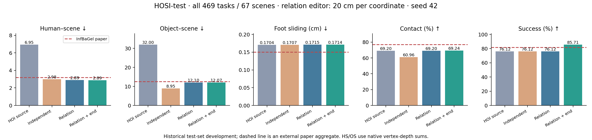

# Phase2.28 — 完整动作的关系保持场景编辑（2026-09-08）

**完整469任务已证明本轮关系保持编辑的场景收益，终点修复另带来45条完成增益。**
最终HS2.8861、OS12.0710、完成率85.7143%优于论文Hybrid聚合参考3.17、12.45、81.45%；接触69.2397%、FS.1714cm及人—物穿透6.1010仍弱于论文76.96%、.15cm、5.05。优势范围保持明确。
相对同一批原始动作，关系保持编辑使HS下降58.42%，OS下降62.18%；接触变化+0.0000个百分点。
终点修复对112条失败任务提出候选，采用其中45条，完成数由357增至402。其余候选及拒绝原因全部保留。

| 全部469任务 |HS↓|OS↓|FS cm↓|C%↑|S%↑|
|---|---:|---:|---:|---:|---:|
|HOIPrior 原始动作|6.9531|32.0017|0.1704|69.2011|76.1194|
|独立变换20|2.9843|8.9498|0.1707|60.9641|76.1194|
|关系保持20|2.8910|12.1022|0.1715|69.2011|76.1194|
|关系保持20＋终点修复|2.8861|12.0710|0.1714|69.2397|85.7143|
|InfBaGel Hybrid 论文|3.1700|12.4500|0.1500|76.9600|81.4500|

论文行直接引用[InfBaGel Table1 Hybrid](https://arxiv.org/html/2604.04843v1#S4.T1)。它是外部聚合参照；本地各行使用同一批469动作，分别保存逐任务数据。

## 效果、配对不确定性与方法代价

下表差值为关系保持20减原始动作。接触与完成用百分点，其他沿用原生单位。每组10000次seed42 bootstrap；任务和场景是两种归约单位。

| 指标 | 差值 | 任务95%区间 | 场景95%区间 |
|---|---:|---:|---:|
|HS↓|-4.0621|[-6.3796, -2.2061]|[-7.0723, -1.7723]|
|OS↓|-19.8995|[-25.3173, -14.9691]|[-25.5771, -14.6886]|
|FS cm↓|+0.0011|[-0.0015, +0.0038]|[-0.0008, +0.0034]|
|C%↑|+0.0000|[+0.0000, +0.0000]|[+0.0000, +0.0000]|
|S%↑|+0.0000|[+0.0000, +0.0000]|[+0.0000, +0.0000]|

独立变换20的接触率为60.9641%，关系保持为69.2011%；对应OS为8.9498/12.1022。这把关系保持的收益与可行域缩小带来的穿透代价直接并列。

终点修复与关系保持输入配对，完成率增益9.5949个百分点，任务95%区间[7.0362,12.3667]，场景区间[7.2495,12.1535]。完整15原生指标加完成率、所有任务/场景区间见紧凑结果和统计补充目录的analysis。

| 物体类别（每类67任务） | 来源HS | 关系HS | 来源OS | 关系OS | 来源C% | 关系C% | 最终S% |
|---|---:|---:|---:|---:|---:|---:|---:|
|clothesstand|4.0897|1.8810|85.7087|30.1032|44.18|44.18|100.00|
|floorlamp|8.0965|1.6585|25.4156|11.1697|73.02|73.02|29.85|
|monitor|14.4521|5.6624|11.8149|4.7897|71.42|71.42|92.54|
|smallbox|1.8736|1.1582|7.4108|4.3233|85.70|85.70|94.03|
|smalltable|6.1510|1.8367|33.8931|7.4785|78.90|78.90|100.00|
|suitcase|2.5539|1.2383|4.5441|1.3349|87.79|87.79|98.51|
|tripod|11.4551|6.8018|55.2246|25.5159|43.40|43.40|85.07|

## 全部原生指标

| 指标 | 来源 | 独立20 | 关系20 | 关系＋终点 | 论文Hybrid |
|---|---:|---:|---:|---:|---:|
|地面估计 cm|4.01502|4.00549|4.01947|4.01798|—|
|FS cm|0.17043|0.17074|0.17148|0.17145|0.15000|
|手—物穿透均值 cm|0.38228|0.38074|0.38228|0.38218|—|
|手—物4cm穿透帧比例 %|19.27608|19.51043|19.27509|19.27011|—|
|Pbody 原生尺度|6.10016|6.13454|6.10028|6.10099|5.05000|
|人体—物4cm穿透帧比例 %|19.63711|20.07155|19.63526|19.63028|—|
|人体终点误差 cm|3.56337|3.56337|3.56337|3.56337|4.37000|
|物体终点误差 cm|7.57822|7.57822|7.57822|7.21503|7.94000|
|接触 %|69.20108|60.96408|69.20108|69.23972|76.96000|
|HS s_mean|6.95311|2.98426|2.89098|2.88608|3.17000|
|HS s_max|62.86136|36.17310|35.35879|35.35875|37.09000|
|HS穿透帧 %|31.18100|28.86104|28.25083|28.15940|26.74000|
|OS s_mean|32.00167|8.94976|12.10216|12.07096|12.45000|
|OS s_max|166.81134|97.94549|112.39637|112.39101|93.37000|
|OS穿透帧 %|26.10583|17.40456|23.32631|23.14222|22.32000|
|完成 %|76.11940|76.11940|76.11940|85.71429|81.45000|

## 全量审计与残余失败

scene_human_penetration_s_mean：136条改善、21条增加（绝对容差1e-6）；前10条贡献净收益的68.04%。最大残余及退化任务的来源数值完整保留在紧凑结果。
scene_obj_penetration_s_mean：160条改善、0条增加（绝对容差1e-6）；前10条贡献净收益的35.38%。最大残余的任务及来源数值完整保留在紧凑结果。

例如任务245的HS从5.0733增至10.1087，同时OS从80.5965降至42.0478；此类取舍作为真实退化保留。

关系保持的最大手—物体坐标误差0.000775mm；最初6帧与最后3帧人体位置最大误差分别为0/0m，物体位置分别为0/0m。

终点候选拒绝原因可重叠：`{"completion_recovery": 62, "scene_obj_penetration_s_mean": 9, "foot_sliding": 1, "contact": 1}`。所有采用与拒绝的整条动作均保存；终点检查是公开的候选验收规则。

最终67条失败中floorlamp占47条。完成率衡量终点误差：clothesstand完成率100%，接触率仍44.18%；tripod最终完成85.07%，来源/主编辑接触43.40%。这些指标描述不同质量维度，保留全部绝对数值。

## 方法、数据使用及论点范围

本轮把编辑放在 P15/Arm B500 完整生成之后，直接优化原生 30 Hz 的人体姿态和刚体物体轨迹。人体与物体共用水平平移和绕人体骨盆的 yaw 变换；固定上半身局部姿态，由此保持手在物体坐标系中的位置。六个髋、膝、踝关节的局部旋转参与支撑修正。独立变换对照允许物体使用另一组水平平移和 yaw，其他设置及每条任务的步数一致。

控制量通过间距 0.5 秒的三次 B 样条展开，叠加平滑进出包络。主编辑精确保留最初 6 帧和最后 3 帧。目标使用完整 SMPL-X 人体表面和完整物体网格的场景 SDF 穿透，配合来源动作的足部位置、速度、控制量和时间平滑约束，以及新增场景域外位移惩罚。保留固定目标函数最小的迭代。优化物理计算在 GPU 上分 24 帧块进行，重建全时域原生几何后调用现有评价函数。

固定 28 条开发任务仅比较 10/20 cm 两组范围。通过登记保护后按 OS 选择 20 cm：其含义为每个水平坐标最多 20 cm，yaw 最多 20°；腿部局部旋转每个轴角分量最多 20°。该限制作用于控制参数；顶点位移还取决于转动与关节位置。所有控制量、权重、20/40 次来源风险自适应步数及选择规则在完整 469 条结果出现前冻结。

终点修复单独施加于关系保持编辑输出。成功任务保持原样；失败任务在最后一秒将未达标骨盆/物体终点朝原任务目标推进，目标误差 8 cm、每项位移范数最多 5 cm，并保留末尾 3 帧的保持段。上肢及腿部旋转优化 20 步，来源已接触的手维持物体坐标锚点。只有恢复完成且满足预登记接触、FS、HS、OS 限制的整条候选才被采用；所有拒绝候选与原因保留。此候选验收是明确公开的方法组成部分。

评价分母为全部 469 条任务、67 个场景；开发 28 条仍只计一次。HS/OS 沿用原生逐帧穿透顶点深度之和的时间均值，FS 为 cm，接触为任一手距离完整物体表面小于 5 cm 的帧比例，完成要求原始任务的人体和物体终点误差均小于 10 cm。任务及场景分别作 10000 次 seed42 配对 bootstrap。人体/物体目标、长度、采样预算、评价顶点与指标公式保持原口径。

本轮直接引用 InfBaGel 论文 Table 1 Hybrid 行：其外部聚合值可用于比较方向与差距，无法提供与本地动作的配对显著性或同计算预算的速度结论。全部 HOSI-test 任务具有历史开发使用；固定方法的置信区间不校正自适应使用测试集的偏差。交付论点应限于该基准和该离线编辑设置；本轮没有专家训练或 HSI 前向贡献证据。骨架视频提供粗粒度时序对照，完整表面数值承担接触与穿透判断，未进行人工盲评。

信息和计算预算也需公开：本编辑直接查询完整 Scene_sdf；InfBaGel 论文强调从较粗的场景感知实时生成。即使本轮部分指标优于论文行，现有实验也只支持“额外精细场景几何与离线优化下的结果优势”。它尚未比较 InfBaGel 加上同一个后处理器，无法据此把全部优势归于 HOIPrior 本身。

## 开发选择、实现与验证

固定28条开发任务完成4臂、112个结果。10/20两组关系保持臂均通过登记开发保护，按较低OS冻结20组。开发终点修复6次尝试恢复1条，22/28成为23/28。开发结果只用于已登记的这次选择，完整469包含这些28条且各计一次。
使用默认关闭的Hydra配置与既有test_infbagel_hosi入口，新增mixer/surface_edit.py；native_body_pose复用原始CPU旋转解码顺序，其余完整表面与优化计算在GPU上完成。core和两个专家代码没有修改。
正式全量开始前12项组件检查通过，完整authority suite为1100 passed/4既有skips，190.82s，日志authority-frozen-full.log。原生来源恢复在所有编辑任务执行；新生成的28条重复来源与原缓存的关节及指标最大差均为0。
基线完整生成2086窗口、90426原生帧，469条均有结果，task_failed与nonfinite_values均为0。8卡分片按场景分配，全部配置在启动前完整解析，使用清洁已提交工作树和标准manifest生命周期。

汇总发现completed布尔值被通用统计发现器排除，因此原始任务区间缺该项；场景区间及所有点值正确。989eeb2把原生结果表统一为数值，13组件检查及全套1101 passed/4 skipped、210.80s通过。单独statistics运行重算四组登记统计，原有均值完全一致，原区间最大差1.39e-17，补齐完成率区间。原始分析与manifest保留；统计任务新增动作0。

## 运行失败与成本

前三次正式启动分别在CUDA惰性初始化、官方物体SDF文件名、原生CPU/GPU旋转解码一致性处停止；完成编辑均为0。三个failed manifest及原始输出保留。第三次失败后的固定来源诊断保留2次原生来源核对，未产生编辑。修复为正确初始化/真实文件名/共享原始解码路径，科学设置保持原样。
运行源码依次为e1ddc6f、6d8ae28、7279d9a、fea5034；开发成功运行使用fea5034，终点与完整469使用49ac532。预登记为2833844。统计类型修正使用989eeb2。完成提交由exp/p2y-surface-edit-v1定位。

| 已完成工作 | 控制器wall秒 |
|---|---:|
|edit-r3|241.879|
|terminal|57.475|
|source469|635.220|
|full469|1051.433|
|terminal469|170.595|

全量主编辑与终点作业最大CUDA allocator分别为1.089/1.181GiB。主编辑记录每任务同步优化时间与含评价时间；详细总和见audits。8卡并行wall表示本次执行成本，原生分片合并已把串行延迟字段标为无效，不能与论文实时速度直接配对。

## 产物与复现入口

紧凑结果：`experiments/results/p2_mixer_surface_edit_s42_20260908.json`。
完整来源：`results/experiments/p2-mixer-surface-source469-s42-20260908/`；主比较：`p2-mixer-surface-full469-s42-20260908/`；终点：`p2-mixer-surface-terminal469-s42-20260908/`。每个目录保留manifest、全解析配置、任务输出、执行日志与完成状态。
开发目录`p2-mixer-surface-edit-r3-s42-20260908/visualizations`提供预选14/329/371/375/420的5段动作、20张帧图与开发汇总图；已检查开发汇总及375帧。主图为全469最终结果，已经检查。PNG与PDF均可独立导出。
统计补充：`results/experiments/p2-mixer-surface-statistics-s42-20260908/`，其中四个子目录引用原始lanes并提供含完成率的完整task/scene表与区间。
复现入口为现有Hydra的config_sample_hosi_surface_edit配置（来源任务用surface_edit.enabled=false；编辑用true），离线summary通过mixer.surface_edit.summarize_surface并指定frozen_arm="relation_20"。新运行使用新目录和run_id。既有输入身份继续引用封存manifest，本轮没有添加新的校验体系。

## 下次session入口

先读本总结、OVERVIEW和Phase2最新计划。Phase2.28至此只封存已批准的固定协议与全部结果；使用完整表中的实际优势和代价确定论文表述，保留测试集开发、精细SDF和离线预算的说明。新的算法方向需另行形成具体提案后再开始。

封存检查：1101 passed/4 existing skips，190.93s（authority-completion.log）；404条registry有效，9份manifest全部封存，完整469任务/67场景的每项对比均含全部16个结果。PNG/PDF主图已检查，工程交付按本phase完成门槛封存并快进整合至phase/02-mixer。
