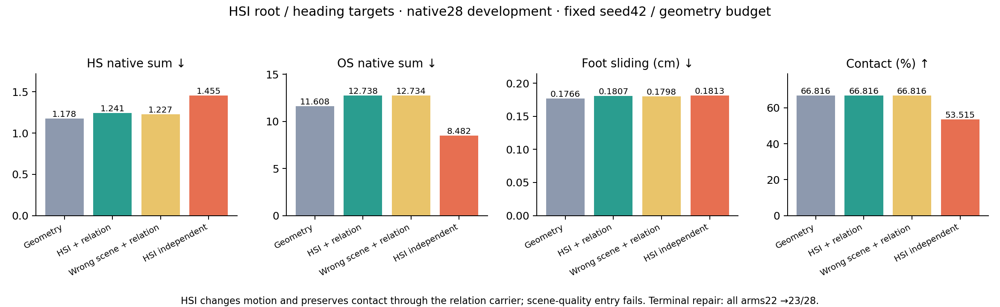
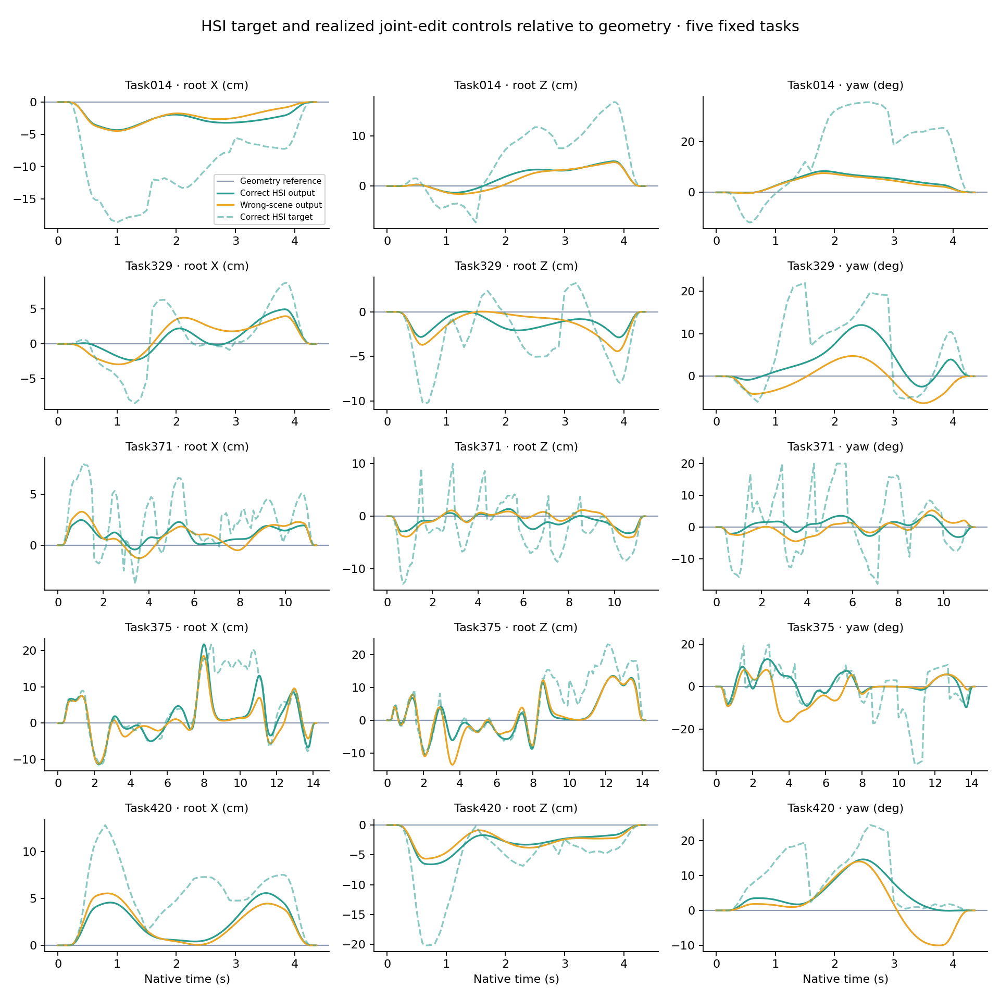

# Phase2.29 — HSI root／朝向目标的关系保持迁移（2026-09-08）

**工程和固定28任务实验完成；HSI独立收益与场景依赖条件均未通过，停止本设置的469扩展。**
HSI已经通过共同变换影响人体和物体，同时保持原有接触。本轮尚未建立有用场景知识迁移：正确HSI相对同预算几何基线的HS均值增加5.41%、OS增加9.73%，正确场景也未优于固定错配场景。原Phase2.28强基线保留。

| 28开发任务，终点修复前 | HS↓ | OS↓ | FS cm↓ | 接触%↑ | 完成%↑ |
|---|---:|---:|---:|---:|---:|
|纯几何关系编辑|1.17750|11.60779|0.17657|66.81601|78.57143|
|正确HSI＋关系保持|1.24123|12.73762|0.18071|66.81601|78.57143|
|错配HSI＋关系保持|1.22671|12.73443|0.17981|66.81601|78.57143|
|正确HSI＋独立变换|1.45490|8.48176|0.18134|53.51476|78.57143|

四组均在终点修复前完成22/28；同一个终点规则各恢复任务19，成为23/28（82.1429%）。该共同增益单列，HSI额外完成增益为0。所有终点候选及拒绝原因保留。

## 预登记与方法

用户在2026-09-08恢复HSIPrior场景知识迁移这一核心要求，并批准先在现有框架注入完整HSI的root／朝向目标。预登记caef76d，运行源码f4e7248，分支phase/02z-hsi-motion-target。协议为experiments/protocols/p2_hsi_motion_target_s42_20260908.json，唯一覆盖配置为config_sample_hosi_motion_target.yaml。
复用Phase2.28完整来源中的固定28任务，4场景、每场景7种物体，共124个原始窗口。P15 online、ArmB500、R2 EMA、seed42、16/2帧、232维与原生30Hz评价固定。新HOI生成0、新专家训练0。所有任务已有开发使用，未声明完全未见验证。
每窗口用噪声级199、两个配对噪声实现读取R2原始完整条件x0。未来物体/接触采用已验证的known-empty噪声边际，人体历史固定，模型侧物体条件masked。查询沿干净原始HOI源动作，保留原生静态/动态观察；CFG和HSI后验几何指导关闭。
错配条件将所有世界查询绕固定任务起点旋转+90°，并旋转物体prefix，保持交互对象的相对观察关系。模型收到相同的局部动作、文本、目标、进度、噪声和非场景参数；真实SDF评价使用原场景。非场景参数逐张量相等。
完整预测相对来源的世界root XZ位移与最接近世界Y轴的yaw构成目标，两个yaw按圆周平均。每窗口拥有local2..15，对应global14*w+2..15；第一段历史目标为0，全部帧覆盖一次。目标限制为每水平坐标±20cm、yaw±20°，按原生时钟插值至30Hz，并乘相同进出包络。
优化从原来的零控制量开始。20/40步Adam、lr.05、24帧块及原全人体/物体SDF、足部、残差、时序、域外项保持固定。持续HSI目标项权重.25，XZ按5cm、yaw按10°归一化，对3个分量和全帧取均值。HSI提供root/yaw，腿部沿用几何处理；完整HSI的其他姿态输出保留用于诊断。
关系组共享人体/物体XZ和yaw，独立组物体另有控制场。首6帧和末3帧锁定，选择完整登记目标最小的迭代，零来源穿透保持来源。几何预算、任务长度、目标、原生指标均保持固定。

## 配对结果与门槛

每组10000次seed42 bootstrap，任务和场景分别重采样，15个原生指标及数值化完成率全部保存。开发入口使用预登记点估计，未要求所有区间通过。

| 比较/指标 | 均值差 | 任务95%区间 | 场景95%区间 |
|---|---:|---:|---:|
|正确－几何/HS|+0.063734|[-0.170361, +0.425661]|[-0.100512, +0.313048]|
|正确－几何/OS|+1.129826|[-0.024226, +2.934962]|[+0.160354, +2.633660]|
|正确－几何/FS cm|+0.004135|[-0.003879, +0.009957]|[-0.002648, +0.009960]|
|正确－错配/HS|+0.014523|[-0.022607, +0.056967]|[-0.019211, +0.032815]|
|正确－错配/OS|+0.003190|[-0.315837, +0.318315]|[-0.110877, +0.140912]|
|正确－错配/FS cm|+0.000900|[-0.001874, +0.003946]|[-0.001192, +0.004582]|

失败条件为额外HS收益、正确场景优势和OS保护。接触、完成、FS及关系/首尾锁定保护通过。正确HSI的HS/OS均值方向已经变差；其相对错配场景的差值也没有优势。完成数及接触在三个关系组逐任务一致。
独立变换接触53.5148%，关系保持66.8160%，相差13.3012个百分点。它取得更低OS，同时人体HS更高。该消融支持关系保持机制的作用，不能替代HSI场景收益。

## 信号是否进入联合运动

496次真实HSI前向，正确与错配各248次；独立组复用相同正确目标。27/28条HSI输出发生变化。相对纯几何，root XZ坐标RMS变化按任务平均为21.7043mm，yaw平均绝对变化3.0363°，物体平均位移33.1360mm。原生root差与控制场差的最大误差为2.28e-7m。
正确/错配原始root目标的配对差异RMS为24.0062mm，两次噪声实现差为2.2290mm，前者约10.8倍。完整有界目标的平均余弦相似度.8352。因此场景输入引起稳定且实质的目标变化；这种敏感性尚未转化为有用场景效果。
27条动作更接近正确HSI目标，归一化目标距离均值1.2368→.6365；26条的原几何/运动目标值高于纯几何解。记录支持目标匹配与原几何目标之间存在取舍。
正确关系组手—物体坐标最大误差6.62557284e-07m，首尾人体和物体位置误差0；所有接触率与来源相同。HSI信号传递和交互保持已经执行，所选目标的物理收益仍未建立。

曲线为预选14/329/371/375/420相对纯几何的root XZ及yaw控制差，虚线为HSI目标。仅展示控制响应，不作人体自然度或细接触视觉认证。完整动作保存在各任务的pt文件中。

## 冲突分层与限制

以下按已冻结几何输出是否改变来源作事后描述性分层；没有据此选择、执行或推广新的路由方法。

| 来源组 | 任务数 | 正确HSI－几何 HS | OS | FS cm | 正确HSI－错配HSI HS |
|---|---:|---:|---:|---:|---:|
| 几何已修改 |9|+.527632|+3.972940|−.005110|+.034323|
| 几何原样返回 |19|−.156007|−.216913|+.008514|+.005144|

额外冲突集中在几何已经修改的9条任务，尤其任务375。另19条的HS/OS均值改善，但错配场景也产生相近改善。仅按这一分层启用HSI，仍不能据此把收益解释为正确场景知识迁移。9条中的3条输出更接近原始来源；不把全部退化概括成回到原始动作。
正确查询的区域外覆盖约.3924%，错配为18.6446%；静态和动态观察约49.26%、39.58%元素变化。这个对照是场景对应的压力干预，结论限定于该干预。
本轮只读出root/yaw。完整HSI身体预测是否包含被舍弃的有益腿部/躯干配合尚未做原生几何验证，因此没有证明HSIPrior整体失效，也没有证明重做共同去噪一定有效。

## 验证、成本与产物

18组件检查通过；运行前完整authority为1106 passed/4 existing skips，192.86s。初轮一个绕过__init__的测试fixture漏了新可选字段，在正式运行前修正。正式运行失败0，9作业均exit0；全部来源与原生条件恢复通过。原缓存缺完整context，恢复条件未冒充与不存在的捕获值逐项一致。
纯几何28任务的全部16个指标与封存基线精确一致，来源关节最大差0；相同终点流程相对旧缓存最大指标误差1.22e-6。场景输入配对、非场景参数一致、时间覆盖和有限目标/梯度检查通过。
控制器wall252.761s，累计教师查询/恢复计时14.142s，最大CUDA allocator1.256GiB。8×RTX3090，首条通过后并行其余任务。物理优化与统计在GPU上，代码中保存每臂同步时间；这些并行成本不作为串行速度优势。
新增代码位于mixer/hsi_motion_target.py，并以可选目标接入surface_edit.py；core与两个专家目录保持原样。原始surface配置的无HSI默认路径保留。没有新增tools脚本、训练、额外smoke或校验体系。
运行目录：`results/experiments/p2-mixer-hsi-motion-target-s42-20260908/`。包含manifest、9份全解析配置、预检、日志、执行状态；每任务teacher.pt/json保存原始预测、输入、观察、目标，主臂及终点pt/json保存完整动作与拒绝候选。analysis保存完整任务/场景表、区间、机制与分层。
紧凑结果：`experiments/results/p2_mixer_hsi_motion_target_s42_20260908.json`。两组图均提供PNG/PDF。预登记caef76d、运行f4e7248，完成提交由`exp/p2z-hsi-motion-target-v1`定位。

## 下次session入口

先读本总结、OVERVIEW及Phase2最新计划。保留Phase2.28强基线；停止当前固定root/yaw目标设置的升级。下一份提案优先区分HSI完整预测的物理价值与root/yaw读出造成的损失，再决定扩展关系保持的身体自由度，或重做共同去噪过程。现有预测可复用，下一步物理诊断/新方法需先形成具体协议。当前会话没有启动下一阶段。
